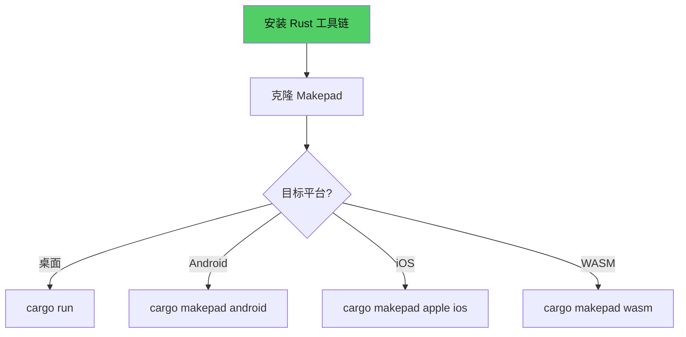

# 第2章：环境搭建

## 为什么这很重要

在写第一行 Makepad 代码之前，你需要一个能编译和运行 Makepad 应用的开发环境。Makepad 基于 Rust，所以你需要 Rust 工具链。但 Makepad 还有自己的构建工具 `cargo-makepad`，用于处理跨平台编译、资源打包和移动端部署。

好消息是：Makepad 的依赖非常少。不需要 Node.js、不需要 Gradle（除了 Android）、不需要 Xcode CLI 以外的 Apple 工具（除了 iOS 签名）。大多数平台上，安装 Rust + 运行 `cargo run` 就够了。

本章覆盖 macOS、Windows、Linux 三个桌面平台，以及 Android、iOS、WASM 三个部署目标。



---

## 第一步：安装 Rust

Makepad 使用 stable Rust（不需要 nightly）。安装方式在所有平台上相同：

```bash
curl --proto '=https' --tlsv1.2 -sSf https://sh.rustup.rs | sh
```

安装完成后验证：

```bash
rustc --version    # 应显示 rustc 1.85.0 或更高
cargo --version    # 应显示 cargo 1.85.0 或更高
```

如果你已经安装了 Rust，确保更新到最新的 stable 版本：

```bash
rustup update stable
```

Makepad 2.0 需要 Rust 1.80+（因为使用了 `LazyLock` 等新特性）。如果你的版本较旧，`rustup update` 会解决问题。

---

## 第二步：获取 Makepad 源码

```bash
git clone https://github.com/makepad/makepad.git
cd makepad
```

Makepad 是一个 Cargo workspace——所有的 crate（`platform`、`draw`、`widgets`、`examples`）都在这个仓库中。你不需要单独安装 `makepad-widgets` crate——它作为 workspace 成员直接引用。

---

## 第三步：运行第一个示例

### macOS

macOS 是 Makepad 的主要开发平台。不需要额外依赖：

```bash
cargo run -p makepad-example-counter --release
```

首次编译需要几分钟（下载依赖 + 编译整个 workspace）。后续增量编译通常在 5-15 秒内完成。

`--release` 参数启用优化编译。Makepad 的 debug 构建也能运行，但渲染性能会明显较差。**建议始终使用 `--release`。**

### Windows

需要安装 Visual Studio Build Tools（C++ 工作负载）：

1. 下载 [Visual Studio Build Tools](https://visualstudio.microsoft.com/downloads/)
2. 安装时选择"使用 C++ 的桌面开发"工作负载
3. 确保包含 Windows SDK

然后和 macOS 一样：

```bash
cargo run -p makepad-example-counter --release
```

Windows 上 Makepad 使用 D3D11 渲染后端。

### Linux

需要安装 X11 和 OpenGL 开发库：

**Ubuntu/Debian：**

```bash
sudo apt-get install -y libx11-dev libxcursor-dev libxrandr-dev libxinerama-dev \
    libxi-dev libgl1-mesa-dev libglu1-mesa-dev
```

**Fedora：**

```bash
sudo dnf install -y libX11-devel libXcursor-devel libXrandr-devel libXinerama-devel \
    libXi-devel mesa-libGL-devel
```

然后：

```bash
cargo run -p makepad-example-counter --release
```

Linux 上 Makepad 使用 OpenGL 渲染后端。

---

## 第四步（可选）：移动和 Web 目标

### Android

首先安装 `cargo-makepad` 工具和 Android 工具链：

```bash
cargo install cargo-makepad
cargo makepad android install-toolchain
```

这会下载 Android NDK 和必要的工具链组件。然后构建 APK：

```bash
cargo makepad android run -p makepad-example-counter --release
```

确保有 Android 设备通过 USB 连接或 emulator 运行中。

### iOS

需要 macOS + Xcode。安装 iOS 工具链：

```bash
cargo install cargo-makepad
cargo makepad apple ios install-toolchain
```

构建并运行：

```bash
cargo makepad apple ios run -p makepad-example-counter --release
```

需要有效的 Apple 开发者账号进行真机调试。模拟器运行不需要签名。

### WASM (Web)

```bash
cargo install cargo-makepad
cargo makepad wasm run -p makepad-example-counter --release
```

这会启动一个本地 Web 服务器，在浏览器中打开 Makepad 应用。

---

## 验证安装

运行 counter 示例后，你应该看到一个 420×220 的窗口，中间显示 "Count: 0" 和一个 "Increment" 按钮。点击按钮，数字增加。

如果看到这个界面——恭喜，你的 Makepad 开发环境已经就绪。

---

## 常见问题排查

| 问题 | 平台 | 解决方案 |
|------|------|---------|
| `error: linker 'cc' not found` | Linux | 安装 `build-essential`（Ubuntu）或 `gcc`（Fedora） |
| `fatal error: 'X11/Xlib.h' not found` | Linux | 安装 X11 开发库（见上面的 apt/dnf 命令） |
| `error: linking with 'link.exe' failed` | Windows | 安装 Visual Studio Build Tools 的 C++ 工作负载 |
| 编译时内存不足 | 所有 | 首次编译可能需要 8GB+ RAM；关闭其他大型应用 |
| `cargo run` 很慢 | 所有 | 使用 `--release`；确认是增量编译而非全量编译 |
| Android 设备未识别 | Android | 确认 USB 调试已开启；运行 `adb devices` 验证 |
| iOS 签名错误 | iOS | 确认 Xcode 中已配置开发者团队 |
| WASM 运行白屏 | Web | 检查浏览器控制台错误；确认 WebGL 2.0 支持 |

---

## 项目结构速览

在进入下一章写代码之前，了解一下 Makepad 仓库的结构：

```
makepad/
├── platform/           # 核心运行时：事件、窗口、GPU 抽象
│   ├── src/           # Cx, Event, Action, DrawShader 等
│   └── script/        # Splash VM、解析器、GC
├── draw/              # 2D/3D 渲染引擎
│   └── src/           # Turtle 布局、Sdf2d、文本、矢量
├── widgets/           # UI 组件库
│   └── src/           # View, Label, Button, PortalList 等
├── examples/          # 示例应用
│   ├── counter/       # 计数器（本书主要示例）
│   ├── todo/          # Todo 列表
│   └── splash/        # Splash 语言演示
├── studio/            # Makepad Studio IDE
├── tools/
│   └── canvas/        # AI Agent-to-App 画布
├── splash.md          # Splash 语言参考手册
└── Cargo.toml         # Workspace 根配置
```

本书前五章主要使用 `examples/counter/` 和 `examples/todo/`。Part II（Splash 语言篇）大量引用 `platform/script/` 和 `splash.md`。Part VI（AI-Native 篇）聚焦于 `tools/canvas/`。

---

## 本章小结

| 步骤 | 命令 |
|------|------|
| 安装 Rust | `curl --proto '=https' --tlsv1.2 -sSf https://sh.rustup.rs \| sh` |
| 克隆仓库 | `git clone https://github.com/makepad/makepad.git` |
| 运行桌面 | `cargo run -p makepad-example-counter --release` |
| 运行 Android | `cargo makepad android run -p makepad-example-counter --release` |
| 运行 iOS | `cargo makepad apple ios run -p makepad-example-counter --release` |
| 运行 WASM | `cargo makepad wasm run -p makepad-example-counter --release` |

环境就绪后，下一章将带你逐行分析 counter 应用的代码——理解 Makepad 2.0 应用的基本结构（详见第3章：第一个应用）。
