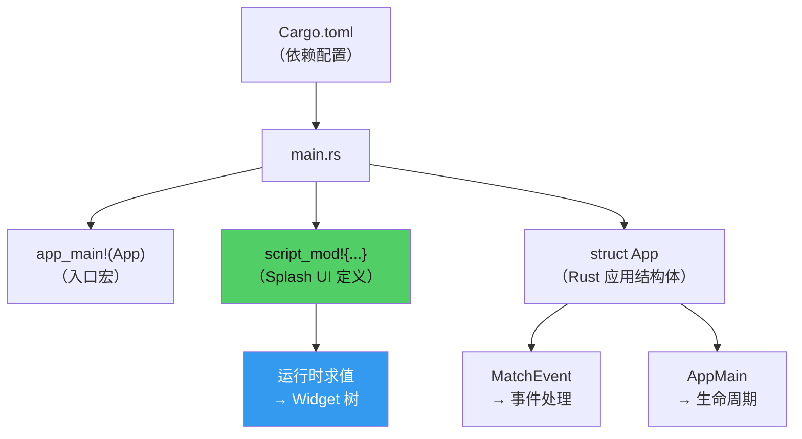
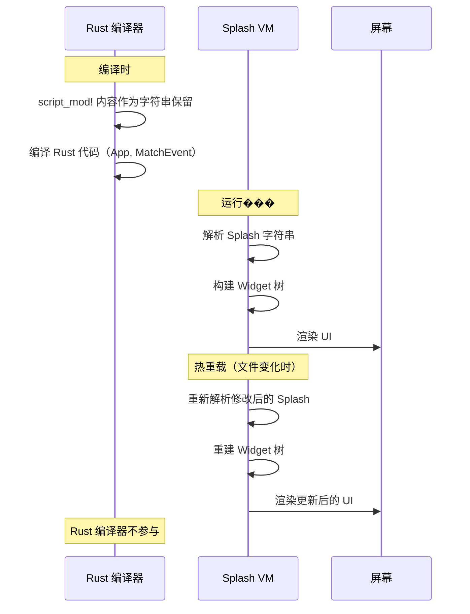

# 第3章：第一个应用

## ��什么这很重要

学任何框架，第一步都是"跑起来"。一个能编译、能运行、能在屏幕上显示东西的最小应用，就是你理解整个框架的起点。

Makepad 2.0 的应用由两部分组成：**Rust 骨架**和 **Splash 脚本**。Rust 骨架定义应用的生命周期和事件处理，Splash 脚本定义 UI 的外观和结构。这种"双层结构"是 Makepad 2.0 的核心设计——Rust 负责"做什么"，Splash 负责"长什么样"。

本章将带你从零构建一个最小的 Makepad 应用，逐行讲解每个部分的作用。你不需要记住所有细节——本章的目标是建立一个"可运行的心智模型"，让你在后续章节中能把新知识放到正确的位置上。



---

## 完整的最小应用

下面是一个完���的 Makepad 2.0 应用——counter（计数器）。它能在屏幕上显示一个数字和一个按钮，点击按钮数字加一。整个应用只有一个文件，71 行代码：

### Cargo.toml

```toml
[package]
name = "makepad-example-counter"
version = "1.0.0"
edition = "2021"

[dependencies]
makepad-widgets = { path = "../../widgets", version = "2.0.0" }
```

*来源：`examples/counter/Cargo.toml`（省略 dev-dependencies）*

唯一的运行时依赖是 `makepad-widgets`——它包含了 Makepad 的所有 UI 组件、渲染引擎和运行时。不需要额外的构建工具、打包器或代码生成器。

### main.rs：完整源码

```rust
pub use makepad_widgets;

use makepad_widgets::*;

app_main!(App);

script_mod! {
    use mod.prelude.widgets.*
    let state = {
        counter: 0
    }
    mod.state = state
    startup() do #(App::script_component(vm)){
        ui: Root{
            on_startup:||{
                ui.main_view.render()
            }
            main_window := Window{
                window.inner_size: vec2(420, 220)
                body +: {
                    main_view := View{
                        width: Fill
                        height: Fill
                        flow: Down
                        spacing: 12
                        align: Center
                        on_render: ||{
                            counter_label := Label{
                                text: "Count: " + state.counter
                                draw_text.text_style.font_size: 24
                            }
                        }
                    }
                    increment_button := Button{
                        text: "Increment"
                    }
                }
            }
        }
    }
}

#[derive(Script, ScriptHook)]
pub struct App {
    #[live]
    ui: WidgetRef,
}

impl MatchEvent for App {
    fn handle_actions(&mut self, cx: &mut Cx, actions: &Actions) {
        if self.ui.button(cx, ids!(increment_button)).clicked(actions) {
            script_eval!(cx,{
                mod.state.counter += 1
                ui.main_view.render()
            });
        }
    }
}

impl AppMain for App {
    fn script_mod(vm: &mut ScriptVm) -> ScriptValue {
        crate::makepad_widgets::script_mod(vm);
        self::script_mod(vm)
    }

    fn handle_event(&mut self, cx: &mut Cx, event: &Event) {
        self.match_event(cx, event);
        self.ui.handle_event(cx, event, &mut Scope::empty());
    }
}
```

*来源：`examples/counter/src/main.rs`*

71 行。下面逐部分解剖。

---

## 逐层解剖

### 第一层：入口宏 `app_main!`

```rust
app_main!(App);
```

*来源：`examples/counter/src/main.rs:5`*

这一行做了两件事：

1. 生成跨平台的 `main` 函数（在 macOS 上是标准的 `fn main()`，在 Android 上是 JNI 入口，在 WASM 上是 `wasm_bindgen` 入口）
2. 初始化 Makepad 运行时（`Cx`），然后启动 `App`

你不需要手写 `fn main()`——`app_main!` 替你处理了所有平台差异。无论你的目标是桌面、移动还是 Web，这一行不需要改变。

### 第二层：Splash 脚��� `script_mod!`

```rust
script_mod! {
    use mod.prelude.widgets.*
    // ... Splash 代码 ...
}
```

*来源：`examples/counter/src/main.rs:7`*

`script_mod!` 是整个应用中最重要的部分。花括号内的代码不是 Rust——它是 Splash 脚本。编译期宏会把这段脚本展开成一个 `ScriptMod`：其中包含源码字符串、源位置以及 `#(...)` 注入值；运行时再由 Splash VM 解析和执行。

**这就是 Makepad 2.0 最根本的设计决策：UI 描述是运行时求值的，不是编译时展开的。**

对比 Makepad 1.x 的 `live_design!`：

| | `live_design!`（1.x） | `script_mod!`（2.0） |
|---|---|---|
| UI 描述能力 | 声明式数据格式 | 完整脚本语言（变量、函数、闭包、控制流） |
| 求值方式 | 宏提取 + 运行时解析 | 完整的 VM 执行 |
| 修改 UI | 支持热重载 | 支持热重载 |
| 动态能力 | 静态属性声明 | `on_render` 动态生成 Widget、条件渲染 |
| AI 生成 | 技术上可行，但缺乏脚本能力 | 完整支持（VM 可接收外部代码） |

这个表格中最关键的变化是"动态能力"和"AI 生成"。`live_design!` 是声明式的数据格式——你只能描述 Widget 的静态属性。`script_mod!` 是完整的脚本语言——变量、函数、闭包、条件渲染、`on_render` 回调……这些能力让 AI Agent 可以生成"有逻辑的 UI"而不只是"静态的布局"。这就是 Canvas 项目（详见第27章：Canvas 架构剖析）的技术基础。

需要澄清的是：`live_design!` 在 1.x 中也支持热重载——它的宏会提取 DSL 内容作为字符串，在运行时解析。`script_mod!` 的真正飞跃是从"声明数据"到"执行脚本"——一个质的变化，让 UI 描述从静态变为动态。

### script_mod! 内部结构

让我们拆解 `script_mod!` 里面的 Splash 代码：

**导入预置组件：**

```splash
use mod.prelude.widgets.*
```

这行导入所有标准 Widget（View, Label, Button 等）。没有这行，Widget 名称不会被识别。

**状态定义：**

```splash
let state = {
    counter: 0
}
mod.state = state
```

`let state = {...}` 定义一个状态对象，`mod.state = state` 把它注册到模块级作用域——这样后面的代码和 Rust 侧都能通过 `mod.state` 访问它。

**UI 组件树：**

```splash
startup() do #(App::script_component(vm)){
    ui: Root{
        main_window := Window{
            window.inner_size: vec2(420, 220)
            body +: {
                main_view := View{
                    width: Fill height: Fill
                    flow: Down spacing: 12 align: Center
                    on_render: ||{
                        counter_label := Label{
                            text: "Count: " + state.counter
                            draw_text.text_style.font_size: 24
                        }
                    }
                }
                increment_button := Button{
                    text: "Increment"
                }
            }
        }
    }
}
```

*来��：`examples/counter/src/main.rs:13-41`（格式化）*

这段代码定义了完整的 UI 树：

- `Root{}` 是应用的根容器
- `Window{}` 创建一个操作系统窗口，`window.inner_size: vec2(420, 220)` 设置窗口大小
- `body +:` 用合并运算符向窗口的 body 区域添加内容
- `main_view := View{...}` 是主内容区域，垂直排列（`flow: Down`）、居中对齐
- `on_render: ||{...}` 是一个渲染回调——每次 `main_view.render()` 被调用时，这段代码会重新执行，更新 Label 的文字
- `increment_button := Button{text: "Increment"}` 是一个按钮

`on_render` 是一个渲染回调——在每次调用 `render()` 时重新执行。`counter_label` 的定义来自 `on_render` 返回结果；每次渲染时这段定义都会重新应用到 `main_view`，同名节点可被复用。当 `state.counter` 改变后，调用 `ui.main_view.render()` 会触发 `on_render` 重新执行，Label 的 `text` 属性随之更新。这种"状态变化 → 重新渲染 → UI 更新"的模式是 Makepad 2.0 中 UI 更新的标准方式。

**`startup() do #(...)` 语法说明：** `startup()` 声明这段 UI 定义在应用启动时执行。`do #(App::script_component(vm))` 连接 Splash 和 Rust——它告诉 VM 这个 UI 树对应的 Rust 组件是 `App`。`#(...)` 是 Splash 调用 Rust 方法的语法，与 Rust 侧的 `script_eval!` 构成双向���梁。

### 第三层：Rust 结构体和事件处理

```rust
#[derive(Script, ScriptHook)]
pub struct App {
    #[live]
    ui: WidgetRef,
}
```

*来源：`examples/counter/src/main.rs:43-47`*

`App` 是应用的 Rust 侧结构体。`#[derive(Script, ScriptHook)]` 让它能和 Splash VM 交互。`#[live]` 标记 `ui` 字段为"运行时活跃的"——它持有 Splash 脚本创建的 Widget 树的引用。

**事件处理 `MatchEvent`：**

```rust
impl MatchEvent for App {
    fn handle_actions(&mut self, cx: &mut Cx, actions: &Actions) {
        if self.ui.button(cx, ids!(increment_button)).clicked(actions) {
            script_eval!(cx,{
                mod.state.counter += 1
                ui.main_view.render()
            });
        }
    }
}
```

*来源：`examples/counter/src/main.rs:49-58`*

`MatchEvent` trait 定义了应用如何响应用户操作。`handle_actions` 在每次用户交互时被调用：

- `self.ui.button(cx, ids!(increment_button))` 查找名为 `increment_button` 的按钮
- `.clicked(actions)` 检查这个按钮是否被点击了
- `script_eval!(cx, {...})` 在 Splash VM 中执行代码：增加计数器并触发 UI 重新渲染

`script_eval!` 是 Rust 调用 Splash 的桥梁——它把花括号内的 Splash 代码发送给 VM 执行。这让 Rust 代码可以修改 Splash 的状态和触发 UI 更新。

**生命周期 `AppMain`：**

```rust
impl AppMain for App {
    fn script_mod(vm: &mut ScriptVm) -> ScriptValue {
        crate::makepad_widgets::script_mod(vm);
        self::script_mod(vm)
    }

    fn handle_event(&mut self, cx: &mut Cx, event: &Event) {
        self.match_event(cx, event);
        self.ui.handle_event(cx, event, &mut Scope::empty());
    }
}
```

*来源：`examples/counter/src/main.rs:60-70`*

`AppMain` trait 定义应用的生命周期：

- `script_mod()` 在启动时被调用，负责初始化 Splash VM——先加载标准 Widget 库（`makepad_widgets::script_mod`），再加载本应用的 `script_mod!` 内容
- `handle_event()` 是事件循环的入口——系统事件（鼠标、键盘、触摸、窗口）从这里进入应用

这两个函数几乎在所有 Makepad 应用中都是一样的——它们是"样板代码"。应用的个性化逻辑在 `MatchEvent` 和 `script_mod!` 中。

---

## 运行时 vs 编译时：一个实验

理解 `script_mod!` 是运行时求值的最好方式是亲身体验。

**实验：修改 Splash 代码，不重新编译。**

Makepad 支持热重载——当你修改 `script_mod!` 内的 Splash 代码并保存时（在 Studio 中），应用立即显示修改后的 UI，不需要重新编译 Rust 代码。

```
1. 运行 counter 应用
2. 在 script_mod! 中修改 Label 的字号：
   draw_text.text_style.font_size: 24  →  font_size: 48
3. 保存文件
4. 应用立即显示更大的字体——没有等待编译
```

这是怎么做到的？因为 `script_mod!` 内的代码不会先变成 Rust UI 代码再编译。宏在编译期生成的是一个包含脚本源码和源位置信息的 `ScriptMod`；运行时由 Splash VM 解析它并构建 Widget 树。当源文件变化时，VM 重新解析修改后的脚本并更新 UI——整个过程不涉及 Rust 重新编译。



这种"运行时求值"的设计是 Makepad 2.0 的核心优势。它不仅支持热重载，还为 AI 动态生成 UI 打开了大门——AI Agent 可以通过 WebSocket 发送 Splash 代码给运行中的应用，应用立即渲染新的 UI（详见第11章：流式求值，第27章：Canvas 架构剖析）。

---

## 应用的数据流

把上面的分析汇总为一张完整的数据流图：

```
用户点击 "Increment" 按钮
    → Makepad 生成 ButtonAction::Clicked
        → App::handle_actions() 被调用
            → 匹配到 increment_button.clicked
                → script_eval!{mod.state.counter += 1; ui.main_view.render()}
                    → Splash VM 执行：
                        1. state.counter 从 0 变为 1
                        2. main_view.render() 被调用
                            → on_render 回调执行
                                → Label.text 更新为 "Count: 1"
                                    → 屏幕刷新
```

关键的交互有两个方向：

- **Rust → Splash**：通过 `script_eval!` 发送 Splash 代码给 VM 执行
- **Splash → Rust**：通过 `#(App::script_component(vm))` 在 Splash 中注册 Rust 组件，通过 `ids!(increment_button)` 在 Rust 中查找 Splash 创建的 Widget

这两个方向构成了 Makepad 的"双层架构"：Splash 是 UI 的"声明层"，Rust 是逻辑的"执行层"。

---

## 模式提炼

### 模式一：Makepad 应用骨架

每个 Makepad 2.0 应用都有相同的骨架结构：

```rust
pub use makepad_widgets;
use makepad_widgets::*;

app_main!(App);           // 1. 入口宏

script_mod! {              // 2. Splash UI 定义
    use mod.prelude.widgets.*
    // ... Widget 树 ...
}

#[derive(Script, ScriptHook)]
pub struct App {           // 3. Rust 应用结构体
    #[live]
    ui: WidgetRef,
}

impl MatchEvent for App {  // 4. 事件处��
    fn handle_actions(&mut self, cx: &mut Cx, actions: &Actions) {
        // ... 处理用户操作 ...
    }
}

impl AppMain for App {     // 5. 生命周期（几乎不变）
    fn script_mod(vm: &mut ScriptVm) -> ScriptValue {
        crate::makepad_widgets::script_mod(vm);
        self::script_mod(vm)
    }
    fn handle_event(&mut self, cx: &mut Cx, event: &Event) {
        self.match_event(cx, event);
        self.ui.handle_event(cx, event, &mut Scope::empty());
    }
}
```

五个部分中，第 1、3、5 部分在所有应用中几乎相同。你的个性化工作集中在第 2 部分（Splash UI）和第 4 部分（事件处理）。

### 模式二：Rust-Splash 双向通信

| 方向 | 机制 | 用途 |
|------|------|------|
| Rust → Splash | `script_eval!(cx, {...})` | 修改状态、触发渲染 |
| Splash → Rust | `#(RustType::method(vm))` | 注册 Rust 组件到 Splash |
| Splash → Rust | `ids!(widget_name)` | 在 Rust 中查找 Splash Widget |

### 模式三：状态-渲染循环

```
状态变化 → 调用 render() → on_render 回调执行 → UI 更新
```

这是 Makepad 中 UI 更新的标准模式。不要直接修改 Widget 属性——修改状态，然后调用 `render()` 让 Splash 根据新状态重新构建 UI。这和 React 的 `setState → re-render` 类似。

---

## 本章小结

| 组件 | 作用 | 所在文件 |
|------|------|---------|
| `app_main!(App)` | 跨平台入口 | main.rs:5 |
| `script_mod!{...}` | Splash UI 定义（运行时求值） | main.rs:7-41 |
| `struct App` | Rust 应用结构体 | main.rs:43-47 |
| `MatchEvent` | 事件处理逻辑 | main.rs:49-58 |
| `AppMain` | 应用生命周期（样板代码） | main.rs:60-70 |

核心要点：

1. **`script_mod!` 是运行时的**——Splash 代码在 VM 中执行，不是在 Rust 编译器中展开
2. **UI 是声明式的**——你描述 UI 应该长什么样，不是命令式地构建它
3. **Rust 和 Splash 双向通信**——`script_eval!` 从 Rust 到 Splash，`ids!` 从 Splash 到 Rust

下一章将在这个基础上，给 counter 应用加入更丰富的交互——多个按钮、状态显示、条件渲染（详见第4章：Counter：状态与事件）。
