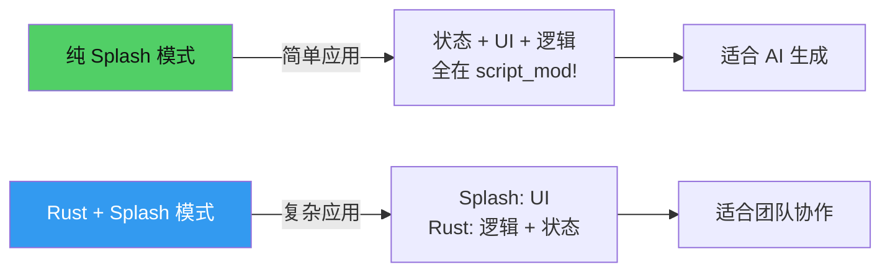
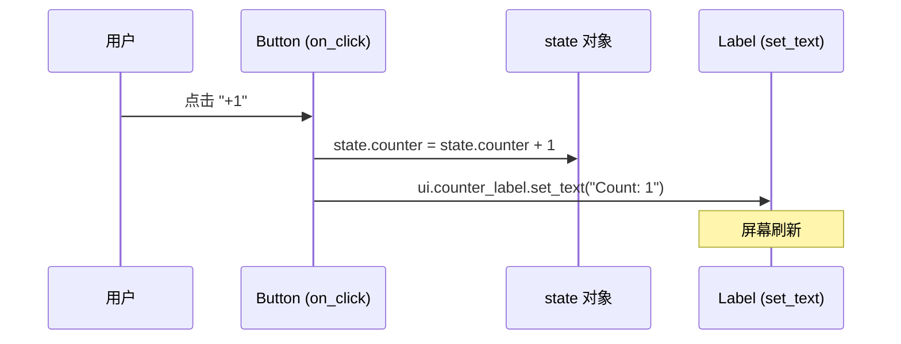
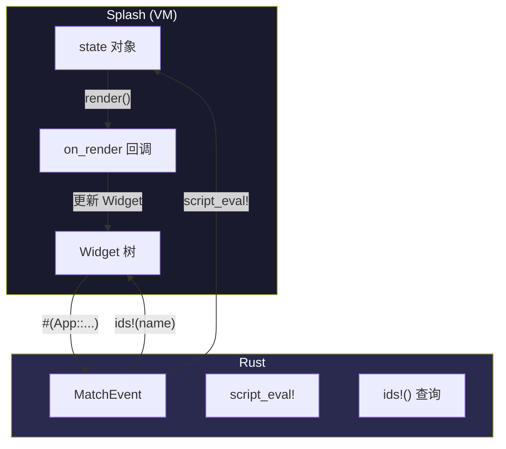

# 第4章：Counter——状态与事件

## 为什么这很重要

上一章展示了 Makepad 应用的骨架结构——`app_main!`、`script_mod!`、`MatchEvent`、`AppMain`。但那个 counter 应用的交互逻辑被一笔带过。本章要回答一个核心问题：**在 Makepad 2.0 中，状态如何流动？事件如何响应？**

这个问题有两种回答方式。第一种是"纯 Splash"——所有逻辑都写在 Splash 脚本中，不需要 Rust 代码参与。第二种是"Rust + Splash 协作"——Splash 负责 UI，Rust 负责逻辑。两种方式各有适用场景，理解它们的区别是构建更复杂应用的基础。

本章将同一个 Counter 应用实现两次：先用纯 Splash，再用 Rust + Splash。通过对比，你会理解 Makepad 的状态管理不是一种固定模式，而是一个灵活的光谱——从"全部在 Splash"到"全部在 Rust"之间，你可以根据应用复杂度选择合适的位置。



---

## 方式一：纯 Splash Counter

先看最简单的版本——所有逻辑都在 Splash 脚本中，零 Rust 逻辑代码。这种模式使用 `set_text()` 命令式更新 UI，和 Canvas 中的 pomodoro 应用类似（pomodoro 也有 `on_render` 声明式模式，但核心交互逻辑同样基于 `on_click` + 状态修改）：

```splash
let state = { counter: 0 }

fn refresh() {
    ui.counter_label.set_text("Count: " + state.counter)
}

SolidView{width: Fill height: Fit draw_bg.color: #x1a1a2e
    flow: Down spacing: 16 padding: 24 align: Center

    counter_label := Label{text: "Count: 0"
        draw_text.color: #xffffff
        draw_text.text_style.font_size: 32}

    View{width: Fit height: Fit flow: Right spacing: 12
        Button{text: "+1" draw_bg.color: #x51cf66
            padding: Inset{left: 20. right: 20. top: 10. bottom: 10.}
            draw_bg.radius: 6.
            on_click: ||{
                state.counter = state.counter + 1
                refresh()
            }
        }
        Button{text: "-1" draw_bg.color: #xff6b6b
            padding: Inset{left: 20. right: 20. top: 10. bottom: 10.}
            draw_bg.radius: 6.
            on_click: ||{
                if state.counter > 0 {
                    state.counter = state.counter - 1
                }
                refresh()
            }
        }
        Button{text: "Reset" draw_bg.color: #x666688
            padding: Inset{left: 20. right: 20. top: 10. bottom: 10.}
            draw_bg.radius: 6.
            on_click: ||{
                state.counter = 0
                refresh()
            }
        }
    }
}
```

这段代码可以直接在 Canvas 中运行（通过 `POST /splash` 推送），不需要任何 Rust 代码。

### 纯 Splash 模式的状态流



流程很直接：

1. **状态定义**：`let state = { counter: 0 }` 创建一个 Splash 对象
2. **事件处理**：`on_click: ||{...}` 在按钮点击时执行——修改 `state.counter`，然后调用 `refresh()` 更新 UI
3. **UI 更新**：`ui.counter_label.set_text(...)` 直接修改 Label 的文字

这里的关键 API 是 `ui.widget_name.set_text(string)`——它通过 `:=` 命名找到对应的 Widget，然后设置其文字内容。`counter_label :=` 声明了一个可寻址的 Label（详见第8章：模板与组合），`ui.counter_label` 就可以在运行时访问它。

### 纯 Splash 模式的特点

| 优势 | 局限 |
|------|------|
| 代码全在一个地方，结构清晰 | 没有类型系统保护 |
| AI 可以完整生成和修改 | 大型应用难以维护 |
| 不需要 Rust 编译 | 无法调用 Rust 库（网络、文件、加密等） |
| 热重载即时生效 | 性能不如原生 Rust |

纯 Splash 模式最适合三种场景：AI 生成的应用（详见第27章：Canvas 架构剖析）、快速原型、以及交互逻辑简单的工具型 UI。

---

## 方式二：Rust + Splash Counter

现在看 `examples/counter/` 中的实际实现——Splash 负责 UI 结构，Rust 负责事件处理。这是 Makepad 应用的标准模式：

### Splash 部分：UI 定义

```splash
use mod.prelude.widgets.*
let state = {
    counter: 0
}
mod.state = state
startup() do #(App::script_component(vm)){
    ui: Root{
        on_startup:||{
            ui.main_view.render()
        }
        main_window := Window{
            window.inner_size: vec2(420, 220)
            body +: {
                main_view := View{
                    width: Fill height: Fill
                    flow: Down spacing: 12 align: Center
                    on_render: ||{
                        counter_label := Label{
                            text: "Count: " + state.counter
                            draw_text.text_style.font_size: 24
                        }
                    }
                }
                increment_button := Button{
                    text: "Increment"
                }
            }
        }
    }
}
```

*来源：`examples/counter/src/main.rs:7-41`*

### Rust 部分：事件处理

```rust
impl MatchEvent for App {
    fn handle_actions(&mut self, cx: &mut Cx, actions: &Actions) {
        if self.ui.button(cx, ids!(increment_button)).clicked(actions) {
            script_eval!(cx,{
                mod.state.counter += 1
                ui.main_view.render()
            });
        }
    }
}
```

*来源：`examples/counter/src/main.rs:49-58`*

### Rust + Splash 模式的状态流

```mermaid
sequenceDiagram
    participant U as 用户
    participant M as Makepad Runtime
    participant R as Rust (MatchEvent)
    participant V as Splash VM
    participant S as Splash 屏幕

    U->>M: 点击 increment_button
    M->>R: handle_actions(actions)
    R->>R: button.clicked(actions)?
    R->>V: script_eval!{counter += 1; render()}
    V->>V: mod.state.counter = 1
    V->>V: on_render 回调执行
    V->>S: Label.text = "Count: 1"
```

和纯 Splash 版本的关键区别：

1. **事件在 Rust 中被捕获**：`self.ui.button(cx, ids!(increment_button)).clicked(actions)` 是 Rust 代码，在 Rust 的类型系统保护下运行
2. **状态修改通过 `script_eval!` 桥接**：Rust 代码通过 `script_eval!` 向 Splash VM 发送脚本执行
3. **UI 更新仍在 Splash 中**：`ui.main_view.render()` 触发 Splash 侧的 `on_render` 回调

---

## 深入理解：双向通信的三种机制

Makepad 提供了三种 Rust↔Splash 通信机制，对应不同的数据流方向。

### 机制一：Rust → Splash（`script_eval!`）

```rust
script_eval!(cx, {
    mod.state.counter += 1
    ui.main_view.render()
});
```

*来源：`examples/counter/src/main.rs:52-55`*

`script_eval!` 接收一段 Splash 代码字符串，在 VM 中执行。它是 Rust 向 Splash VM 发送指令的主要方式。

Makepad 还提供了另一个宏——`script_apply_eval!`——用于直接修改特定 Widget 的属性：

```rust
let color = vec4(1.0, 0.0, 0.0, 1.0);
script_apply_eval!(cx, my_widget, {
    draw_bg +: { color: #(color) }
});
```

`script_apply_eval!` 和 `script_eval!` 的区别：`script_eval!` 执行任意 Splash 代码（可以访问 `mod.state`、调用函数），`script_apply_eval!` 只能 patch 一个具体 Widget 的属性。它更像"运行时属性补丁"而不是完整脚本环境：动态值通常通过 `#(rust_expr)` 注入；部分枚举/常量也可以直接写（例如现有代码中的 `cursor: Hand`），但可用范围取决于具体属性和运行时类型。

**使用场景**：用户交互后需要更新 UI 状态——修改计数器、切换页面、加载数据后刷新显示。

**注意**：`script_eval!` 的执行是同步的——花括号内的 Splash 代码在当前帧内立即执行。不需要等待下一帧。这意味着你可以在 `script_eval!` 之后立即读取更新后的状态。

`script_eval!` 的内容在编译时是字符串字面量，不参与 Rust 的类型检查。如果你写了无效的 Splash 代码（比如拼错了变量名），错误会在运行时而不是编译时出现。这是"运行时求值"的代价——灵活性换来了编译期安全性的降低。

### 机制二：Splash → Rust（Widget 查询 `ids!`）

```rust
self.ui.button(cx, ids!(increment_button)).clicked(actions)
```

*来源：`examples/counter/src/main.rs:51`*

`ids!(increment_button)` 是 Splash → Rust 方向的桥梁。它通过 Widget 名称（Splash 中用 `:=` 声明的）在 Rust 中查找对应的 Widget 引用。然后在这个引用上调用 `.clicked(actions)` 检查用户是否点击了这个按钮。

**使用场景**：Rust 代码需要知道"用户做了什么"——某个按钮是否被点击、某个输入框的内容是什么。

`ids!` 宏将字符串转换为 `LiveId`——Makepad 内部用于快速查找 Widget 的标识符。它和 Splash 中 `:=` 声明的名称必须完全匹配。如果名称拼错了，`button()` 不会 panic，但 `.clicked(actions)` 永远返回 `false`——一个静默的 bug。在更复杂的应用中，建议在 `handle_actions` 开头统一解构所有 Widget 引用，而不是在每个条件分支中分散查询。

**常用查询方法**：

```rust
// 按钮点击
self.ui.button(cx, ids!(my_button)).clicked(actions)

// 文本输入值
self.ui.text_input(cx, ids!(my_input)).text()

// Slider 值变化
self.ui.slider(cx, ids!(my_slider)).changed(actions)
```

### 机制三：Splash → Rust（Rust 组件注册 `#(...)`）

```splash
startup() do #(App::script_component(vm)){...}
```

*来源：`examples/counter/src/main.rs:13`*

`#(App::script_component(vm))` 在 Splash 中注册一个 Rust 组件。这告诉 VM："这段 UI 树归 Rust 侧的 `App` 管理"。注册后，`App` 的 `MatchEvent` 实现就能接收这个 UI 树中的所有事件。

**使用场景**：应用初始化时建立 Splash UI 树和 Rust 事件处理器之间的关联。

### 三种机制的配合



数据流形成一个循环：

1. 用户交互产生事件 → Makepad 分发到 Rust 的 `MatchEvent`
2. Rust 通过 `ids!` 查找 Widget → 判断是哪个按钮被点击
3. Rust 通过 `script_eval!` 修改 Splash 状态 → 触发 `render()`
4. Splash 的 `on_render` 回调执行 → 根据新状态更新 Widget → 屏幕刷新

---

## 两种模式的选择

| 维度 | 纯 Splash | Rust + Splash |
|------|-----------|--------------|
| 适用复杂度 | 中等交互（按钮、表单、HTTP 请求） | 复杂逻辑（并发、加密、文件系统） |
| AI 友好度 | 高（AI 可完整生成） | 中（AI 生成 Splash，人写 Rust） |
| 类型安全 | 无 | Rust 编译器保护 |
| 网络能力 | `net.http_request`（GET/POST/流式） | 任何 Rust crate（reqwest、tonic 等） |
| 热重载范围 | 全部代码 | 仅 Splash 部分 |
| 代码组织 | 单文件 | Splash UI + Rust 逻辑分离 |

**注意：纯 Splash 现在也支持网络请求。** Splash 内置了 `net.http_request` API，支持 GET/POST/流式响应和 HTML 解析（`parse_html()`）。这意味着纯 Splash 应用可以调用外部 API、搜索引擎、加载远程数据——不再局限于"纯本地"场景。

**经验法则**：

- 简单到中等复杂度（UI + HTTP API 调用）→ 纯 Splash
- 需要文件系统、加密、并发、或特定 Rust crate → Rust + Splash
- 如果 AI Agent 需要动态生成和修改 UI → 纯 Splash（这是 Canvas 的模式）
- 如果团队协作开发 → Rust + Splash（Splash 负责 UI，Rust 负责业务逻辑）

大多数生产应用使用 Rust + Splash 模式，因为实际应用几乎总是需要网络或存储。但纯 Splash 模式在 AI 生成场景中是核心模式——Canvas 中的所有应用（pomodoro、token-dashboard、music-player）都是纯 Splash（详见第27章）。

值得注意的是，两种模式可以混合使用。你可以从纯 Splash 原型开始，当需要 Rust 能力时逐步迁移特定的事件处理到 Rust 侧——不需要重写整个应用。`on_click` 中的 Splash 逻辑和 `MatchEvent` 中的 Rust 逻辑可以共存。这种渐进式迁移路径意味着你不需要一开始就做出最终的架构决策。

实际上，pomodoro.splash 就是一个很好的例子：它的全部逻辑（状态、定时器、UI 更新）都在 Splash 中。如果将来需要添加"保存历史记录到文件"的功能，只需要在 Rust 侧添加一个 `MatchEvent` 处理器，用 `ids!` 监听某个按钮，然后用 Rust 的 `std::fs` 写文件——pomodoro 的 Splash 代码不需要改动。

---

## 扩展练习：给 Counter 添加功能

在纯 Splash 版本的基础上，尝试以下扩展。这些练习不需要修改 Rust 代码：

**练习一：添加步长控制**

```splash
let state = { counter: 0 step: 1 }

fn refresh() {
    ui.counter_label.set_text("Count: " + state.counter)
    ui.step_label.set_text("Step: " + state.step)
}

// 在 UI 中添加步长按钮
Button{text: "Step +1"
    on_click: ||{ state.step = state.step + 1  refresh() }}
Button{text: "Step -1"
    on_click: ||{
        if state.step > 1 { state.step = state.step - 1 }
        refresh()
    }}

// 修改 +1 按钮为 +step
Button{text: "Add"
    on_click: ||{
        state.counter = state.counter + state.step
        refresh()
    }}
```

**练习二：添加最大值限制**

```splash
let state = { counter: 0 max: 100 }

fn add(n) {
    state.counter = state.counter + n
    if state.counter > state.max { state.counter = state.max }
    if state.counter < 0 { state.counter = 0 }
    refresh()
}
```

这些练习展示了纯 Splash 模式的灵活性——不需要重新编译，修改 Splash 代码即可添加新功能。

---

## 模式提炼

### 模式一：状态-更新-渲染循环

```
状态变化 → 调用 refresh()/render() → UI 反映新状态
```

无论是纯 Splash 还是 Rust + Splash，UI 更新的模式都是一样的：先修改状态，再触发更新函数。不要试图直接修改 Widget 属性然后期望它自动持久化——状态是"单一真相来源"（Single Source of Truth），UI 是状态的投影。

### 模式二：`refresh()` 辅助函数

在纯 Splash 模式中，定义一个 `refresh()` 函数来集中处理所有 UI 更新逻辑：

```splash
fn refresh() {
    ui.label_a.set_text("..." + state.a)
    ui.label_b.set_text("..." + state.b)
    // 所有 UI 更新在这里
}
```

每个 `on_click` 处理器只需要：修改状态 → 调用 `refresh()`。这避免了在每个事件处理器中重复写 UI 更新代码。

### 模式三：事件处理位置选择

| 场景 | 在哪里处理事件 |
|------|-------------|
| 简单 UI 交互 | Splash `on_click` |
| 需要调用 Rust 库 | Rust `MatchEvent` |
| AI 生成的应用 | Splash `on_click` |
| 需要类型安全 | Rust `MatchEvent` |

---

## 本章小结

| 概念 | 纯 Splash | Rust + Splash |
|------|-----------|--------------|
| 状态定义 | `let state = {...}` | `let state = {...}` + `mod.state` |
| 事件处理 | `on_click: \|\|{...}` | `MatchEvent::handle_actions` |
| UI 更新 | `ui.name.set_text(...)` | `script_eval!{...render()}` |
| 适用场景 | AI 生成、简单工具 | 生产应用、团队协作 |

核心要点：

1. **Makepad 的状态管理是灵活的光谱**——从纯 Splash 到纯 Rust，根据应用复杂度选择
2. **`script_eval!` 是 Rust→Splash 的桥梁**，`ids!` 是 Splash→Rust 的桥梁
3. **状态是唯一真相来源**——修改状态后触发更新，不要直接操作 Widget

下一章将用这些知识构建一个更复杂的应用——Todo 列表，引入列表渲染和数据驱动 UI（详见第5章：Todo 数据驱动 UI）。
