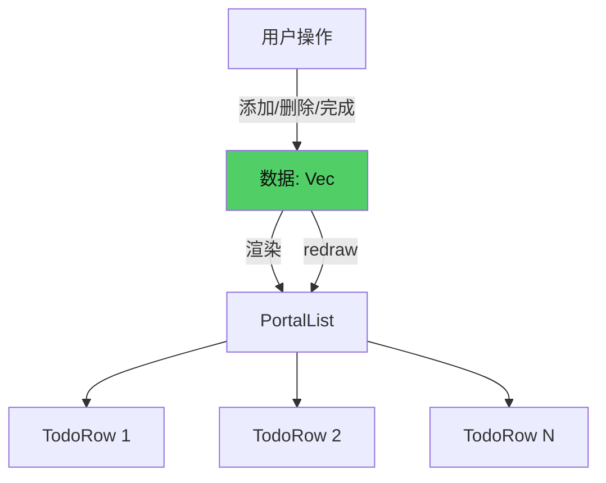
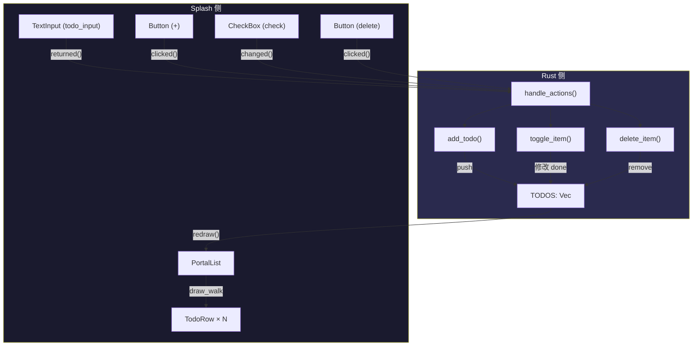

# 第5章：Todo——数据驱动 UI

## 为什么这很重要

Counter 教会了你状态管理和事件响应的基本模式。但 Counter 只有一个数字——现实应用需要管理**一组数据**。Todo 列表就是这类需求的最小案例：一个可变长度的数据列表，每一项可以独立操作（添加、删除、标记完成）。

本章将构建一个完整的 Todo 应用，涉及 Makepad 2.0 的几个新概念：

- **列表渲染**：如何把一组数据映射为一组 Widget
- **模板实例化**：如何用 `let` 模板定义列表项的样式（详见第8章：模板与组合）
- **TextInput 输入处理**：如何接收用户的文字输入
- **PortalList**：Makepad 的虚拟化列表组件

我们会先用纯 Splash 构建一个简化版 Todo（展示核心模式），再分析 `examples/todo/` 中的完整 Rust+Splash 实现。最后对比 React/Flutter 中同样功能的实现方式，突出 Makepad 运行时修改的优势。



---

## 简化版：纯 Splash Todo

先看一个不需要 Rust 代码的 Todo——使用纯 Splash 的 `set_text` 和 `on_render` 模式。这个版本没有虚拟化列表（所有项同时渲染），适合小规模场景：

```splash
let state = { items: ["Buy groceries" "Fix login bug" "Write tests" "Call dentist"] count: 4 }

fn refresh() {
    ui.list_view.render()
    ui.status.set_text("" + state.count + " items")
}

SolidView{width: Fill height: Fit draw_bg.color: #x1a1a2e
    flow: Down spacing: 12 padding: 20

    Label{text: "My Todo" draw_text.color: #xfff draw_text.text_style.font_size: 20}

    View{width: Fill height: Fit flow: Right spacing: 8
        input := TextInput{width: Fill height: Fit empty_text: "What needs to be done?"}
        Button{text: "+" draw_bg.color: #x51cf66 draw_bg.radius: 6.
            padding: Inset{left: 16. right: 16. top: 8. bottom: 8.}
            on_click: ||{
                let text = ui.input.text()
                if text != "" {
                    state.items[state.count] = text
                    state.count = state.count + 1
                    ui.input.set_text("")
                    refresh()
                }
            }
        }
    }

    list_view := View{width: Fill height: Fit flow: Down spacing: 4
        on_render: ||{
            let i = 0
            while i < state.count {
                RoundedView{width: Fill height: Fit draw_bg.color: #x252540 draw_bg.radius: 6.
                    padding: Inset{left: 12. right: 12. top: 8. bottom: 8.}
                    Label{text: state.items[i] draw_text.color: #xddd draw_text.text_style.font_size: 12}
                }
                i = i + 1
            }
        }
    }

    status := Label{text: "4 items" draw_text.color: #x888 draw_text.text_style.font_size: 10}
}
```

这个纯 Splash 版本展示了数据驱动 UI 的核心模式：

1. **数据在 `state` 中**：`items` 数组持有所有 Todo 文本
2. **`on_render` 根据数据生成 UI**：用 `while` 循环为每一项创建一个 `RoundedView`
3. **用户操作修改数据**：`on_click` 向数组添加新项
4. **修改后触发重新渲染**：`refresh()` 调用 `ui.list_view.render()` 让 `on_render` 重新执行

这就是"数据驱动 UI"的本质——UI 是数据的投影。你不需要手动创建、移动、删除 Widget，只需要修改数据然后重新渲染。

和上一章的 Counter 对比，关键的新模式是 `on_render` 中的 `while` 循环。Counter 的 `on_render` 只生成一个 Label；Todo 的 `on_render` 根据数组长度生成 N 个 `RoundedView`。每次 `render()` 被调用，之前的 Widget 会被销毁，新的 Widget 根据当前数据重新创建。这种"每次全量重建"的方式简单但有性能上限——当列表超过几百项时，重建所有 Widget 的开销会变得明显。

纯 Splash 版本的另一个限制是没有删除功能。要实现删除，你需要能在数组中移除元素——Splash 目前的数组操作不支持 `splice` 或 `remove`。这就是为什么完整版 Todo 把数据放在 Rust 侧的 `Vec<TodoItemData>` 中——Rust 的 `Vec::remove()` 可以高效地删除任意位置的元素。

纯 Splash 版本的价值在于**快速原型**和 **AI 生成**。AI Agent 可以在几秒内生成上面的代码，用户立即看到一个可交互的 Todo 原型。当需要添加持久化、同步、删除等高级功能时，再迁移到 Rust + Splash 模式。这种渐进式开发路径（详见第4章）是 Makepad 的核心工作流。

---

## 完整版：`examples/todo/` 分析

纯 Splash 版本适合小规模场景。当 Todo 项数超过几十个时，每次 `on_render` 都重建所有 Widget 会变慢。这就是 `examples/todo/` 中使用 `PortalList` 的原因——它只渲染可见区域内的项目（虚拟化），即使有上千个 Todo 项也能流畅滚动。

### 数据层：Rust 中的 Todo 数据

```rust
#[derive(Clone, Debug)]
struct TodoItemData {
    text: String,
    tag: String,
    done: bool,
}

static TODOS: LazyLock<RwLock<Vec<TodoItemData>>> =
    LazyLock::new(|| RwLock::new(initial_todos()));
```

*来源：`examples/todo/src/main.rs:8-23`*

数据用 Rust 的 `Vec<TodoItemData>` 存储，通过 `static` + `RwLock` 实现全局访问。每个 Todo 项有三个字段：`text`（内容）、`tag`（标签）、`done`（是否完成）。

为什么数据在 Rust 侧而不是 Splash 侧？因为在真实应用中，数据通常来自网络请求或数据库——这些操作只能在 Rust 中完成。把数据放在 Rust 侧是 Makepad 生产应用的标准模式。

### UI 层：Splash 中的 TodoRow 模板

```splash
let TodoRow = RoundedView{
    width: Fill height: Fit
    padding: theme.mspace_2{left: theme.space_3, right: theme.space_3}
    flow: Right spacing: theme.space_2
    align: Align{y: 0.5}
    draw_bg.color: theme.color_bg_container
    draw_bg.border_radius: 10.0

    check := CheckBox{text: ""}
    label := Label{
        width: Fill
        text: "task"
        draw_text.color: theme.color_label_inner
        draw_text.text_style.font_size: theme.font_size_p
    }
    tag := RoundedView{
        width: Fit height: Fit
        padding: theme.mspace_h_1{left: theme.space_2, right: theme.space_2}
        draw_bg.color: theme.color_bg_highlight_inline
        draw_bg.border_radius: 4.0
        tag_label := Label{text: "" ...}
    }
    delete := ButtonFlatter{text: "x" width: 28 height: 28}
}
```

*来源：`examples/todo/src/main.rs:50-85`（简化）*

`TodoRow` 用 `let` 定义了列表项的模板（详见第8章）。每一行包含：一个复选框（`check :=`）、一个文字标签（`label :=`）、一个分类标签（`tag :=`）、一个删除按钮（`delete :=`）。所有需要从 Rust 侧动态设置内容的子组件都用 `:=` 命名。

注意这个模板使用了 `theme.` 变量（如 `theme.color_bg_container`、`theme.space_2`）——这是 Makepad 的主题系统（详见第13章），让 UI 可以适配深色/浅色模式。

### 列表渲染：PortalList

```splash
todo_list := mod.widgets.TodoList{}
```

Todo 列表使用自定义的 `TodoList` Widget，内部包含一个 `PortalList`：

```splash
mod.widgets.TodoList = ...{
    list := PortalList{
        width: Fill height: Fill
        Item := CachedView{TodoRow{}}
        Empty := CachedView{EmptyState{}}
    }
}
```

*来源：`examples/todo/src/main.rs:96-109`（简化）*

`PortalList` 是 Makepad 的虚拟化列表——它只渲染可视区域内的项目。`Item` 和 `Empty` 是两种行模板：有数据时用 `Item`（包含 `TodoRow`），没有数据时显示 `Empty`（空状态提示）。

`CachedView` 包裹 `TodoRow`，启用纹理缓存——已渲染的行被缓存为 GPU 纹理，滚动时直接使用缓存而不重新绘制。这是 PortalList 高性能的关键（详见第15章：列表与虚拟化）。

### 渲染桥梁：`draw_walk` 中的数据绑定

连接 Rust 数据和 Splash 模板的关键代码在 `TodoList` 的 `draw_walk` 方法中：

```rust
impl Widget for TodoList {
    fn draw_walk(&mut self, cx: &mut Cx2d, scope: &mut Scope, walk: Walk) -> DrawStep {
        let todos = TODOS.read().unwrap();
        while let Some(step) = self.view.draw_walk(cx, scope, walk).step() {
            if let Some(mut list) = step.as_portal_list().borrow_mut() {
                list.set_item_range(cx, 0, todos.len());
                while let Some(item_id) = list.next_visible_item(cx) {
                    let item = list.item(cx, item_id, id!(Item));
                    let todo = &todos[item_id];
                    item.check_box(cx, ids!(check)).set_active(cx, todo.done);
                    item.label(cx, ids!(label)).set_text(cx, &todo.text);
                    item.label(cx, ids!(tag.tag_label)).set_text(cx, &todo.tag);
                    item.draw_all_unscoped(cx);
                }
            }
        }
        DrawStep::done()
    }
}
```

*来源：`examples/todo/src/main.rs:210-241`（简化，省略空列表处理）*

逐步分析这段代码：

1. **`TODOS.read().unwrap()`**：获取数据的读锁
2. **`list.set_item_range(cx, 0, todos.len())`**：告诉 PortalList 有多少项数据
3. **`list.next_visible_item(cx)`**：获取下一个需要渲染的可见项 ID（PortalList 只返回可视区域内的项）
4. **`list.item(cx, item_id, id!(Item))`**：为这个 item_id 创建或复用一个 `Item` 模板实例
5. **`item.check_box(...).set_active(cx, todo.done)`**：把 Rust 数据绑定到 Splash Widget
6. **`item.draw_all_unscoped(cx)`**：绘制这一行

这就是 Makepad 的"数据绑定"——不是框架自动的双向绑定，而是在 `draw_walk` 中手动将 Rust 数据设置到 Widget 属性上。这种显式绑定看起来比 React 的 JSX 更繁琐，但它的好处是**零魔法**——你能清楚地看到每个属性是在哪里被设置的，调试时不需要追踪数据流。

### CRUD 操作：Rust 侧的事件处理

**Create（添加）：**

```rust
fn add_todo(&mut self, cx: &mut Cx, text: &str) {
    let text = text.trim();
    if text.is_empty() { return; }
    TODOS.write().unwrap().push(TodoItemData {
        text: text.to_string(),
        tag: String::new(),
        done: false,
    });
    self.ui.text_input(cx, ids!(todo_input)).set_text(cx, "");
    self.sync_status(cx);
    self.ui.redraw(cx);
}
```

*来源：`examples/todo/src/main.rs:249-262`*

添加 Todo：向 `TODOS` Vec 推入新项，清空输入框，更新状态栏，触发重绘。

**Update（标记完成）：**

```rust
fn toggle_item(&mut self, cx: &mut Cx, item_id: usize, checked: bool) {
    if let Some(todo) = TODOS.write().unwrap().get_mut(item_id) {
        todo.done = checked;
    }
    self.sync_status(cx);
    self.ui.redraw(cx);
}
```

*来源：`examples/todo/src/main.rs:270-276`*

**Delete（删除）：**

```rust
fn delete_item(&mut self, cx: &mut Cx, item_id: usize) {
    let mut todos = TODOS.write().unwrap();
    if item_id < todos.len() { todos.remove(item_id); }
    drop(todos);
    self.sync_status(cx);
    self.ui.redraw(cx);
}
```

*来源：`examples/todo/src/main.rs:278-286`*

三个操作的模式完全一致：**修改数据 → 同步状态栏 → 触发重绘**。这就是第4章提到的"状态是唯一真相来源"原则的实际应用。

### 事件分发：MatchEvent

```rust
impl MatchEvent for App {
    fn handle_actions(&mut self, cx: &mut Cx, actions: &Actions) {
        // TextInput 回车
        if let Some((text, _)) = self.ui.text_input(cx, ids!(todo_input)).returned(actions) {
            self.add_todo(cx, &text);
        }
        // "+" 按钮点击
        if self.ui.button(cx, ids!(add_button)).clicked(actions) {
            let text = self.ui.text_input(cx, ids!(todo_input)).text();
            self.add_todo(cx, &text);
        }
        // "Clear completed" 按钮
        if self.ui.button(cx, ids!(clear_done)).clicked(actions) {
            self.clear_done(cx);
        }
        // 列表项内的事件
        let todo_list = self.ui.widget(cx, ids!(todo_list));
        let list = todo_list.portal_list(cx, ids!(list));
        for (item_id, item) in list.items_with_actions(actions) {
            if let Some(checked) = item.check_box(cx, ids!(check)).changed(actions) {
                self.toggle_item(cx, item_id, checked);
            }
            if item.button(cx, ids!(delete)).clicked(actions) {
                self.delete_item(cx, item_id);
            }
        }
    }
}
```

*来源：`examples/todo/src/main.rs:297-320`（简化）*

注意 `list.items_with_actions(actions)` 这个 API——它遍历 PortalList 中所有产生了 action 的项目，返回 `(item_id, item)` 对。`item_id` 就是数据的索引，直接用于查找和修改 `TODOS[item_id]`。

这种"列表项事件 → item_id → 数据索引"的映射是 Makepad 列表交互的标准模式。不需要给每个列表项绑定唯一的回调——PortalList 自动管理 item_id 和实际 Widget 的映射。

---

## 数据流全景

把 Todo 应用的完整数据流画出来：



数据流是单向的：**用户操作 → Rust 事件处理 → 修改数据 → 重绘 UI**。Splash 侧从不直接修改数据，只负责渲染和收集用户事件。

---

## 对比：React 中的 Todo

同样的 Todo 功能在 React 中的核心逻辑：

```jsx
function TodoApp() {
  const [todos, setTodos] = useState([{text: "Buy groceries", done: false}]);
  const [input, setInput] = useState("");

  const addTodo = () => {
    if (!input.trim()) return;
    setTodos([...todos, {text: input, done: false}]);
    setInput("");
  };

  return (
    <div>
      <input value={input} onChange={e => setInput(e.target.value)} />
      <button onClick={addTodo}>+</button>
      {todos.map((todo, i) => (
        <div key={i}>
          <input type="checkbox" checked={todo.done}
            onChange={() => {
              const next = [...todos];
              next[i].done = !next[i].done;
              setTodos(next);
            }} />
          <span>{todo.text}</span>
        </div>
      ))}
    </div>
  );
}
```

两者的核心模式相同：**状态驱动 UI，事件修改状态**。但有几个关键差异：

| 维度 | Makepad (Splash + Rust) | React |
|------|------------------------|-------|
| 列表渲染 | `PortalList` + `draw_walk` | `Array.map()` + virtual DOM diff |
| 虚拟化 | 原生支持（PortalList） | 需要 `react-window` 等三方库 |
| 运行时修改 UI | 可以（修改 Splash 即时生效） | 需要重新编译/打包 |
| AI 修改 UI | Splash 代码可以被 AI 动态替换 | 需要构建工具链参与 |
| 性能 | GPU 渲染，零 GC 暂停 | DOM 操作，JavaScript GC |

Makepad 的核心优势不在于"Todo 写起来更简单"——两者的代码量和复杂度相当。优势在于**运行时能力**：你可以在应用运行时修改 Splash 中的 `TodoRow` 模板，立即看到所有列表项的样式变化，不需要重新编译。这在 React 中是不可能的——JSX 是编译时的。

对于 AI 生成场景，这个差异更加显著。假设你想让 AI 重新设计 Todo 列表的外观——添加渐变背景、改变字体、调整布局。在 React 中，AI 需要生成 JSX + CSS，经过 Babel/Webpack 编译，生成新的 bundle，浏览器重新加载——即使用 Vite 的 HMR，这个链路也是秒级的。在 Makepad 中，AI 通过 WebSocket 发送新的 Splash 代码（新的 `TodoRow` 模板），应用立即渲染——延迟是毫秒级的（详见第11章：流式求值）。

更根本的是，React 的 Todo 和它的构建工具链是耦合的——你不能在没有 Node.js、npm、Webpack 的环境中运行它。Makepad 的 Todo 是一个独立的原生二进制文件，不需要任何运行时环境。Splash 脚本内嵌在 Rust 代码中，在任何支持的平台（macOS、Windows、Linux、Android、iOS、WASM）上编译一次就能运行。

这并不意味着 Makepad 在所有方面都优于 React——React 的生态系统（npm 包、UI 库、开发者社区）远远超过 Makepad。但在"运行时修改 UI"和"AI 动态生成 UI"这两个特定场景中，Makepad 的架构提供了 React 无法比拟的优势。这正是 Canvas Agent-to-App 管线（详见第27章）选择 Makepad 的原因。

---

## 模式提炼

### 模式一：数据-渲染分离

```
Rust 侧：Vec<Data> + 修改方法（add, toggle, delete）
Splash 侧：模板定义（let TodoRow = ...）+ PortalList 渲染
桥梁：handle_actions → 修改数据 → redraw()
```

数据存在 Rust，模板定义在 Splash，渲染逻辑在 `draw_walk` 中连接两者。这是 Makepad 列表应用的标准架构。

### 模式二：PortalList 列表交互

```rust
let list = widget.portal_list(cx, ids!(list));
for (item_id, item) in list.items_with_actions(actions) {
    // item_id = 数据索引
    // item = Widget 引用
    if item.check_box(cx, ids!(check)).changed(actions) { ... }
    if item.button(cx, ids!(delete)).clicked(actions) { ... }
}
```

不需要为每个列表项单独注册事件——`items_with_actions` 自动找出哪些项有用户操作，返回 `(index, widget)` 对供你处理。

### 模式三：统一的 CRUD 尾部

```rust
// 每个 CRUD 操作的结尾都是相同的三步
self.sync_status(cx);  // 1. 更新状态栏
self.ui.redraw(cx);    // 2. 触发重绘
```

把"同步 UI"的逻辑集中在少数几个方法中，避免在每个事件处理器中重复写 redraw 逻辑。

---

## 本章小结

| 概念 | 实现方式 |
|------|---------|
| 数据存储 | Rust: `static TODOS: LazyLock<RwLock<Vec<TodoItemData>>>` |
| 列表模板 | Splash: `let TodoRow = RoundedView{check := ... label := ...}` |
| 虚拟化列表 | `PortalList` + `CachedView` |
| 列表项事件 | `list.items_with_actions(actions)` → `(item_id, item)` |
| CRUD 操作 | Rust 方法修改 Vec → `redraw()` |
| 输入处理 | `TextInput.returned(actions)` / `TextInput.text()` |

核心要点：

1. **数据驱动 UI** = 修改数据 → 触发重绘 → UI 自动反映新状态
2. **PortalList** 提供原生虚拟化列表，性能远超 DOM 列表
3. **Makepad 的运行时优势**在列表场景中尤为明显——修改模板样式即时生效

Part I（入门篇）到此结束。下一步是 Part III 的 Phase 3：回头写第1-2章（设计哲学和环境搭建），然后进入 Part II 的进阶章节。
