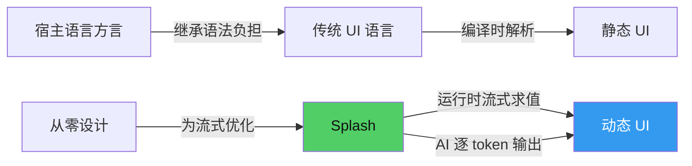
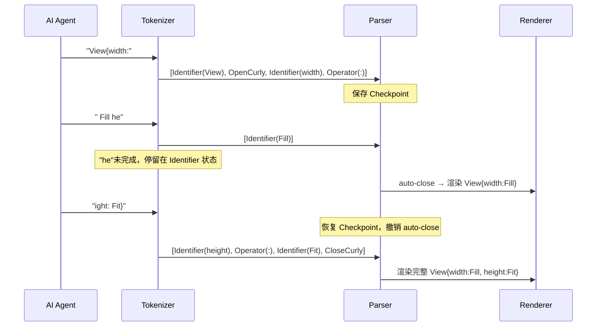

# 第6章：Splash 语法设计哲学

## 为什么这很重要

如果你曾用过 Qt/QML、Flutter、SwiftUI 或 React，你已经习惯了一种模式：UI 描述语言是某种"宿主语言的方言"。QML 是 JavaScript 的扩展，JSX 是 JavaScript 的语法糖，SwiftUI 是 Swift 的 DSL。它们的语法规则——逗号、分号、括号匹配——继承自宿主语言。

Makepad 2.0 做了一个不同的选择：从零设计一种新语言。

这种语言叫 Splash。它没有逗号，没有分号，用空格分隔属性，用花括号嵌套组件。第一次看到 Splash 代码，你会注意到它不像任何你熟悉的语法——它像 JSON 但又不是 JSON，像 CSS 但又不是 CSS。这种"似曾相识又全然不同"的感觉是刻意的。

Splash 的语法设计服务于三个目标：

1. **人类可读性**：去掉所有不承载语义的标点符号，让 UI 描述清晰直白
2. **流式解析**：代码可以逐字符到达，解析器无需等待完整输入即可开始工作
3. **AI 友好性**：更紧凑的表达意味着 AI 生成相同 UI 所需的 token 更少

这三个目标并非巧合。它们指向同一个设计赌注：**UI 描述应该是运行时的、可流式的、AI 可写的**。当你把这三个约束放在一起，大多数现有 UI 语法都无法同时满足。JSON 对机器友好但对人类不友好；XML 对人类可读但关闭标签浪费空间；QML 接近理想但它的 JavaScript 表达式让流式解析变得复杂。

Splash 不是对某种现有语法的改良，它是为 AI 时代专门设计的 UI 语言。本章将通过一个真实的 Splash 应用——番茄钟计时器——来解剖这种语法设计的每一个决策，并深入源码验证这些决策如何被实现。



---

## 初见 Splash：一个番茄钟

在讲解语法规则之前，先看一段真实的 Splash 代码。这是 Canvas 项目中的番茄钟计时器，一个完整的、可运行的应用——84 行代码，包含状态管理、定时器、交互逻辑和 UI 布局。

这里先只看它的 UI 布局部分（已做格式调整以增强可读性）：

```splash
SolidView{width: Fill height: Fit draw_bg.color: #x0a0a12
  flow: Down align: Center spacing: 20
  padding: Inset{left: 40. right: 40. top: 50. bottom: 40.}

  mode_label := Label{text: "FOCUS TIME"
    draw_text.color: #xff6b6b
    draw_text.text_style.font_size: 14}

  timer_label := Label{text: "25:00"
    draw_text.color: #xffffff
    draw_text.text_style.font_size: 64}

  View{height: 20}

  View{width: Fit height: Fit flow: Right spacing: 16 align: Center
    start_btn := Button{text: "Start"
      draw_bg.color: #x51cf66 draw_text.color: #x111111
      padding: Inset{left: 24. right: 24. top: 12. bottom: 12.}
      draw_bg.radius: 6.}
    Button{text: "Reset"
      draw_bg.color: #x444466 draw_text.color: #xccccdd
      padding: Inset{left: 24. right: 24. top: 12. bottom: 12.}
      draw_bg.radius: 6.}
    Button{text: "Skip"
      draw_bg.color: #x333355 draw_text.color: #x9999bb
      padding: Inset{left: 24. right: 24. top: 12. bottom: 12.}
      draw_bg.radius: 6.}
  }
}
```

*来源：`tools/canvas/examples/pomodoro.splash:53-84`（已格式化）*

先不纠结每个属性的含义（详见第7章：属性与容器），注意这段代码的"外观"：

- **没有逗号**——属性之间用空格或换行分隔
- **没有分号**——语句不需要终止符
- **花括号嵌套**——`SolidView{...}` 表示组件及其内容
- **冒号赋值**——`text: "Start"` 而不是 `text = "Start"`
- **点路径属性**——`draw_text.color: #xff6b6b` 而不是嵌套对象
- **内联布局**——多个属性可以写在同一行，也可以分行写

这不是偶然的风格选择。每一条都是经过权衡的设计决策。接下来逐条解剖。

---

## 语法解剖：七条核心规则

### 规则一：空格是分隔符，不是逗号

```splash
width: Fill height: Fit flow: Down spacing: 20
```

在 Splash 中，属性之间用空格（或换行）分隔。不需要逗号，不需要分号。解析器看到 `identifier:` 模式就知道新属性开始了。

对比番茄钟中的按钮行，两个属性紧挨着写：

```splash
draw_bg.color: #x51cf66 draw_text.color: #x111111
```

*来源：`tools/canvas/examples/pomodoro.splash:58`（简化提取）*

中间只有一个空格。`draw_bg.color:` 和 `draw_text.color:` 各自是完整的 `key: value` 对，空格是它们之间的天然边界。

这个设计消除了一类常见的编程错误：漏写逗号。在 JSON 中，`{"a": 1 "b": 2}` 是语法错误——漏了一个逗号。在 Splash 中，`a: 1 b: 2` 天然合法。对于 AI 生成代码来说，少一种可能出错的标点符号意味着更高的生成成功率。

同时，这也意味着 Splash 代码的换行是可选的。你可以一行写多个属性（紧凑），也可以每个属性一行（清晰）：

```splash
// 紧凑风格
Button{text: "OK" draw_bg.color: #x51cf66 draw_bg.radius: 6.}

// 展开风格
Button{
  text: "OK"
  draw_bg.color: #x51cf66
  draw_bg.radius: 6.
}
```

两种写法语义完全相同。这种灵活性让人类和 AI 可以根据场景选择最合适的格式。

### 规则二：花括号是唯一的嵌套结构

```splash
SolidView{ ... }
Inset{left: 40. right: 40. top: 50. bottom: 40.}
```

所有嵌套都用 `{}`。Widget 用 `WidgetName{...}`，内联值对象用 `TypeName{...}`。没有 `<tag></tag>`，没有 `()` 包裹参数，没有 `[]` 做列表。花括号是唯一的嵌套标记。

这意味着解析器只需要跟踪一种括号的匹配深度。对比 XML 和 JSX，关闭标签必须和开启标签的名字匹配（`<View>...</View>`）——如果 AI 在生成过程中写错了关闭标签的名字，整个 UI 描述就崩溃了。而在 Splash 中，关闭永远只是一个 `}`。

更进一步，这让流式解析器在遇到 `}` 时不需要回头查找对应的开启标签名——它只需要弹出括号栈。这在 AI 逐 token 输出的场景下是重要的简化。

### 规则三：冒号赋值，不是等号

```splash
text: "Start"
width: Fill
draw_bg.color: #x51cf66
```

Splash 用 `:` 做属性赋值，不用 `=`。这和 JSON、YAML、CSS 一致，而不是 JavaScript 或 Rust 的 `=`。

选择 `:` 而不是 `=` 有一个实际原因：在 Splash 的脚本部分（函数和逻辑代码），`=` 用于变量赋值：

```splash
pomo.running = false        // 脚本赋值用 =
text: "Start"               // 属性声明用 :
```

*来源：`tools/canvas/examples/pomodoro.splash:21,58`（分别取自函数和 UI 部分）*

两种语义用两种符号，解析器可以仅凭符号类型区分"正在声明 UI 属性"还是"正在执行脚本赋值"。这种区分对流式解析也有帮助——遇到 `:` 就知道是在 UI 描述区域，遇到 `=` 就知道是在脚本区域。

### 规则四：点路径展平嵌套

```splash
draw_text.text_style.font_size: 14
```

*来源：`tools/canvas/examples/pomodoro.splash:54`*

而不是：

```json
{
  "draw_text": {
    "text_style": {
      "font_size": 14
    }
  }
}
```

点路径是 Splash 最节省空间的设计之一。三层嵌套被压缩成一行。这不只是语法糖——它改变了代码的认知负担。读者不需要在脑中维护缩进层级，属性的完整路径在一行内自解释。

点路径还解决了一个更微妙的问题：在嵌套对象语法中，添加一个深层属性需要正确地嵌套多层花括号，任何一层的遗漏都会导致语法错误。在点路径语法中，每个属性都是独立的一行，互不干扰：

```splash
draw_bg.color: #x1e1e2e
draw_bg.border_radius: 10.0
draw_text.color: #xffffff
draw_text.text_style.font_size: 14
```

即使删除其中任意一行，其余行仍然是合法的 Splash 代码。这种"每行独立"的特性让 AI 在流式生成时更加安全——即使输出被截断，已经输出的部分仍然可以被正确解析。

### 规则五：浮点数用尾部点号

```splash
padding: Inset{left: 40. right: 40. top: 50. bottom: 40.}
draw_bg.radius: 6.
```

*来源：`tools/canvas/examples/pomodoro.splash:53,58`（简化提取）*

`40.` 而不是 `40.0`。Splash 的数字字面量中，尾部的 `.` 表示"这是浮点数"。tokenizer 通过检查 `.` 的存在来区分整数和浮点数——没有 `.`、没有 `e`/`E` 的数字被解析为 `U40`（整数），有 `.` 的被解析为 `F64`（浮点数）：

```rust
// 简化自 platform/script/src/tokenizer.rs:369-390
if !(self.temp.contains('.') || self.temp.contains('e')
    || self.temp.contains('E'))
    && v <= 0xFF_FFFF_FFFFu64 as f64
{
    // → 解析为整数 U40
    token: ScriptToken::U40(v as u64),
}
// → 否则解析为浮点数 F64
token: ScriptToken::F64(number),
```

*来源：`platform/script/src/tokenizer.rs:369-390`（简化展示，中文注释为译注）*

这是一个典型的"小决策大收益"：少写一个字符 `0`，但它出现在每一个浮点数值上。在番茄钟的 UI 部分中，有 16 个浮点数值（padding、radius 等），每个节省一个字符，累计节省 16 个字符。在更大的应用中，这种节省会更加显著。

### 规则六：十六进制颜色的 `#x` 前缀

```splash
draw_bg.color: #x0a0a12
draw_text.color: #xff6b6b
```

*来源：`tools/canvas/examples/pomodoro.splash:53-54`*

大多数颜色值用 `#` 前缀就够了（如 `#f00`、`#ff0000`）。但当十六进制颜色包含字母 `e` 时，tokenizer 会把它当作科学计数法的指数符号。`#1e1e2e` 中的 `1e1` 被解析为 `10.0`，而不是颜色值的一部分。

解决方案：`#x` 前缀。`#x1e1e2e` 明确告诉 tokenizer"这是颜色"。这是一个务实的妥协——为了保持 tokenizer 的简单性（不需要回溯来判断 `e` 到底是颜色值还是指数），用一个额外的字符消除歧义。

在实际开发中，建议始终使用 `#x` 前缀——即使颜色值中没有 `e`。这样做的好处是统一风格，消除"这个颜色需不需要 `#x`"的心智负担。番茄钟的代码就采用了这个惯例：所有颜色都用 `#x` 前缀。

### 规则七：组件声明即实例化

```splash
SolidView{ ... }
Label{text: "FOCUS TIME" ...}
Button{text: "Start" ...}
```

在 Splash 中，写 `Button{text: "Start"}` 就是创建一个 Button 实例并设置其 text 属性。没有 `new`、没有 `createElement`、没有 `@Component` 装饰器。组件名后跟花括号就是声明加实例化。

这使得 Splash 代码的结构和最终 UI 的 Widget 树是同构的——代码的嵌套结构就是 UI 的嵌套结构。一个 `SolidView` 包含两个 `Label` 和一个 `View`，代码中的缩进就直接反映了这种父子关系。

对比 React 中需要 `import` 组件、调用 `createElement`（或使用 JSX 编译器将标签转换为函数调用），Splash 跳过了这些中间步骤。组件名以大写字母开头就是组件——这是 Splash 唯一的约定。这个简化对 AI 生成特别有利：AI 不需要知道某个组件是否已经导入，不需要管理 import 列表，直接写组件名和属性就行。

---

## 为什么这样设计：与四种语法的对比

现在把同一个 UI 片段——番茄钟的按钮区域——用五种不同的语法表达，来具体量化 Splash 设计的效果。

### 同一 UI 的五种表达

**Splash：**

```splash
View{width: Fit height: Fit flow: Right spacing: 16
  Button{text: "Start" draw_bg.color: #x51cf66 draw_bg.radius: 6.}
  Button{text: "Reset" draw_bg.color: #x444466 draw_bg.radius: 6.}
}
```

**JSON（假设 JSON-based UI DSL）：**

```json
{
  "type": "View",
  "width": "Fit",
  "height": "Fit",
  "flow": "Right",
  "spacing": 16,
  "children": [
    {
      "type": "Button",
      "text": "Start",
      "draw_bg": {"color": "#51cf66", "radius": 6.0}
    },
    {
      "type": "Button",
      "text": "Reset",
      "draw_bg": {"color": "#444466", "radius": 6.0}
    }
  ]
}
```

**XML：**

```xml
<View width="Fit" height="Fit" flow="Right" spacing="16">
  <Button text="Start" draw_bg.color="#51cf66" draw_bg.radius="6.0"/>
  <Button text="Reset" draw_bg.color="#444466" draw_bg.radius="6.0"/>
</View>
```

**JSX（React 风格）：**

```jsx
<View width="Fit" height="Fit" flow="Right" spacing={16}>
  <Button text="Start" drawBg={{color: "#51cf66", radius: 6.0}} />
  <Button text="Reset" drawBg={{color: "#444466", radius: 6.0}} />
</View>
```

**QML（Qt Quick 风格）：**

```qml
Row {
    spacing: 16
    Button {
        text: "Start"
        background: Rectangle {
            color: "#51cf66"
            radius: 6.0
        }
    }
    Button {
        text: "Reset"
        background: Rectangle {
            color: "#444466"
            radius: 6.0
        }
    }
}
```

### 语法对比矩阵

| 维度 | Splash | JSON | XML | JSX | QML |
|------|--------|------|-----|-----|-----|
| 属性分隔符 | 空格 | 逗号 `,` | 空格 | 空格 | 换行/分号 |
| 赋值符 | `:` | `:` | `=` | `=` / `{}` | `:` |
| 嵌套标记 | `{}` | `{}` `[]` | `<>` `</>` | `<>` `</>` `{}` | `{}` |
| 关闭标记 | `}` | `}` `]` | `</Tag>` | `</Tag>` | `}` |
| 嵌套属性 | 点路径 | 嵌套对象 | 属性或嵌套 | 嵌套对象 | 子组件嵌套 |
| 类型声明 | 组件名 | `"type":` 字段 | 标签名 | 标签名 | 组件名 |
| 流式解析友好度 | 高 | 低 | 中 | 中 | 中 |
| 闭合匹配复杂度 | 仅 `}` | `}` `]` `"` | 标签名匹配 | 标签名匹配 | 仅 `}` |

关于"流式解析友好度"的评分说明：

- **Splash（高）**：tokenizer 和 parser 都原生支持增量输入，无需分隔符确认属性边界
- **JSON（低）**：严格依赖括号和逗号匹配，部分 JSON 无法被确定性解析
- **XML/JSX（中）**：标签结构可以增量解析，但关闭标签需要名字匹配；JSX 中的 `{expression}` 需要完整的 JavaScript 表达式求值
- **QML（中）**：花括号嵌套可以增量解析，但属性值可以包含 JavaScript 表达式

### 字符效率对比

直接对比上述五个代码片段的字符数：

| 语法 | 字符数 | 相对 Splash | 主要开销来源 |
|------|--------|-------------|-------------|
| **Splash** | **~155** | **1.0x** | — |
| XML | ~195 | 1.26x | 关闭标签 `</View>` |
| JSX | ~210 | 1.35x | 关闭标签 + `{{}}` 嵌套 |
| QML | ~240 | 1.55x | 子组件 `Rectangle{}` 嵌套 |
| JSON | ~320 | 2.06x | 引号、逗号、`"type":` 字段、`"children":` 数组 |

Splash 的字符效率主要来自三个方面：

1. **无冗余标点**：没有逗号、引号（对非字符串值）、闭合标签
2. **点路径**：`draw_bg.color: #x51cf66` vs JSON 的 `"draw_bg": {"color": "#51cf66"}`
3. **隐式类型**：组件名即类型，不需要 `"type": "Button"` 这样的显式声明

这种紧凑性的最大受益者是 JSON 对比——Splash 大约只需要 JSON 一半的字符。对 XML 和 JSX，优势在 25-35% 左右。对 QML，优势主要来自点路径 vs 子组件嵌套。

需要注意的是，字符数和 token 数不是线性关系——不同 tokenizer 对不同语法结构的编码效率不同。但字符数是一个合理的近似：更少的字符通常意味着更少的 token，也意味着 AI 生成相同 UI 所需的时间更短。

---

## 源码佐证：为流式设计的 tokenizer 和 parser

Splash 的语法选择不是拍脑袋的结果。打开 `tokenizer.rs` 的第一行注释：

```rust
// Makepad script streaming tokenizer
```

*来源：`platform/script/src/tokenizer.rs:1`*

"streaming tokenizer"——这两个词定义了整个语法设计的出发点。

### tokenizer 的状态机

Splash 的 tokenizer 是一个字符级状态机，只有 14 个状态：

```rust
enum State {
    Whitespace,           // 初始状态和空白
    Identifier,           // 标识符（组件名、属性名、关键字）
    Operator,             // 运算符（: = + - . 等）
    RustValue,            // Rust 互操作值
    Number,               // 数字
    Color,                // 颜色值（# 开头）
    String(bool),         // 字符串（true=双引号, false=单引号）
    EscapeInString(bool), // 字符串中的转义序列
    UnicodeHexInString(bool),   // \xNN 转义
    UnicodeCurlyInString(bool), // \u{NNNN} 转义
    AsciiHexInString(bool),     // \uNNNN 转义
    BlockComment(usize),  // 块注释 /* */
    MaybeEndBlock(usize), // 块注释可能结束（看到 *）
    LineComment,          // 行注释 //
}
```

*来源：`platform/script/src/tokenizer.rs:226-242`*

14 个状态中，8 个是字符串处理和注释的子状态。核心的文本处理只有 6 个主状态：`Whitespace`、`Identifier`、`Operator`、`RustValue`、`Number`、`Color`。一个能描述完整 UI 应用的语言（包含布局、样式、颜色、数值），tokenizer 只需要 6 个主状态——这是语法简洁的直接证据。

作为对比，一个标准的 JSON tokenizer 需要处理字符串转义（6种）、数字精度（整数/浮点/指数）、Unicode 多字节、true/false/null 字面量等。状态数可能不多，但每个状态的分支逻辑要复杂得多——因为 JSON 的语法规则（引号必须匹配、逗号必须精确放置）给 tokenizer 增加了额外的验证负担。

### 为什么没有逗号：tokenizer 的视角

看 tokenizer 如何处理分隔符：

```rust
fn is_separator(c: char) -> bool {
    c == ',' || c == ';'
}
```

*来源：`platform/script/src/tokenizer.rs:618-619`*

逗号和分号被识别为 `Separator` token，但它们**不是必需的**——tokenizer 将它们当作空白处理。这意味着你可以写逗号也可以不写，两种风格在语法上完全等价。实际上，从 Makepad 1.x `live_design!` 迁移过来的代码大量使用逗号，Splash 继续接受它们以保持向后兼容。当前的指导是"匹配周围代码风格"——在新项目中推荐省略逗号（更简洁），在已有项目中保持一致即可。

在 `Whitespace` 状态下，遇到新的标识符就自动开始新属性，无需先看到分隔符：

```rust
State::Whitespace => {
    if c.is_numeric() {
        self.state = State::Number;
        self.temp.push(c);
    } else if c == '_' || c == '$' || c.is_alphabetic() {
        self.state = State::Identifier;
        self.temp.push(c);
    } else if c == '#' {
        self.state = State::Color;
    } else if is_separator(c) {
        self.emit_separator(c);  // 接受但不要求
    } else if is_operator(c) {
        self.state = State::Operator;
        self.temp.push(c);
    }
    // ...
}
```

*来源：`platform/script/src/tokenizer.rs:647-668`*

空白状态下，遇到字母就进入 `Identifier` 状态，遇到数字就进入 `Number` 状态。**不需要先看到逗号来确认"上一个值已结束"**。逗号如果出现，会被接受（`emit_separator`）但不是必须的。这就是"空格作为分隔符"的实现基础：属性边界由 token 类型的转换来确定，而不是由显式的分隔符来标记。

### 流式 tokenize 的关键：增量输入

```rust
pub fn tokenize(&mut self, new_chars: &str, heap: &mut ScriptHeap)
    -> &[ScriptTokenPos]
```

*来源：`platform/script/src/tokenizer.rs:596`*

`tokenize` 方法接收 `new_chars`——不是完整的源码，而是新到达的字符片段。tokenizer 将内部状态（`self.state`、`self.unfinished`、`self.temp`）保持在 struct 中，在每次调用之间延续上下文。`ScriptToken::StreamEnd` 标记"当前输入结束但后续可能还有更多内容到达"。

这就是为什么 Splash 不需要逗号和分号的深层原因：**在流式场景下，你不知道输入何时结束**。如果语法依赖逗号来分隔属性，那么在 AI 输出 `text: "Start"` 之后、逗号之前，解析器无法确定这个属性是否完整。而 Splash 的设计中，看到下一个 `identifier:` 或 `}` 就自然结束上一个属性——无需等待任何分隔符。

### parser 的流式支持：ParserCheckpoint

流式设计不仅在 tokenizer 层面，parser 也原生支持增量解析。`parser.rs` 定义了 `ParserCheckpoint` 结构：

```rust
/// Snapshot of parser state that can be restored for incremental parsing.
/// Captures the state before auto-close so we can undo those synthetic
/// closings when more source arrives.
pub struct ParserCheckpoint {
    pub opcodes_len: usize,
    pub source_map_len: usize,
    pub token_index: u32,
    state: Vec<State>,
    destruct_defaults_len: usize,
    nested_patterns_len: usize,
    /// The last opcode before the checkpoint, saved because auto-close's
    /// set_pop_to_me() mutates it in place. Must be restored on continuation.
    last_opcode: Option<ScriptValue>,
}
```

*来源：`platform/script/src/parser.rs:738-751`*

这个设计揭示了 Splash 流式解析的工作机制：当一批新 token 到达时，parser 先保存当前状态（checkpoint），然后尝试解析新 token。如果解析成功，状态向前推进。如果输入在中途断开（比如 AI 还没输出完），parser 会"自动关闭"未完成的结构（auto-close），让已有的 UI 可以被渲染。当更多 token 到达时，parser 恢复到 checkpoint，撤销之前的自动关闭，继续解析完整的输入。

这是一种"乐观解析"策略：即使输入不完整，也渲染已有的部分。这正是 AI 逐 token 输出时用户看到 UI 逐步成型的技术基础（详见第11章：流式求值）。



---

## 模式提炼

从 Splash 的语法设计中，可以提炼出三条可复用的 UI 语言设计模式。

### 模式一：分隔符最小化

**问题**：逗号、分号等分隔符不承载语义，但消耗字符和 token，且要求精确放置。漏写一个逗号就导致语法错误。

**方案**：用空格作为天然分隔符，通过 `key:` 模式（identifier 后跟冒号）识别属性边界。

**前提条件**：语言的 token 类型足够清晰（标识符、数字、字符串、运算符各有明确的起始字符），使得解析器仅凭 token 类型就能判断属性边界，无需显式分隔符。

**收益**：
- 减少约 15% 的字符数（每个省略的逗号 = 1 个字符）
- 消除"漏写逗号"类的语法错误
- 简化流式解析——无需等待分隔符确认属性完整性

**局限**：如果属性值本身是标识符（如 `width: Fill`），那么紧跟其后的下一个标识符需要能被区分为"新属性"还是"当前值的延续"。Splash 通过约定解决这个问题：属性名后面必须紧跟 `:`，而值不会以 `:` 结尾。

### 模式二：点路径展平

**问题**：嵌套属性需要多层花括号或对象字面量，增加缩进深度、认知负担和字符数。

**方案**：`draw_text.text_style.font_size: 14` 一行表达三层嵌套。

**前提条件**：属性的层级结构是静态已知的（Widget 的属性路径在编译时确定）。如果属性路径是动态的（比如用变量作为属性名），点路径就不适用。

**收益**：
- 减少嵌套深度，每个属性独立一行
- 提高单行可读性——一行内就能看到属性的完整路径
- 截断安全——删除任意一行点路径属性，其余行仍然合法

**局限**：对于需要同时设置同一对象多个属性的场景，点路径会导致路径前缀重复（如 `draw_text.color:` / `draw_text.text_style.font_size:`）。Splash 用合并运算符 `+:` 来处理这种情况，但那属于高级用法。

### 模式三：流式优先设计

**问题**：传统语法需要完整输入才能解析。JSON 需要匹配所有括号，XML 需要匹配所有闭合标签。在输入不完整时，解析器只能等待或报错。

**方案**：从 tokenizer 到 parser 的全链路支持增量输入：
- tokenizer 的 `tokenize(new_chars)` 接受字符片段
- parser 的 `ParserCheckpoint` 支持状态快照和回滚
- auto-close 机制让不完整的输入也能产生可渲染的 UI

**前提条件**：语法中不存在需要"向前看多步"才能确定含义的结构。每个 token 的含义在它被读取时就能确定。

**收益**：AI 逐 token 输出时，UI 可以逐步渲染。用户看到的不是"等待……等待……完整 UI 出现"，而是 UI 逐渐成型的过程。这种体验从根本上改变了 AI 生成 UI 的交互感受——从"等待结果"变为"观看构建"（详见第11章：流式求值，第27章：Canvas 架构剖析）。

---

## 本章小结

Splash 的语法不是"简化版 JSON"或"无逗号 QML"。它是一种为三个约束条件同时优化的语言：

| 设计约束 | 关键设计决策 | 实现效果 |
|---------|-----------|---------|
| 人类可读性 | 去掉逗号/分号，点路径展平嵌套 | 更少的视觉噪音，每行自解释 |
| 流式解析 | 增量 tokenizer + parser checkpoint + auto-close | 部分输入即可解析和渲染 |
| AI 友好性 | 最小化标点，紧凑表达，组件名即类型 | 比 JSON 少约一半字符，更高的生成成功率 |

这三个约束的交集定义了 Splash 的设计空间。下一章将深入 Splash 的属性系统——`draw_bg`、`draw_text`、布局属性的完整用法，以及那些让人踩坑的常见陷阱（详见第7章：属性与容器）。
