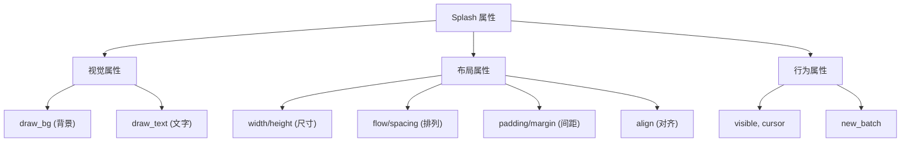

# 第7章：属性与容器

## 为什么这很重要

上一章讲了 Splash 的语法哲学——空格分隔、点路径、花括号嵌套。但"知道语法规则"和"能写出好看的 UI"之间还有一段距离。这段距离就是**属性系统**和**容器组件**。

属性系统决定了你如何控制 UI 的外观：颜色、字体、间距、圆角、阴影。容器组件决定了你如何组织 UI 的结构：水平排列、垂直堆叠、滚动区域。两者结合，就是 Splash 中"从空白到完整界面"的全部工具集。

本章以 Canvas 的 token-dashboard 应用为贯穿示例，系统讲解三类属性（视觉、布局、行为）和容器组件家族。读完本章，你应该能够仅凭 Splash 代码构建出一个有层次、有样式的完整界面。



---

## 属性系统总览

### 三类属性

Splash 的属性可以分为三类，每类的命名模式和用途不同：

**视觉属性**——以 `draw_bg` 和 `draw_text` 开头，控制组件的渲染外观：

```splash
draw_bg.color: #x161628           // 背景颜色
draw_bg.radius: 8.                // 圆角半径
draw_text.color: #xeeeeff         // 文字颜色
draw_text.text_style.font_size: 20  // 字号
```

*来源：`tools/canvas/examples/token-dashboard.splash:5,12`*

视觉属性的命名规律：`draw_bg` 前缀控制背景渲染（颜色、圆角、边框、阴影），`draw_text` 前缀控制文字渲染（颜色、字体、字号）。所有视觉属性都通过点路径设置，不需要嵌套。

**布局属性**——控制组件的尺寸和子组件的排列方式：

```splash
width: Fill height: Fit           // 尺寸
flow: Down spacing: 20            // 垂直排列，间距 20px
padding: Inset{left: 32. right: 32. top: 24. bottom: 24.}  // 内边距
align: Align{y: 0.5}             // 垂直居中
```

*来源：`tools/canvas/examples/token-dashboard.splash:1,4`*

**行为属性**——控制组件的交互和渲染行为：

```splash
visible: true                     // 是否可见
new_batch: true                   // 开启新渲染批次
cursor: MouseCursor.Hand          // 鼠标指针样式
clip_x: true                      // 水平裁剪
```

*来源：`splash.md:452-460`*

### dot-path 的工作机制

在第6章我们已经见过点路径语法（详见第6章：Splash 语法设计哲学，规则四）。现在深入理解它的工作方式。

当你写 `draw_bg.color: #x161628` 时，Splash 做了什么？这等价于：

```splash
draw_bg +: { color: #x161628 }
```

`+:` 是合并运算符——它不是替换整个 `draw_bg`，而是在现有的 `draw_bg` 对象上修改 `color` 字段。这意味着你可以分多行设置同一个子对象的不同属性，而不会互相覆盖：

```splash
draw_bg.color: #x161628           // 设置颜色
draw_bg.radius: 8.         // 设置圆角（不影响颜色）
draw_bg.border_color: #x333355    // 设置边框色（不影响上面两个）
```

每一行都只修改点路径指向的那个字段，其他字段保持不变。这就是为什么点路径在 Splash 中如此安全——你可以放心地逐行添加或删除属性，不用担心副作用。

---

## 容器组件：View 家族

### 为什么有这么多 View？

Splash 有超过 15 种容器组件，全部继承自 `ViewBase`。初看让人困惑：为什么不能只用一个 `View` 加不同的属性？

原因是性能。每种容器使用不同的 GPU shader。`View` 不画任何背景（零 GPU 开销）；`SolidView` 用最简单的纯色 shader；`RoundedView` 需要计算圆角的 SDF（Signed Distance Field）。把这些能力分开，可以让每个组件只承担它需要的 GPU 计算量。

### 常用容器速查

| 容器 | 背景 | 形状 | 使用场景 |
|------|------|------|---------|
| `View` | 无 | — | 纯布局容器，不需要背景 |
| `SolidView` | 纯色 | 矩形 | 页面背景、分隔区域 |
| `RoundedView` | 纯色 | 圆角矩形 | 卡片、按钮容器、标签 |
| `RoundedShadowView` | 纯色+阴影 | 圆角矩形 | 悬浮卡片、弹窗 |
| `CircleView` | 纯色 | 圆形 | 头像、状态指示器 |
| `GradientXView` | 水平渐变 | 矩形 | 装饰背景 |
| `GradientYView` | 垂直渐变 | 矩形 | 装饰背景 |

*来源：`splash.md:414-430`*

### 三种最常用的容器

**View——不可见的布局容器**

```splash
View{width: Fill height: Fit flow: Right spacing: 16
    Label{text: "Left"}
    Filler{}
    Label{text: "Right"}
}
```

`View` 不绘制任何背景，GPU 开销为零。它是纯粹的布局工具——用来排列子组件。当你只需要"把几个东西横着排"或"把几个东西竖着排"时，用 `View`。

上面的例子展示了一个经典的 Splash 布局技巧：用 `Filler{}` 将左右两个元素推到两端。`Filler` 是一个宽度为 `Fill` 的空组件，它占满中间的所有可用空间，把后面的元素推到最右边。这比 CSS 的 `justify-content: space-between` 更直观——你能在代码中"看到"那个占位的空间。

`View` 的另一个常见用途是作为"间距块"——不需要任何属性，只用固定高度制造垂直间距：

```splash
View{height: 20}    // 20px 的空白间距
```

token-dashboard 中多次使用这个技巧来分隔不同区域。

**SolidView——纯色背景容器**

```splash
SolidView{width: Fill height: Fit draw_bg.color: #x0c0c18
    flow: Down padding: 20
    Label{text: "Content on dark background"
        draw_text.color: #xeeeeff}
}
```

*来源：`tools/canvas/examples/token-dashboard.splash:1`（简化）*

`SolidView` 已经默认设置了 `show_bg: true`，你只需要通过 `draw_bg.color` 设置颜色。它使用最简单的矩形 shader，没有圆角，没有阴影。

**RoundedView——圆角卡片容器**

```splash
RoundedView{width: Fill height: Fit
    draw_bg.color: #x161628
    draw_bg.radius: 8.
    padding: Inset{left: 20. right: 20. top: 16. bottom: 16.}
    flow: Down spacing: 6
    Label{text: "Input Tokens"
        draw_text.color: #x888899
        draw_text.text_style.font_size: 10}
    Label{text: "48.5M"
        draw_text.color: #xcc66ff
        draw_text.text_style.font_size: 28}
}
```

*来源：`tools/canvas/examples/token-dashboard.splash:12-15`（格式化）*

`RoundedView` 是最常用的"有外观"容器。通过 `draw_bg.radius` 设置圆角半径，通过 `draw_bg.color` 设置背景色。token-dashboard 中的每个卡片都是一个 `RoundedView`。

### 滚动容器

当内容超出视区时，使用滚动容器：

```splash
ScrollYView{width: Fill height: Fill
    flow: Down spacing: 8
    // 很多子组件...
}
```

| 容器 | 滚动方向 |
|------|---------|
| `ScrollXView` | 水平 |
| `ScrollYView` | 垂直 |
| `ScrollXYView` | 双向 |

*来源：`splash.md:432-437`*

---

## 视觉属性详解

### draw_bg：背景属性

`draw_bg` 是所有带背景容器的视觉属性根。以下是常用属性：

```splash
// 基础
draw_bg.color: #x334455           // 背景色（所有带背景容器）

// 圆角（RoundedView 系列）
draw_bg.radius: 8.                // 圆角半径

// 边框（RectView、RoundedView 等）
draw_bg.border_size: 1.           // 边框宽度
draw_bg.border_color: #x888888    // 边框颜色

// 阴影（RoundedShadowView、RectShadowView）
draw_bg.shadow_radius: 10.        // 阴影模糊半径
draw_bg.shadow_color: #x0007      // 阴影颜色
draw_bg.shadow_offset: vec2(0 3)  // 阴影偏移方向

// 渐变（GradientXView、GradientYView，或任何带背景的容器）
draw_bg.color: #x334455           // 渐变起始色
draw_bg.color_2: vec4(0.2 0.1 0.3 1.0)  // 渐变结束色
```

*来源：`splash.md:499-514`*

**属性与容器的匹配关系**是一个重要的概念：不是所有属性在所有容器上都有效。`draw_bg.radius` 在 `SolidView` 上无效（它没有圆角 shader），`shadow_radius` 在非 Shadow 容器上无效。如果你在错误的容器上设置了这些属性，Splash 不会报错——属性会被静默忽略，这是初学者困惑的常见来源。

下表总结了哪些属性在哪些容器上有效：

| 属性 | View | SolidView | RoundedView | ShadowView | CircleView |
|------|------|-----------|-------------|------------|------------|
| `draw_bg.color` | — | 有效 | 有效 | 有效 | 有效 |
| `draw_bg.radius` | — | — | 有效 | 有效 | — |
| `draw_bg.border_size` | — | — | 有效 | 有效 | — |
| `draw_bg.shadow_radius` | — | — | — | 有效 | — |
| `draw_bg.color_2` | — | — | — | — | — |

（GradientXView/GradientYView 支持 `color` 和 `color_2` 渐变）

**颜色格式**

```splash
#f00               // RGB 短格式
#ff0000            // RGB 完整格式
#ff0000ff          // RGBA
#x1e1e2e           // 含 e 的十六进制用 #x 前缀
#0000              // 完全透明
vec4(1.0 0.0 0.0 1.0)  // RGBA 向量
```

*来源：`splash.md:352-360`*

### draw_text：文字属性

`draw_text` 控制文本的外观：

```splash
draw_text.color: #xffffff                    // 文字颜色
draw_text.text_style.font_size: 14           // 字号
draw_text.text_style: theme.font_bold{}      // 使用粗体
draw_text.text_style: theme.font_code{}      // 使用等宽字体
```

*来源：`splash.md:560-571`*

可用字体：

| 值 | 说明 |
|----|------|
| `theme.font_regular` | 常规体（默认） |
| `theme.font_bold` | 粗体 |
| `theme.font_italic` | 斜体 |
| `theme.font_bold_italic` | 粗斜体 |
| `theme.font_code` | 等宽代码体 |
| `theme.font_icons` | 图标字体 |

**重要：默认文字颜色是白色（`#fff`）。** 在浅色背景上，你必须显式设置 `draw_text.color` 为深色，否则文字不可见（白字白底）。

---

## 布局属性详解

### 尺寸：width 和 height

每个组件都有 `width` 和 `height`，值是 `Size` 枚举：

```splash
width: Fill           // 填满可用空间（默认值）
width: Fit            // 收缩到内容大小
width: 200            // 固定 200px
width: Fill{min: 100 max: 500}  // 填满，但限制在 100-500px
height: Fit{max: Abs(300)}      // 收缩，但最大 300px
```

*来源：`splash.md:362-371`*

**Fill**：组件尽可能大，占满父容器给它的空间。`width` 和 `height` 的默认值都是 `Fill`。当父容器是 `flow: Right` 时，多个 `width: Fill` 的子组件会平分可用宽度。

**Fit**：组件尽可能小，刚好容纳子组件。当你写 `width: Fit` 时，组件的宽度由它最宽的子组件决定。**大多数容器需要显式设置 `height: Fit`**——这是本章最重要的陷阱之一（后面会详细讲）。

**Fixed（数字）**：固定像素大小。`width: 200` 表示固定 200px，不随父容器缩放。

**带约束的 Fill/Fit**：可以给 Fill 和 Fit 加上最小/最大限制：

```splash
width: Fill{min: 100 max: 500}    // 填满，但宽度限制在 100-500px
height: Fit{max: Abs(300)}         // 收缩到内容，但最多 300px
```

这在响应式布局中很有用——比如一个卡片的宽度填满父容器，但不超过 500px。

**理解 Fill vs Fit 是 Splash 布局的核心**。一个简单的心智模型：

- `Fill` = "给我多少空间我占多少"（向外扩张）
- `Fit` = "我的内容有多大我就多大"（向内收缩）

token-dashboard 的卡片区域完美展示了这两者的配合：外层 `View{flow: Right}` 包含四个 `RoundedView{width: Fill}`——四个 Fill 平分水平空间，每个卡片占 25% 宽度。每个卡片内部 `height: Fit`——高度由内容（标题+数值两行文字）决定。

### 排列方向：flow

`flow` 决定子组件的排列方向：

```splash
flow: Right                      // 默认，从左到右
flow: Down                       // 从上到下
flow: Overlay                    // 堆叠（后面的覆盖前面的）
flow: Flow.Right{wrap: true}     // 从左到右，自动换行
flow: Flow.Down{wrap: true}      // 从上到下，自动换列
```

*来源：`splash.md:375-382`*

token-dashboard 用 `flow: Down` 做页面的垂直布局，用 `flow: Right` 做卡片的水平排列：

```splash
// 页面级：垂直排列各区块
SolidView{... flow: Down spacing: 20
    // 标题栏：水平排列标题和副标题
    View{... flow: Right align: Align{y: 0.5}
        Label{text: "March 2025 Token Usage" ...}
        Filler{}
        Label{text: "Claude Code" ...}
    }
    // 卡片区：水平排列四张卡片
    View{... flow: Right spacing: 16
        RoundedView{...}
        RoundedView{...}
        RoundedView{...}
        RoundedView{...}
    }
}
```

*来源：`tools/canvas/examples/token-dashboard.splash:1-28`（结构简化）*

### 间距：spacing, padding, margin

```splash
spacing: 16           // 子组件之间的间距（16px）
padding: 20           // 组件内部的统一内边距
padding: Inset{top: 24. bottom: 24. left: 32. right: 32.}  // 四边独立内边距
margin: Inset{top: 8. bottom: 8.}  // 外边距
```

*来源：`splash.md:384-391`*

- **spacing**：子组件之间的间距，类似 CSS 的 `gap`。只作用于相邻子组件之间，第一个子组件前面和最后一个子组件后面没有间距
- **padding**：组件边界到内容区域的距离。裸数字表示四边统一，`Inset{}` 表示四边独立
- **margin**：组件自身到外部的距离。用法和 padding 相同

padding 的两种写法在实践中的选择：

```splash
// 四边统一：简洁
padding: 20

// 上下和左右不同：用 Inset
padding: Inset{top: 24. bottom: 24. left: 32. right: 32.}

// 只设置某些方向（其他方向默认 0）
padding: Inset{left: 16. right: 16.}
```

token-dashboard 的设计展示了一个常见的间距策略：页面级使用较大的 padding（32px 左右）给整体留白，卡片级使用较小的 padding（16-20px）给内容留白，`spacing` 控制同层级元素之间的间距。这种"层级递减"的间距策略让界面有清晰的视觉层次。

### 对齐：align

```splash
align: Center                    // 居中（水平+垂直）
align: HCenter                   // 仅水平居中
align: VCenter                   // 仅垂直居中
align: Align{x: 1.0 y: 0.0}     // 右上角
align: Align{x: 0.0 y: 1.0}     // 左下角
```

*来源：`splash.md:394-401`*

`Align{x: 0.5 y: 0.5}` 等价于 `Center`。x 值 0.0 是左，1.0 是右；y 值 0.0 是上，1.0 是下。

token-dashboard 中柱状图底部对齐的技巧：

```splash
View{width: Fill height: 130 flow: Right spacing: 2 align: Align{y: 1.0}
    // 每根柱子从底部向上生长
    View{width: Fill height: Fit flow: Down align: Center spacing: 4
        RoundedView{width: 14 height: 38 draw_bg.color: #x7733cc draw_bg.radius: 2.}
        Label{text: "01" draw_text.color: #x444455 draw_text.text_style.font_size: 7}
    }
    // ...更多柱子
}
```

*来源：`tools/canvas/examples/token-dashboard.splash:33-37`*

`align: Align{y: 1.0}` 让子组件贴到底部。结合 `flow: Right`，实现了"从底部向上生长的柱状图"效果。

---

## 陷阱地图：六个必须知道的坑

### 陷阱一：忘记 `height: Fit`

这是 Splash 开发中最常见的问题——**没有之一**。

```splash
// ❌ 错误：容器不可见（0px 高度）
RoundedView{width: Fill draw_bg.color: #x334
    Label{text: "Where am I?"}
}

// ✅ 正确：显式设置 height: Fit
RoundedView{width: Fill height: Fit draw_bg.color: #x334
    Label{text: "Here I am!"}
}
```

**为什么？** `height` 的默认值是 `Fill`（填满父容器）。但如果父容器的高度是 `Fit`（收缩到内容），子容器说"我要填满你"，而父容器说"你有多大我就多大"——循环依赖，结果是 0px。

什么情况下可以不写 `height: Fit`？

- 父容器有固定高度：`View{height: 300 View{height: Fill ...}}` — 子容器填满 300px，合法
- 根窗口：Window 本身有屏幕高度，直接子组件用 `height: Fill` 是安全的
- 滚动容器的直接子组件：`ScrollYView{height: Fill ...}` — 滚动容器自身应该 Fill

除了这三种情况，**其他所有容器都应该写 `height: Fit`**。当你看到一个 UI 组件"消失"了（存在于代码中但不可见），第一个检查的就是 `height: Fit` 是否遗漏。

**规则：在 Splash 中，每个 View/SolidView/RoundedView 都显式写 `height: Fit`，除非你确定父容器有固定高度或 `height: Fill`。**

### 陷阱二：颜色中的 `e` 导致解析错误

```splash
// ❌ 错误：1e1 被解析为科学计数法
draw_bg.color: #1e1e2e

// ✅ 正确：使用 #x 前缀
draw_bg.color: #x1e1e2e
```

当十六进制颜色值包含字母 `e` 时，tokenizer 会将 `1e1` 解析为浮点数 `10.0`。这不是 bug——这是 tokenizer 保持简单性的设计选择（详见第6章：Splash 语法设计哲学，规则六）。

**规则：所有颜色值统一使用 `#x` 前缀。**

### 陷阱三：浮点数漏写尾部点号

```splash
// ❌ 错误：8 被解析为整数，某些属性期望浮点数
draw_bg.radius: 8

// ✅ 正确：尾部点号表示浮点数
draw_bg.radius: 8.
```

有些属性（如 `draw_bg.radius`、`shadow_radius`）期望浮点数类型。传入整数可能导致类型不匹配而被忽略。养成给所有"物理量"属性（半径、偏移等）加尾部点号的习惯。

### 陷阱四：`draw_bg.radius` 传入 Inset

```splash
// ❌ 错误：border_radius 不接受 Inset
draw_bg.radius: Inset{top: 0 bottom: 16 left: 0 right: 0}

// ✅ 正确：border_radius 是单一 f32 值
draw_bg.radius: 16.
```

*来源：`splash.md:178-185`*

`draw_bg.radius` 是一个统一的圆角值，四个角相同。Splash 不支持单独设置每个角的半径（如果需要，使用 `RoundedAllView` 配合 `vec4`）。传入 `Inset` 会导致静默的解析错误，可能破坏整个布局。

### 陷阱五：在 View 上设置 `draw_bg.color`

```splash
// ❌ 错误：View 没有背景 shader，颜色不生效
View{width: Fill height: Fit draw_bg.color: #x334
    Label{text: "No background visible"}
}

// ✅ 正确：使用 SolidView 或 RoundedView
SolidView{width: Fill height: Fit draw_bg.color: #x334
    Label{text: "Background visible!"}
}
```

`View` 默认没有背景——它是一个不可见的布局容器。在它上面设置 `draw_bg.color` 不会报错，但也不会有任何效果。需要背景色时，使用 `SolidView`（矩形）或 `RoundedView`（圆角）。

### 陷阱六：文字被背景遮盖（`new_batch` 问题）

```splash
// ❌ 错误：文字可能被同一批次的其他背景遮盖
RoundedView{draw_bg.color: #x334 height: Fit
    Label{text: "Might be invisible!"}
}

// ✅ 正确：new_batch: true 确保背景先绘制
RoundedView{draw_bg.color: #x334 height: Fit new_batch: true
    Label{text: "Always visible!"}
}
```

*来源：`splash.md:466-478`*

**为什么会发生？** Makepad 的渲染器为了性能，会将使用相同 shader 的组件合并到同一个 GPU 绘制调用（draw batch）中。比如页面上所有的 `Label` 文字会被合并到同一个文字绘制批次。如果你有 `Label{} RoundedView{ Label{} }`，两个 Label 的文字会被合并到同一个 draw call 中，这个 call 可能在 RoundedView 的背景之前执行——结果是第二个 Label 的文字被 RoundedView 的背景遮住。

`new_batch: true` 强制当前容器开启新的渲染批次，打断这种跨容器的 shader 合并。容器内部的绘制从新批次开始，确保背景先画、文字后画。

**这个问题在 hover 动画中尤为致命。** 如果一个列表项有 hover 效果（鼠标悬停时背景从透明变为半透明），没有 `new_batch: true` 时：

```splash
// ❌ hover 时文字消失！
View{show_bg: true height: Fit
    draw_bg.color: #0000    // 透明→hover 时变为不透明
    Label{text: "I vanish on hover!" draw_text.color: #xfff}
}

// ✅ 加上 new_batch 保证文字始终在背景之上
View{show_bg: true height: Fit new_batch: true
    draw_bg.color: #0000
    Label{text: "I stay visible!" draw_text.color: #xfff}
}
```

*来源：`splash.md:472-476`*

hover 前背景透明所以看不出问题；hover 时背景变为不透明，突然盖住了文字——这被 splash.md 列为"排名第一的错误"。

**经验法则：任何带背景（`show_bg: true` 或使用 SolidView/RoundedView）且包含文字的容器，都加 `new_batch: true`。**

---

## 实战解读：token-dashboard 的属性结构

让我们把本章学到的知识应用到 token-dashboard 的一个完整片段上。下面是仪表板中"模型分布"区域的代码：

```splash
RoundedView{width: Fill height: Fit
    draw_bg.color: #x161628 draw_bg.radius: 8.
    padding: Inset{left: 20. right: 20. top: 16. bottom: 16.}
    flow: Down spacing: 12
    Label{text: "Model Distribution"
        draw_text.color: #xaaaacc draw_text.text_style.font_size: 12}
    View{width: Fill height: 24 flow: Right
        RoundedView{width: 496 height: Fill draw_bg.color: #x7733cc draw_bg.radius: 4.}
        RoundedView{width: 224 height: Fill draw_bg.color: #x3366aa draw_bg.radius: 4.}
        RoundedView{width: 80 height: Fill draw_bg.color: #x33aa66 draw_bg.radius: 4.}
    }
    View{width: Fill height: Fit flow: Right spacing: 24
        View{width: Fit height: Fit flow: Right spacing: 6 align: Align{y: 0.5}
            RoundedView{width: 10 height: 10 draw_bg.color: #xcc66ff draw_bg.radius: 2.}
            Label{text: "Opus 4 — 62%" draw_text.color: #xcc66ff draw_text.text_style.font_size: 11}
        }
        // ... Sonnet 4 和 Haiku 4 类似
    }
}
```

*来源：`tools/canvas/examples/token-dashboard.splash:118-139`（简化）*

逐层分析这段代码中的属性：

**外层 RoundedView（卡片容器）**：
- `width: Fill height: Fit` — 宽度填满父容器，高度由内容决定
- `draw_bg.color: #x161628 draw_bg.radius: 8.` — 深色背景 + 8px 圆角
- `padding: Inset{...}` — 内边距，上下 16px，左右 20px
- `flow: Down spacing: 12` — 子组件垂直排列，间距 12px

**水平条形图（`View{height: 24 flow: Right}`）**：
- `height: 24` — 固定高度 24px（不是 Fit，因为条形图需要固定高度）
- `flow: Right` — 三个条形从左到右排列
- 三个 `RoundedView{width: 496/224/80}` — 固定宽度表示比例（62%/28%/10%）
- `height: Fill` — 填满父容器的 24px 高度（这里 Fill 是安全的，因为父容器有固定高度）

**图例行（`View{flow: Right spacing: 24}`）**：
- 每个图例项是 `View{width: Fit flow: Right spacing: 6 align: Align{y: 0.5}}`
- `width: Fit` — 每个图例项收缩到内容宽度
- `align: Align{y: 0.5}` — 色块和文字垂直居中对齐
- 色块用 `RoundedView{width: 10 height: 10 draw_bg.radius: 2.}` — 小圆角方块

这个片段综合运用了本章的几乎所有概念：Fill/Fit/Fixed 尺寸混用、flow: Down 嵌套 flow: Right、RoundedView 做卡片和色块、padding/spacing 控制间距、align 做垂直居中。

---

## 模式提炼

### 模式一：卡片模式

token-dashboard 中反复出现的模式——带圆角背景的内容卡片：

```splash
RoundedView{width: Fill height: Fit
    draw_bg.color: #x161628 draw_bg.radius: 8.
    padding: Inset{left: 20. right: 20. top: 16. bottom: 16.}
    flow: Down spacing: 6 new_batch: true
    // 标题（小字灰色）
    Label{text: "Title" draw_text.color: #x888899 draw_text.text_style.font_size: 10}
    // 数值（大字彩色）
    Label{text: "48.5M" draw_text.color: #xcc66ff draw_text.text_style.font_size: 28}
}
```

**要素**：`RoundedView` + `draw_bg.radius` + `padding` + `new_batch: true` + `flow: Down`。

### 模式二：标题栏模式

水平排列标题和右侧信息，使用 `Filler` 将两者推到两端：

```splash
View{width: Fill height: Fit flow: Right align: Align{y: 0.5}
    Label{text: "Main Title" draw_text.color: #xeeeeff draw_text.text_style.font_size: 20}
    Filler{}
    Label{text: "Subtitle" draw_text.color: #x666688 draw_text.text_style.font_size: 12}
}
```

*来源：`tools/canvas/examples/token-dashboard.splash:4-8`（简化）*

**要素**：`flow: Right` + `Filler{}` + `align: Align{y: 0.5}`（垂直居中）。

### 模式三：属性检查清单

每次写一个新的容器组件时，按这个顺序检查：

1. `height: Fit` — 是否设置了？（最常见的遗漏）
2. `width: Fill` — 根容器是否填满宽度？
3. `flow: Down` 或 `Right` — 子组件排列方向正确吗？
4. `draw_bg.color` — 是否用了正确的容器类型（不是 `View`）？
5. `new_batch: true` — 有背景+文字时是否设置了？
6. `#x` 前缀 — 颜色值中是否有 `e`？

---

## 本章小结

| 属性类别 | 关键属性 | 典型用法 |
|---------|---------|---------|
| 视觉：背景 | `draw_bg.color`, `.border_radius`, `.shadow_radius` | 设置容器外观 |
| 视觉：文字 | `draw_text.color`, `.text_style.font_size` | 设置文字样式 |
| 布局：尺寸 | `width`, `height` (Fill/Fit/数字) | 控制组件大小 |
| 布局：排列 | `flow`, `spacing`, `align` | 控制子组件位置 |
| 布局：间距 | `padding`, `margin` (数字或 Inset) | 控制内外边距 |
| 行为 | `new_batch`, `visible`, `cursor` | 控制渲染和交互 |

容器选择指南：

| 需要 | 选择 |
|------|------|
| 纯布局，无背景 | `View` |
| 纯色矩形背景 | `SolidView` |
| 圆角卡片 | `RoundedView` |
| 带阴影的卡片 | `RoundedShadowView` |
| 可滚动的内容区 | `ScrollYView` |

下一章将讲解 Splash 的模板系统——如何用 `let` 定义可复用组件，用 `:=` 命名子组件实现实例级覆写（详见第8章：模板与组合）。
