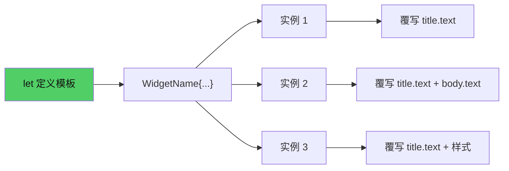
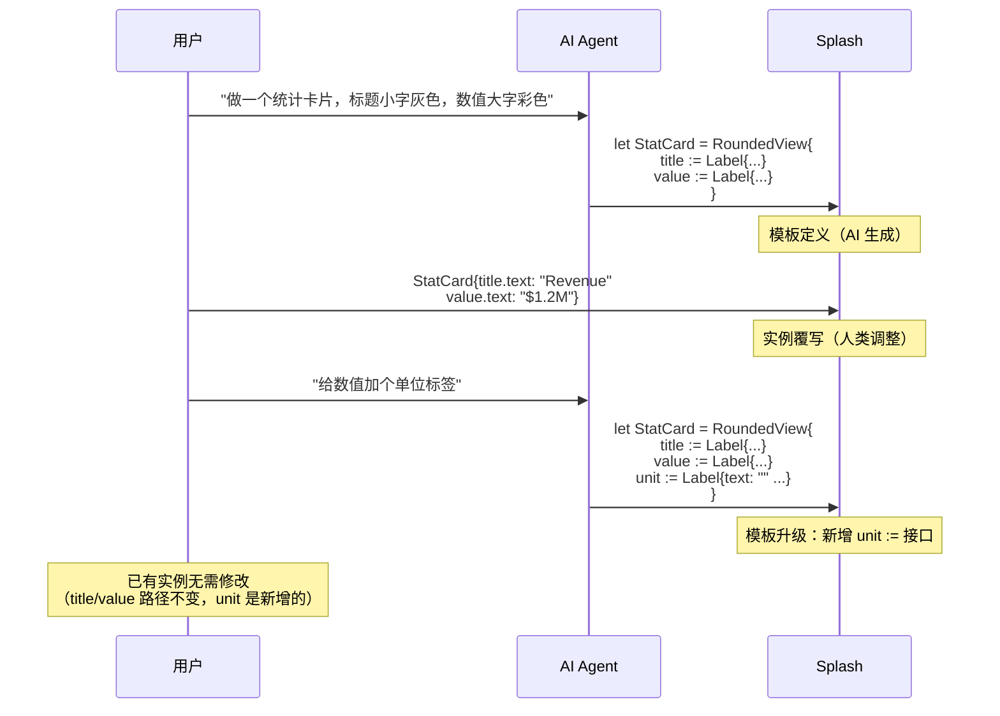

# 第8章：模板与组合

## 为什么这很重要

回顾上一章的 token-dashboard：四张统计卡片的代码几乎一模一样——每张都是 `RoundedView` + padding + 两个 Label。如果要修改卡片的圆角半径，你需要改四个地方。如果要加第五张卡片，你需要复制粘贴整块代码。

这就是**模板**要解决的问题。

Splash 用 `let` 定义模板，用 `:=` 命名子组件，用实例化语法覆写特定属性。这套机制让你可以"定义一次，使用多次"。但 Splash 的模板不只是代码复用工具——它是 AI 与人类协作的接口：AI 负责生成模板结构和默认值，人类负责覆写每个实例的具体内容。

本章从最简单的模板开始，逐步递进到嵌套模板和多层覆写，最后展示这套机制如何服务于 AI 生成 UI 的场景。



---

## 第一层：let 定义模板

### 最简单的模板

`let` 用于定义一个可复用的 widget 模板。语法很直接：

```splash
let MyHeader = Label{
    draw_text.color: #xffffff
    draw_text.text_style.font_size: 16
}
```

*来源：`splash.md:254-257`*

这定义了一个叫 `MyHeader` 的模板——本质上是一个"预配置的 Label"，文字颜色白色、字号 16。使用时直接写模板名加花括号：

```splash
MyHeader{text: "Dashboard Title"}
MyHeader{text: "Settings"}
MyHeader{text: "About"}
```

每次使用 `MyHeader{}` 都会创建一个新的 Label 实例，继承模板中定义的所有属性（白色、16号字），同时可以覆写 `text` 等其他属性。

理解 `let` 的本质：它不是运行时变量——它是一个**编译期的名称绑定**。`let MyHeader = Label{...}` 告诉 Splash "以后凡是遇到 `MyHeader`，就用这个预配置的 Label 来实例化"。这和 CSS 的 class 有相似之处（定义一组样式，多次应用），但 Splash 的模板更强大——它不仅能定义样式，还能定义子组件的完整结构。

模板实例化时，你可以覆写模板中定义的属性，也可以添加模板中没有的属性。覆写的优先级高于模板默认值——就像 CSS 中内联样式覆盖 class 样式一样：

```splash
// 模板定义了 draw_text.color: #xffffff（白色）
// 实例覆写为绿色
MyHeader{text: "Success" draw_text.color: #x66ffaa}
```

**关键规则：`let` 必须在使用之前定义。** Splash 是从上到下解析的，如果你先使用 `MyHeader{}` 再定义 `let MyHeader = ...`，会得到"未知组件"错误。这和大多数编程语言中的变量声明类似。

### 带子组件的模板

更常见的场景是模板内部包含多个子组件。这里以 splash.md 中的 InfoCard 为例：

```splash
let InfoCard = RoundedView{
    width: Fill height: Fit
    padding: 15 flow: Down spacing: 8
    draw_bg.color: #x334
    draw_bg.radius: 8.
    title := Label{text: "default"
        draw_text.color: #xfff
        draw_text.text_style.font_size: 16}
    body := Label{text: ""
        draw_text.color: #xaaa}
}
```

*改编自：`splash.md:260-267`（原名 MyCard，改为 InfoCard；统一使用 #x 颜色前缀）*

注意两个 Label 前面的 `title :=` 和 `body :=`。这就是下一节要讲的命名机制。现在先看使用方式：

```splash
View{flow: Down height: Fit spacing: 12 padding: 20
    InfoCard{title.text: "First Card" body.text: "Content here"}
    InfoCard{title.text: "Second Card" body.text: "More content"}
}
```

*改编自：`splash.md:273-275`*

两行代码创建了两张卡片，每张有不同的标题和正文。模板中定义的样式（背景色、圆角、字体）被所有实例共享，只有 `title.text` 和 `body.text` 是每个实例独有的。

---

## 第二层：`:=` 命名机制

### 为什么需要 `:=`？

在上面的 InfoCard 模板中，我们写了 `title := Label{...}` 而不是 `title: Label{...}`。这一个符号的差异决定了子组件是否可以被外部覆写。

**`:=` 声明一个命名的、可寻址的子组件。** 只有用 `:=` 声明的子组件才能在模板实例化时被覆写：

```splash
// 模板定义
let Card = RoundedView{
    title := Label{text: "default"}     // ✅ 命名子组件，可被覆写
    Label{text: "footer"}               // 匿名子组件，无法从外部修改
}

// 使用
Card{title.text: "New Title"}           // ✅ title 可以覆写
// Card 的 footer Label 永远显示 "footer"，无法从实例修改
```

这是 Splash 模板系统最核心的概念：**`:=` 是模板的"接口声明"**——它定义了模板的哪些部分是可定制的，哪些是固定的。

### 覆写语法：dot-path 到命名子组件

覆写的语法和属性的点路径一致——用 `.` 连接子组件名和属性名：

```splash
InfoCard{
    title.text: "Revenue Report"              // 覆写 title 的文字
    title.draw_text.color: #x66ffaa           // 覆写 title 的颜色
    body.text: "Q1 2026 financial summary"    // 覆写 body 的文字
    body.draw_text.text_style.font_size: 12   // 覆写 body 的字号
}
```

你可以覆写命名子组件的**任何**属性——不仅是 `text`，还包括颜色、字号、间距等所有属性。覆写只影响当前实例，不影响模板定义和其他实例。

### `:=` vs `:` 的区别

这是初学者最容易犯的错误之一。对比以下两种写法：

```splash
// ❌ 用冒号：label 是静态属性，不可寻址
let BadCard = RoundedView{
    label: Label{text: "default"}
}
BadCard{label.text: "new text"}   // 静默失败！文字仍是 "default"

// ✅ 用冒号等号：label 是命名子组件，可寻址
let GoodCard = RoundedView{
    label := Label{text: "default"}
}
GoodCard{label.text: "new text"}  // 成功！文字变为 "new text"
```

*基于 `splash.md:8-17` 的规则构造*

用 `:` 声明的 `label` 被解析为一个静态属性赋值（把一个 Label 赋给名为 `label` 的属性），而不是一个可寻址的命名子组件。覆写 `label.text` 时，Splash 找不到这个命名子组件，覆写静默失败——文字保持默认值，但不会报任何错误。

这是 Splash 中最隐蔽的 bug 来源之一。当你发现模板实例化后文字"不见了"或"不变"时，第一个检查的就是：模板中的子组件是否用了 `:=` 而不是 `:`。

---

## 第三层：嵌套模板与路径解析

### 嵌套命名容器

当模板的结构变复杂——命名子组件被放在另一个容器内部时，覆写路径需要包含完整的命名链：

```splash
let TodoItem = View{
    width: Fill height: Fit
    padding: Inset{top: 8 bottom: 8 left: 12 right: 12}
    flow: Right spacing: 8
    align: Align{y: 0.5}
    check := CheckBox{text: ""}
    label := Label{text: "task"
        draw_text.color: #xddd
        draw_text.text_style.font_size: 11}
    Filler{}
    tag := Label{text: ""
        draw_text.color: #x888
        draw_text.text_style.font_size: 9}
}

View{flow: Down height: Fit spacing: 4
    TodoItem{label.text: "Walk the dog" tag.text: "personal"}
    TodoItem{label.text: "Fix login bug" tag.text: "urgent"}
    TodoItem{label.text: "Buy groceries" tag.text: "errands"}
}
```

*来源：`splash.md:285-301`*

TodoItem 有三个命名子组件：`check`、`label`、`tag`。每个实例可以独立覆写任意一个。注意 `Filler{}` 是匿名的——它不需要被覆写，所以不用 `:=`。

### 匿名容器中的命名子组件：不可达陷阱

**这是模板系统中最容易踩的坑：** 如果一个命名子组件被嵌套在一个匿名 `View{}` 中，覆写路径无法到达它：

```splash
// ❌ label 被嵌套在匿名 View 中，从外部不可达
let BadItem = View{
    View{                              // 匿名容器——没有 :=
        flow: Down
        label := Label{text: "default"}
    }
}
BadItem{label.text: "new text"}        // 静默失败！

// ✅ 给中间容器也加上 :=
let GoodItem = View{
    texts := View{                     // 命名容器
        flow: Down
        label := Label{text: "default"}
    }
}
GoodItem{texts.label.text: "new text"} // 成功！
```

*来源：`splash.md:306-317`*

规则：**从模板根到目标子组件的路径上，每一层容器都必须有 `:=` 名称。** 覆写路径就是这些名称用 `.` 连接起来的完整链。

这在设计模板时需要预先规划——哪些中间容器将来可能需要被"穿透"来覆写内部子组件？这些容器都要用 `:=` 命名。

---

## 陷阱速查

前面各节已经详细讲解了模板的常见问题。这里汇总为快速诊断表：

| 症状 | 可能原因 | 诊断方法 |
|------|---------|---------|
| 覆写后文字"不变"或"消失" | 子组件用了 `:` 而非 `:=` | 检查模板中对应子组件的声明符号 |
| 深层子组件覆写不生效 | 路径上有匿名容器 | 检查路径上每层容器是否都有 `:=` 名称 |
| "未知组件"错误 | `let` 在使用位置之后 | 把 `let` 移到使用位置的上方 |
| 所有实例显示相同内容 | 覆写语法错误（可能缺少 `.`） | 检查 `Name{id.prop: value}` 格式 |

### 陷阱详解：在 let 定义之前使用模板

```splash
// ❌ 先使用后定义——MyCard 未知
View{
    MyCard{title.text: "Oops"}
}
let MyCard = RoundedView{
    title := Label{text: "default"}
}

// ✅ 先定义后使用
let MyCard = RoundedView{
    title := Label{text: "default"}
}
View{
    MyCard{title.text: "Works!"}
}
```

*来源：`splash.md:246`*

**症状**：组件名显示为未知。
**诊断**：确保 `let` 定义在使用位置的上方。

---

## 实战重构：用模板改造 token-dashboard

token-dashboard 的四张统计卡片是完美的模板化候选——结构相同，只有标题、数值、颜色不同。

### 重构前：四段重复代码

```splash
View{width: Fill height: Fit flow: Right spacing: 16
    RoundedView{width: Fill height: Fit draw_bg.color: #x161628 draw_bg.radius: 8.
        padding: Inset{left: 20. right: 20. top: 16. bottom: 16.}
        flow: Down spacing: 6
        Label{text: "Input Tokens" draw_text.color: #x888899
            draw_text.text_style.font_size: 10}
        Label{text: "48.5M" draw_text.color: #xcc66ff
            draw_text.text_style.font_size: 28}
    }
    RoundedView{width: Fill height: Fit draw_bg.color: #x161628 draw_bg.radius: 8.
        padding: Inset{left: 20. right: 20. top: 16. bottom: 16.}
        flow: Down spacing: 6
        Label{text: "Output Tokens" draw_text.color: #x888899
            draw_text.text_style.font_size: 10}
        Label{text: "12.3M" draw_text.color: #x66aaff
            draw_text.text_style.font_size: 28}
    }
    // ... 还有两张类似的卡片
}
```

*来源：`tools/canvas/examples/token-dashboard.splash:11-28`（简化）*

四张卡片的共同点：`RoundedView` + 同样的背景色、圆角、padding、flow、spacing。不同点：标题文字、数值文字、数值颜色。

### 重构后：一个模板 + 四次实例化

```splash
let StatCard = RoundedView{
    width: Fill height: Fit
    draw_bg.color: #x161628 draw_bg.radius: 8.
    padding: Inset{left: 20. right: 20. top: 16. bottom: 16.}
    flow: Down spacing: 6 new_batch: true
    title := Label{text: "Metric"
        draw_text.color: #x888899
        draw_text.text_style.font_size: 10}
    value := Label{text: "0"
        draw_text.color: #xcc66ff
        draw_text.text_style.font_size: 28}
}

View{width: Fill height: Fit flow: Right spacing: 16
    StatCard{title.text: "Input Tokens" value.text: "48.5M"
        value.draw_text.color: #xcc66ff}
    StatCard{title.text: "Output Tokens" value.text: "12.3M"
        value.draw_text.color: #x66aaff}
    StatCard{title.text: "Estimated Cost" value.text: "$186.50"
        value.draw_text.color: #x66ffaa}
    StatCard{title.text: "Active Days" value.text: "20 / 31"
        value.draw_text.color: #xffaa66}
}
```

重构的效果：

| 维度 | 重构前 | 重构后 |
|------|--------|--------|
| 代码行数 | ~32 行 | ~20 行 |
| 修改圆角半径 | 改 4 处 | 改 1 处 |
| 添加第5张卡片 | 复制粘贴 8 行 | 1 行 |
| 改共享样式 | 逐一修改 | 改模板定义 |

模板让"结构"和"数据"分离。`let StatCard` 定义了卡片的结构和默认样式，每个实例只提供差异化的数据（标题、数值、颜色）。

这种分离带来的一个隐含好处是**一致性保障**。在重构前，如果设计师要求把标题文字从 10 号改成 11 号，你需要在四个地方各改一次——很容易漏改一个。重构后，只需要修改 `StatCard` 模板定义中的一行，所有实例自动更新。

注意重构后版本加了 `new_batch: true`（详见第7章：属性与容器，陷阱六）。原版没有这个属性，可能存在文字被背景遮盖的风险。模板化的另一个好处是：修复一个 bug 就修复了所有实例。

---

## AI 协作视角：模板是 AI 与人类的接口

Splash 的模板机制天然适合 AI-human 协作。这种协作模式分为两个阶段：

**阶段一：AI 生成模板**

AI 根据用户的自然语言描述，生成完整的模板定义。模板包含结构（哪些子组件、如何排列）和默认样式（颜色、字号、间距）。

**阶段二：人类覆写实例**

人类不需要理解模板内部的全部实现细节——只需要知道模板暴露了哪些命名子组件（`:=`），然后在实例化时覆写具体的文字和颜色。



为什么 Splash 的模板比其他框架更适合这种协作？因为 `:=` 命名机制天然创造了一个"接口层"。在 React 中，组件的可定制性通过 props 定义——需要写 TypeScript 类型声明、解构参数、处理默认值。在 Splash 中，`:=` 就是全部——写一个名字，这个子组件就变成了可覆写的接口点。AI 不需要思考"这个参数应该是什么类型"，只需要给子组件一个名字。

这个工作流的关键特性：

**1. 模板是 AI 的"输出格式"**

AI 生成完整的 `let ... = Widget{...}` 定义。因为 Splash 的语法简洁（详见第6章），AI 生成模板的成功率很高——不需要处理复杂的括号匹配或类型标注。

**2. `:=` 是 AI 与人类之间的"接口合约"**

AI 用 `:=` 标记哪些子组件是"可定制的"。人类只需要关心这些接口点，不需要理解模板内部的布局逻辑。这和面向对象编程中"公共接口 vs 私有实现"的概念类似。

**3. 模板升级遵循"接口不变"原则**

当用户要求修改模板结构时（比如加一个新字段），AI 可以重新生成模板定义。只要保持已有的 `:=` 命名不变、不改变已有子组件的嵌套层级，所有已有的实例代码都不需要修改。新增功能通过新增 `:=` 接口实现。

但要注意：如果 AI 将已有的 `:=` 子组件移到新的命名容器内部（比如把 `title :=` 移到 `header := View{title := ...}` 里面），覆写路径就会从 `title.text` 变为 `header.title.text`——所有已有实例都会失效。这就是前面"路径必须连续"规则的实际后果。好的模板升级策略是：**只新增，不重组已有的命名层级**。

**4. 实例代码是人类的"数据层"**

```splash
StatCard{title.text: "Revenue" value.text: "$1.2M" value.draw_text.color: #x66ffaa}
```

这一行是人类的工作——填入业务数据和品牌颜色。它简短、直观、不需要任何编程知识。非技术用户也能修改实例代码来更新仪表板数据。

---

## 模式提炼

### 模式一：模板接口设计

**问题**：模板需要在"可定制性"和"封装性"之间平衡。太多 `:=` 让模板难以维护，太少让使用者无法调整。

**方案**：只对"每个实例都不同的内容"使用 `:=`。样式属性（颜色、字号）在模板中固定，文字内容和关键样式（如强调色）暴露为 `:=` 接口。

**检查清单**：
- 文字内容（text）→ 用 `:=`
- 每个实例不同的颜色 → 通过 `value.draw_text.color` 覆写
- 所有实例共享的样式 → 在模板中固定，不暴露

### 模式二：递进式模板构建

**问题**：一开始不确定模板需要多复杂。

**方案**：从最简单的模板开始（只有一两个 `:=`），随着需求增长逐步添加命名子组件。不要一开始就设计"万能模板"。

**步骤**：
1. 先写 2-3 个具体实例（不用模板）
2. 找出重复的结构
3. 提取为 `let` 模板，把差异部分标记为 `:=`
4. 用模板替换原来的重复代码

这正是我们在"实战重构"中做的事情——先看到了 token-dashboard 的四段重复代码，再提取为 StatCard 模板。

### 模式三：AI 安全的模板结构

**问题**：AI 生成的模板在升级时可能破坏已有实例。

**方案**：遵循"接口不变"原则——模板的 `:=` 命名是"接口合约"。修改模板内部结构时，保持所有已有的 `:=` 名称和路径不变。新增功能用新的 `:=` 名称，不修改已有的名称。

---

## 本章小结

| 概念 | 语法 | 作用 |
|------|------|------|
| 模板定义 | `let Name = Widget{...}` | 定义可复用的组件结构 |
| 模板实例化 | `Name{...}` | 创建模板的实例 |
| 命名子组件 | `id := Widget{...}` | 声明可从外部覆写的子组件 |
| 实例覆写 | `Name{id.prop: value}` | 修改实例中命名子组件的属性 |
| 嵌套路径 | `Name{outer.inner.prop: value}` | 穿透多层命名容器覆写 |

三个关键规则：

1. **`:=` 是接口**——只有 `:=` 声明的子组件才能被覆写
2. **路径必须连续**——从模板根到目标子组件，每层容器都要有 `:=` 名称
3. **先定义后使用**——`let` 必须在使用位置的上方

下一章将讲解 Splash 的事件系统——`on_click`、`on_return` 等回调如何让 UI 具有交互能力（详见第9章：事件与交互）。
