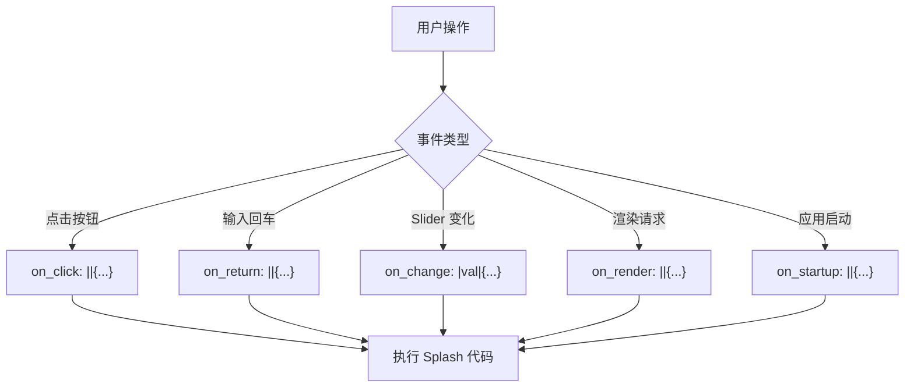
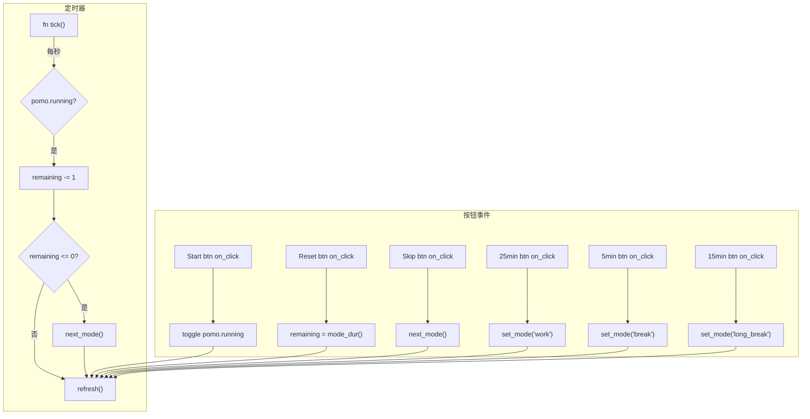

# 第9章：事件与交互

## 为什么这很重要

前面的章节已经多次使用 `on_click: ||{...}` 让按钮响应点击。但事件系统远不止按钮点击——TextInput 的回车提交、Slider 的值变化、View 的渲染回调、应用的启动事件，都是 Splash 事件系统的一部分。

本章系统讲解 Splash 中所有可用的事件类型、闭包语法和事件处理模式。读完本章，你能够让 UI 中的任何组件响应用户操作，并理解事件从触发到回调执行的完整链路。

注意：本章聚焦于 Splash 侧的事件（`on_click`、`on_render` 等回调），不涉及 Rust 侧的 `MatchEvent` 细节（详见第22章：事件与 Action 系统）。在纯 Splash 应用和 Canvas Agent-to-App 场景中，Splash 侧事件就是你需要的全部。



---

## 四种事件回调

### on_click：按钮点击

`on_click` 是最常用的事件。它绑定在 Button 上，在用户点击（鼠标松开或触屏抬起）时触发：

```splash
Button{text: "Start" draw_bg.color: #x51cf66
    on_click: ||{
        state.running = true
        refresh()
    }
}
```

*改编自：`tools/canvas/examples/pomodoro.splash:58-63`*

`||{...}` 是 Splash 的闭包语法——两个竖线表示"没有参数"，花括号内是执行体。闭包可以访问外部作用域的变量（如 `state`、`ui`），这就是闭包的"捕获"能力。

pomodoro 应用中，每个按钮都有自己的 `on_click`——Start/Pause 切换运行状态，Reset 重置计时器，Skip 跳到下一个阶段：

```splash
// Start/Pause 按钮
start_btn := Button{text: "Start"
    on_click: ||{
        if pomo.running { pomo.running = false }
        else { pomo.running = true }
        refresh()
    }
}

// Reset 按钮
Button{text: "Reset"
    on_click: ||{ pomo.running = false  pomo.remaining = mode_dur()  refresh() }
}

// Skip 按钮
Button{text: "Skip"
    on_click: ||{ next_mode()  refresh() }
}
```

*来源：`tools/canvas/examples/pomodoro.splash:58-70`（格式化）*

注意 `on_click` 的位置——它是 Button 的一个属性，和 `text`、`draw_bg.color` 同级。这意味着它遵循 Splash 的属性语法：空格分隔，不需要逗号。你可以把 `on_click` 和其他属性写在同一行，也可以单独一行。

**多行 vs 单行 on_click**：当逻辑简短（一两行）时，可以写成紧凑的单行形式：

```splash
Button{text: "Reset" on_click: ||{ state.count = 0  refresh() }}
```

多个语句用双空格分隔（Splash 没有分号，空格就是语句分隔符）。当逻辑复杂时，展开为多行更清晰。

### on_return：TextInput 回车

`on_return` 绑定在 TextInput 上，在用户按回车键时触发。这是表单提交的标准模式：

```splash
input := TextInput{width: Fill height: Fit
    empty_text: "What needs to be done?"
    on_return: ||{
        let text = ui.input.text()
        if text != "" {
            state.items[state.count] = text
            state.count = state.count + 1
            ui.input.set_text("")
            refresh()
        }
    }
}
```

`on_return` 的闭包也是无参数的（`||{...}`）。输入框中的文字通过 `ui.input.text()` 获取——这是 Splash 的 Widget API，通过 `:=` 名称访问 Widget 实例并调用方法。

在 Rust + Splash 模式中，`on_return` 的等价写法是 `text_input.returned(actions)`（详见第5章的 Todo 示例）。纯 Splash 模式下直接使用 `on_return` 更简洁。

scratchpad 示例中有一个优雅的用法——TextInput 回车时程序化触发按钮点击：

```splash
input := TextInput{
    on_return: || ui.search_button.on_click()
}
search_button := Button{text: "Search"
    on_click: ||{ /* 搜索逻辑 */ }
}
```

*来源：`examples/scratchpad/src/main.rs:72`（简化）*

`ui.search_button.on_click()` 程序化触发按钮的点击事件——这避免了在 `on_return` 和 `on_click` 中重复相同的逻辑。

### on_change：Slider 值变化

`on_change` 绑定在 Slider 上，在用户拖动滑块改变值时触发。它使用**有参数**的闭包语法 `|val|{...}`：

```splash
Slider{text: "Volume" min: 0. max: 100. default: 50.
    on_change: |val|{
        state.volume = val
        ui.volume_label.set_text("Volume: " + val)
    }
}
```

`|val|{...}` 中的 `val` 是 Slider 的当前值（浮点数）。这是 `on_change` 和 `on_click` 的关键区别：`on_click` 是无参数闭包（`||{...}`），`on_change` 是有参数闭包（`|val|{...}`）。

参数名可以是任意合法标识符：`|v|{...}`、`|value|{...}`、`|x|{...}` 都可以。

### on_render：渲染回调

`on_render` 和前三个不同——它不是用户触发的事件，而是**程序触发的渲染回调**。当你调用 `ui.view_name.render()` 时，这个 View 的 `on_render` 闭包被执行，闭包中的 Widget 定义替换 View 之前的子组件。

```splash
main_view := View{width: Fill height: Fit flow: Down
    on_render: ||{
        if state.page == "home" {
            Label{text: "Welcome Home" draw_text.color: #xfff draw_text.text_style.font_size: 20}
        }
        if state.page == "settings" {
            Label{text: "Settings" draw_text.color: #xfff draw_text.text_style.font_size: 20}
            Slider{text: "Brightness" min: 0. max: 100. default: 70.}
        }
    }
}

// 切换页面
Button{text: "Go Home" on_click: ||{ state.page = "home"  ui.main_view.render() }}
Button{text: "Settings" on_click: ||{ state.page = "settings"  ui.main_view.render() }}
```

`on_render` 实现了**条件渲染**——根据状态的不同值，生成不同的 Widget 树。这是 Splash 中 `if/else` 在 UI 层面的应用。每次 `render()` 被调用，`on_render` 中的代码完全重新执行，之前的 Widget 被销毁，新的 Widget 被创建。

**`on_render` 的典型用途**：

- 条件渲染（如上面的页面切换）
- 动态列表（`while` 循环生成 N 个 Widget，如第5章的 Todo）
- 数据驱动显示（`Label{text: "Count: " + state.counter}`）

**`on_render` vs `set_text`**：两种方式都能更新 UI，但适用场景不同：

| 方式 | 适用场景 | 优势 | 限制 |
|------|---------|------|------|
| `set_text()` | 更新已有 Widget 的文字 | 快速，不重建 Widget | 只能改文字，不能增删 Widget |
| `on_render` | 根据状态动态生成 Widget | 可以条件渲染、循环生成 | 每次重建所有子 Widget |

经验法则：如果只是更新文字或颜色，用 `set_text()`。如果需要根据状态显示/隐藏组件或改变组件数量，用 `on_render`。

两者也可以结合使用。比如一个仪表板，大部分内容用 `set_text()` 更新（效率高），但"当前页面"的切换用 `on_render`（需要替换整个 Widget 子树）。pomodoro 就是这种混合模式——`refresh()` 函数用 `set_text()` 更新时间标签和按钮文字，而不重建整个 UI。

`on_render` 的另一个重要用途是**动态列表**。在第5章的纯 Splash Todo 中，`on_render` 内的 `while` 循环根据数组长度生成 N 个列表项。每次添加或删除 Todo 后调用 `render()`，列表重新生成。这比手动增删单个 Widget 简单得多——代价是每次全量重建，性能上限较低。对于小规模列表（<100 项），这个代价可以接受。大规模列表需要 PortalList 虚拟化（详见第15章）。

**`on_render` 和 `on_startup` 的区别**：`on_startup` 在应用启动时执行一次，常用于初始化（如第一次调用 `render()`）。`on_render` 在每次 `render()` 调用时执行，可以执行多次。两者都是无参数闭包。

---

## 闭包语法详解

### 无参数闭包

```splash
on_click: ||{ state.counter = state.counter + 1 }
on_return: ||{ /* 处理回车 */ }
on_render: ||{ Label{text: "dynamic"} }
on_startup: ||{ ui.main_view.render() }
```

`||` 表示"无参数"。花括号内是执行体。

### 有参数闭包

```splash
on_change: |val|{ state.volume = val }
```

`|val|` 表示"一个参数，名为 val"。目前 Splash 中只有 `on_change` 使用有参数闭包。

### 闭包中的变量访问

闭包可以访问定义时的外层作用域中的变量：

```splash
let state = { counter: 0 }

fn refresh() { ui.label.set_text("" + state.counter) }

Button{text: "Add"
    on_click: ||{
        state.counter = state.counter + 1   // 访问 state
        refresh()                             // 调用函数
        ui.label.set_text("Updated!")         // 访问 ui
    }
}
```

在闭包内可以访问的东西：
- **`state`** 和其他 `let` 定义的变量
- **`ui`**——Widget 树的根引用
- **全局函数**——用 `fn` 定义的函数
- **Splash 内置 API**——`math.floor()` 等

不能在闭包内做的事：
- 定义新的 `let` 模板（`let` 模板只能在顶层定义，详见第8章）
- 创建命名 Widget（`:=` 只能在 Widget 树定义中使用，不能在事件回调中）
- 直接调用 Rust 函数（需要通过 `#(...)` 桥接，这是 Rust 侧的高级用法）

一个常见的困惑是：为什么在 `on_click` 中不能写 `label := Label{text: "new"}`？因为 `:=` 创建命名 Widget 是 Widget 树构建阶段的操作——它在 Splash 代码首次解析时执行，不在事件回调中执行。事件回调只能修改已有 Widget 的属性（通过 `ui.name.set_text()`）或触发 `on_render` 重建。

这种分离是有意的：Widget 树的**结构**在定义时确定（或在 `on_render` 中动态重建），事件回调只修改**数据**和触发**更新**。这让事件处理保持简单——你不需要担心在事件中创建新 Widget 时的生命周期问题。

---

## `fn tick()`：定时器事件

除了 `on_click` 等 Widget 级事件，Splash 还有一个特殊的全局事件——`fn tick()`。如果你在 Splash 脚本中定义了名为 `tick` 的函数，Splash 运行时会每秒自动调用它一次：

```splash
let state = { seconds: 0 running: true }

fn tick() {
    if state.running {
        state.seconds = state.seconds + 1
        ui.timer_label.set_text("" + state.seconds + "s")
    }
}

timer_label := Label{text: "0s" draw_text.color: #xfff draw_text.text_style.font_size: 24}
```

*来源：`tools/canvas/CLAUDE.md`（Timer 支持段落）*

`fn tick()` 是 pomodoro 计时器的核心——它每秒递减剩余时间，当时间到零时切换到下一个阶段：

```splash
fn tick() {
    if pomo.running {
        if pomo.remaining > 0 { pomo.remaining = pomo.remaining - 1 }
        if pomo.remaining <= 0 { next_mode() }
        refresh()
    }
}
```

*来源：`tools/canvas/examples/pomodoro.splash:45-51`*

`fn tick()` 的约定：
- 函数名**必须**是 `tick`，不是其他名字
- 调用频率约为 1 秒一次（不精确，受渲染帧率影响）
- 不需要注册或启动——定义即激活
- 适合计时器、轮询更新等场景

`fn tick()` 和 `on_click` 的区别在于触发源：`on_click` 由用户操作触发，`tick` 由运行时自动触发。但两者在闭包体内可以做的事情完全相同——修改状态、调用函数、更新 UI。实际上 pomodoro 的 `tick()` 和按钮的 `on_click` 都调用同一个 `refresh()` 函数，说明事件处理的输出端是统一的。

如果你需要不同于 1 秒的定时间隔，目前 Splash 没有原生支持。一个变通方案是在 `tick()` 中使用计数器来降频：

```splash
let state = { tick_count: 0 }
fn tick() {
    state.tick_count = state.tick_count + 1
    if state.tick_count >= 5 {   // 每 5 秒执行一次
        state.tick_count = 0
        // 实际逻辑
    }
}
```

另一个变通是用 `fn on_audio()` 回调（约 10Hz，Canvas 音频管线提供），但那属于 Canvas 的特定功能（详见第30章：音频可视化案例）。

---

## `net.http_request`：网络请求

Splash 不仅能处理 UI 事件——它还内置了 HTTP 请求能力。`net.http_request` 让纯 Splash 应用可以调用外部 API：

```splash
let req = net.HttpRequest{
    url: "https://api.example.com/data"
    method: net.HttpMethod.GET
    headers: {"User-Agent": "MakepadApp/1.0"}
}
net.http_request(req) do net.HttpEvents{
    on_response: |res|{
        let data = res.body.parse_json()
        ui.result_label.set_text("" + data.title)
    }
    on_error: |e|{
        ui.result_label.set_text("Error: " + e.message)
    }
}
```

支持的方法：`GET`、`POST`、`PUT`、`DELETE`、`HEAD`、`PATCH`、`OPTIONS`。

POST 请求可以发送 JSON body：

```splash
let req = net.HttpRequest{
    url: "https://api.example.com/submit"
    method: net.HttpMethod.POST
    headers: {"Content-Type": "application/json"}
    body: {name: "test" value: 42}.to_json()
}
```

流式响应用 `is_streaming: true` + `on_stream` 回调：

```splash
let req = net.HttpRequest{url: "..." method: net.HttpMethod.POST is_streaming: true}
net.http_request(req) do net.HttpEvents{
    on_stream: |res|{ /* 每个 chunk 调用一次 */ }
    on_complete: |res|{ /* 流结束 */ }
}
```

Splash 还内置了 `parse_html()` 方法，可以解析 HTML 响应并用 CSS 选择器查询元素——适合抓取网页数据：

```splash
let doc = html_string.parse_html()
let titles = doc.select("h2.title")
```

`net.http_request` 改变了纯 Splash 的能力边界——以前纯 Splash 应用无法做网络请求，现在可以了。这让 AI 生成的纯 Splash 应用可以直接调用 API、搜索引擎、加载远程数据（详见第4章：两种模式的选择）。

---

## 实战：pomodoro 的完整事件地图

把 pomodoro.splash 中的所有事件梳理出来，形成一张完整的事件地图：



pomodoro 有 7 个事件源（1 个定时器 + 6 个按钮），全部通过 `refresh()` 函数统一更新 UI。这就是第4章总结的"refresh 辅助函数"模式——所有事件处理的最后一步都是调用 `refresh()`。

---

## 模式提炼

### 模式一：事件 → 状态 → UI

所有 Splash 事件的处理模式都是相同的三步：

```
事件触发 → 修改 state → 调用 refresh() 或 render()
```

不要在事件回调中直接操作多个 Widget 的属性——先修改状态，然后让一个统一的函数（`refresh` 或 `on_render`）根据新状态更新所有 UI。

### 模式二：on_return → on_click 委托

当 TextInput 和 Button 需要执行相同的逻辑时，不要重复代码——让 `on_return` 程序化触发 `on_click`：

```splash
input := TextInput{on_return: || ui.submit_btn.on_click()}
submit_btn := Button{text: "Submit" on_click: ||{ /* 逻辑只写一次 */ }}
```

### 模式三：on_render 条件渲染

```splash
content := View{on_render: ||{
    if state.condition { /* 条件为真时的 Widget */ }
    else { /* 条件为假时的 Widget */ }
}}

// 状态变化时触发重新渲染
Button{on_click: ||{ state.condition = true  ui.content.render() }}
```

这是 Splash 中实现"显示/隐藏"的标准方式——不用 `set_visible`（Splash 不支持），而是用条件渲染。

---

## 本章小结

| 事件 | 触发时机 | 闭包语法 | 常用组件 |
|------|---------|---------|---------|
| `on_click` | 用户点击 | `\|\|{...}` | Button |
| `on_return` | 用户按回车 | `\|\|{...}` | TextInput |
| `on_change` | 值变化 | `\|val\|{...}` | Slider |
| `on_render` | 程序调用 `render()` | `\|\|{...}` | View |
| `on_startup` | 应用启动 | `\|\|{...}` | Root |
| `fn tick()` | 每秒自动调用 | 普通函数 | 全局 |

核心规则：

1. **所有事件回调最终都要更新 UI**——通过 `set_text()` 或 `render()`
2. **闭包可以访问外层变量**——`state`、`ui`、全局函数
3. **`on_render` 是条件渲染的唯一方式**——Splash 没有 `set_visible`
4. **`fn tick()` 是唯一的定时器机制**——定义即激活，约 1 秒间隔

下一章将讲解 Splash 的状态机和动画系统——`mod.state`、Animator、hover/pressed 效果（详见第10章：状态与动画）。
