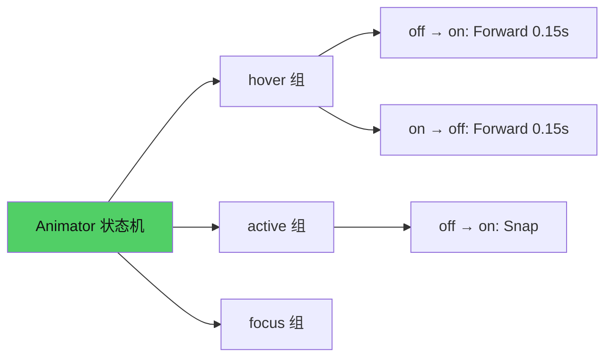

# 第10章：状态与动画

## 为什么这很重要

到目前为止，我们构建的 UI 都是"静态"的——按钮按下去没有视觉反馈，页面切换没有过渡效果，列表项没有 hover 高亮。在现代 UI 中，动画不是装饰——它是反馈。当用户鼠标悬停在按钮上，按钮颜色变化告诉用户"这个东西是可点击的"。当页面切换有过渡动画，用户知道"我从这里到了那里"。

Makepad 2.0 的动画系统叫 **Animator**——一个基于状态机的属性动画引擎。它不是 CSS transitions 那种"从 A 过渡到 B"的简单模型，而是一个完整的多状态、多轨道、多缓动的动画系统。

本章讲解 Animator 的 Splash 语法和使用模式。以 Canvas 的 music-player 应用为案例，从最简单的 hover 效果开始，逐步构建到完整的状态驱动 UI。



---

## Animator 基础：状态组和过渡

### 核心概念

Animator 是一个**状态机**——它管理一组命名的状态，以及状态之间的过渡方式。每个状态定义了一组目标属性值，过渡定义了从当前值到目标值的插值方式。

Animator 的结构：

```splash
animator: Animator{
    hover: {                         // 状态组名
        default: @off                // 初始状态（@ 前缀）
        off: AnimatorState{          // 状态定义
            from: {all: Forward {duration: 0.15}}  // 过渡方式
            apply: {draw_bg: {hover: 0.0}}         // 目标属性值
        }
        on: AnimatorState{
            from: {all: Forward {duration: 0.15}}
            apply: {draw_bg: {hover: 1.0}}
        }
    }
}
```

*来源：`splash.md:1374-1387`*

三个层级：

1. **状态组**（`hover`）：独立的动画轨道。多个组可以同时运行互不干扰
2. **状态**（`off`、`on`）：组内的具体状态。每个状态有过渡方式和目标值
3. **过渡**（`Forward {duration: 0.15}`）：从一个状态到另一个状态时的插值方式

### 三种过渡类型

| 过渡 | 效果 | 语法 | 适用场景 |
|------|------|------|---------|
| **Forward** | 从当前值平滑过渡到目标值 | `Forward {duration: 0.15}` | hover 效果、渐变、淡入淡出 |
| **Snap** | 立即跳到目标值，无过渡 | `Snap` | 点击反馈、开关切换 |
| **Loop** | 循环播放动画 | `Loop {duration: 1.0}` | 加载动画、呼吸灯、脉冲 |

*来源：`splash.md:1393-1402`*

`from` 块定义"从哪个状态来时用什么过渡"。`all` 是通配符，表示从任何状态来都用这个过渡：

```splash
from: {all: Forward {duration: 0.2}}   // 从任何状态来都用 0.2 秒过渡
from: {all: Snap}                       // 从任何状态来都立即跳转
from: {
    all: Forward {duration: 0.1}        // 默认 0.1 秒
    down: Forward {duration: 0.01}      // 从 down 状态来时更快
}
```

*来源：`splash.md:1396-1401`*

### apply 块：动画目标

`apply` 定义状态对应的属性目标值。结构镜像 Widget 的属性树：

```splash
apply: {
    draw_bg: {hover: 1.0}              // 动画 draw_bg.hover 到 1.0
    draw_text: {hover: 1.0}            // 同时动画 draw_text.hover 到 1.0
}
```

*来源：`splash.md:1404-1412`*

Animator 动画的目标是 `instance()` 类型的 shader 变量——它们是每个 Widget 实例独有的浮点值（详见第7章：属性与容器）。`hover`、`down`、`focus`、`active` 是最常用的 instance 变量，由 Animator 自动驱动。

---

## 实战一：hover 效果

最常见的动画是 hover 效果——鼠标悬停时背景变化。这需要三步：

**第一步：设置支持 hover 的 shader**

```splash
View{
    width: Fill height: Fit
    cursor: MouseCursor.Hand       // 鼠标变成手型
    show_bg: true                  // 启用背景绘制
    new_batch: true                // 防止文字被遮盖（详见第7章）
    draw_bg +: {
        color: uniform(#0000)           // 默认透明
        color_hover: uniform(#xfff2)    // hover 时半透明白
        hover: instance(0.0)            // 动画变量，0→1
        pixel: fn(){
            return Pal.premul(self.color.mix(self.color_hover, self.hover))
        }
    }
```

**第二步：配置 Animator**

```splash
    animator: Animator{
        hover: {
            default: @off
            off: AnimatorState{
                from: {all: Forward {duration: 0.15}}
                apply: {draw_bg: {hover: 0.0}}
            }
            on: AnimatorState{
                from: {all: Forward {duration: 0.15}}
                apply: {draw_bg: {hover: 1.0}}
            }
        }
    }
```

**第三步：放入内容**

```splash
    Label{text: "Hoverable item" draw_text.color: #xfff}
}
```

*改编自：`splash.md:1341-1369`*

这三步的完整代码构成了一个"hover 响应容器"——鼠标移入时背景在 0.15 秒内从透明过渡到半透明白色，移出时再过渡回去。

**工作原理**：

1. 鼠标进入时，Makepad 自动将 hover 组切换到 `on` 状态
2. Animator 开始将 `draw_bg.hover` 从 0.0 插值到 1.0（0.15 秒，Forward）
3. shader 的 `pixel` 函数用 `self.hover` 做颜色混合——`hover=0` 时显示 `color`（透明），`hover=1` 时显示 `color_hover`（半透明白）
4. 鼠标移出时，hover 组切换回 `off`，`hover` 从 1.0 插值回 0.0

**重要限制：不是所有 Widget 都支持 Animator。**

| 支持 Animator | 不支持 Animator |
|--------------|----------------|
| View, SolidView, RoundedView | Label, H1-H4, P, TextBox |
| Button, ButtonFlat, ButtonFlatter | Image, Icon, Slider |
| CheckBox, Toggle, RadioButton | Markdown, Html, DropDown |
| TextInput, ScrollView | Splitter, Hr, Filler |

*来源：`splash.md:1337-1339`*

如果你给 Label 添加 `animator`，定义会被**静默忽略**——不报错，但也没效果。要让 Label 有 hover 效果，把它包在支持 Animator 的 View 中（如上面的示例）。

---

## 实战二：按钮状态（hover + pressed）

按钮需要同时响应 hover 和 pressed 两个状态组。Makepad 内置的 Button 已经有这些动画，但你也可以自定义：

```splash
Button{text: "Custom Button"
    draw_bg +: {
        color: uniform(#x336)
        color_hover: uniform(#x449)
        color_down: uniform(#x225)
    }
}
```

*改编自：`splash.md:628-638`*

Button 内置了 `hover` 和 `down` 两个 Animator 组——你只需要设置颜色的 `uniform` 值，Animator 自动处理状态切换和过渡动画。

对于 pomodoro 中的按钮，颜色是直接通过 `draw_bg.color` 设置的（不是 `uniform()`），所以它们没有 hover 动画——点击有效，但没有视觉反馈。如果你想给 pomodoro 的按钮加 hover 效果，需要改为 `uniform()` + Animator 配置。

---

## 实战三：music-player 的状态控制

music-player 展示了一种不同的"状态"模式——不是 Animator 驱动的视觉状态，而是**应用逻辑状态**（播放/暂停）。它使用 Splash 的 `fn on_audio()` 回调和状态变量来驱动 UI：

```splash
let player = { track: 0 }

fn on_audio() {
    ui.time_cur.set_text(fmt_time(_pos))
    ui.time_end.set_text(fmt_time(_dur))
    if _playing { ui.play_btn.set_text("Pause") }
    else { ui.play_btn.set_text("Play") }
}
```

*来源：`tools/canvas/examples/music-player.splash:28-33`*

这里的"状态"不是 Animator 状态——它是应用数据层面的状态（当前播放的曲目、是否正在播放）。`_playing`、`_pos`、`_dur` 是 Canvas 音频系统注入的全局变量（详见第30章：音频可视化案例）。

music-player 展示了两种"状态"的共存：

| 状态类型 | 管理者 | 示例 | UI 效果 |
|---------|--------|------|---------|
| **视觉状态** | Animator | hover, pressed, focus | 颜色过渡、缩放动画 |
| **应用状态** | Splash 变量 | playing, track, volume | 文字更新、按钮切换 |

两种状态是独立的——Animator 管理"看起来怎样"，Splash 变量管理"数据是什么"。它们通过不同的机制更新 UI：Animator 通过 shader instance 变量驱动颜色插值，Splash 变量通过 `set_text()` 和 `on_render` 更新内容。

---

## 高级特性

### snap()：立即跳转

在 `apply` 中用 `snap()` 包裹的值会立即跳到目标，不做插值：

```splash
apply: {
    draw_bg: {down: snap(1.0), hover: 1.0}  // down 立即跳，hover 平滑过渡
}
```

*来源：`splash.md:1430-1436`*

适用场景：按钮按下时需要立即变色（不要等 0.15 秒），但松开时可以平滑恢复。

### timeline()：关键帧动画

`timeline()` 让你定义多个时间点的值，Animator 在时间点之间插值：

```splash
apply: {
    draw_bg: {anim_time: timeline(0.0 0.0  0.5 1.0  1.0 0.0)}
}
```

*来源：`splash.md:1438-1444`*

这创建了一个"0 → 1 → 0"的三角波动画——0% 时值为 0，50% 时值为 1，100% 时值回到 0。结合 `Loop` 过渡类型，可以实现呼吸灯效果。

### 多状态组并行

一个 Widget 可以有多个独立的 Animator 组：

```splash
animator: Animator{
    hover: {
        default: @off
        off: AnimatorState{from: {all: Forward {duration: 0.15}} apply: {draw_bg: {hover: 0.0}}}
        on: AnimatorState{from: {all: Forward {duration: 0.15}} apply: {draw_bg: {hover: 1.0}}}
    }
    focus: {
        default: @off
        off: AnimatorState{from: {all: Forward {duration: 0.1}} apply: {draw_bg: {focus: 0.0}}}
        on: AnimatorState{from: {all: Forward {duration: 0.1}} apply: {draw_bg: {focus: 1.0}}}
    }
}
```

`hover` 组和 `focus` 组**同时运行**——鼠标悬停时 hover=1.0，键盘聚焦时 focus=1.0，两者互不干扰。shader 可以同时使用两个变量来计算最终颜色。

---

## 模式提炼

### 模式一：hover 响应容器

```splash
View{show_bg: true cursor: MouseCursor.Hand new_batch: true
    draw_bg +: {
        color: uniform(#0000)
        color_hover: uniform(#xfff2)
        hover: instance(0.0)
        pixel: fn(){return Pal.premul(self.color.mix(self.color_hover, self.hover))}
    }
    animator: Animator{
        hover: {
            default: @off
            off: AnimatorState{from: {all: Forward {duration: 0.15}} apply: {draw_bg: {hover: 0.0}}}
            on: AnimatorState{from: {all: Forward {duration: 0.15}} apply: {draw_bg: {hover: 1.0}}}
        }
    }
    // 内容
}
```

**何时用**：列表项、卡片、任何需要 hover 反馈的容器。

**要点**：`show_bg: true` + `new_batch: true` + `cursor` 三者缺一不可。

### 模式二：应用状态 vs 视觉状态分离

| 层面 | 管理方式 | 更新机制 |
|------|---------|---------|
| 应用数据 | `let state = {...}` | `set_text()` / `on_render` |
| 视觉效果 | `Animator` | shader instance 变量自动插值 |

不要试图用 Animator 管理应用数据（如"当前页面"），也不要用 Splash 变量手动实现 hover 动画。两套系统各有分工。

### 模式三：过渡类型选择

| 场景 | 过渡类型 | duration |
|------|---------|----------|
| hover 效果 | Forward | 0.1-0.2s |
| 按钮按下 | Snap（或 Forward 0.01s） | 即时 |
| 展开/折叠 | Forward | 0.2-0.4s |
| 加载动画 | Loop | 1.0-2.0s |

---

## 本章小结

| 概念 | 作用 | 语法 |
|------|------|------|
| Animator | 管理视觉状态过渡 | `animator: Animator{...}` |
| 状态组 | 独立的动画轨道 | `hover: {...}` / `focus: {...}` |
| AnimatorState | 单个状态的目标值和过渡 | `AnimatorState{from: {...} apply: {...}}` |
| Forward | 平滑过渡 | `Forward {duration: 0.15}` |
| Snap | 立即跳转 | `Snap` |
| Loop | 循环动画 | `Loop {duration: 1.0}` |
| instance() | Animator 驱动的 shader 变量 | `hover: instance(0.0)` |
| uniform() | 不被 Animator 驱动的固定值 | `color: uniform(#x336)` |

下一章是 Part II 的高潮——流式求值，揭示 AI 逐 token 输出时 UI 如何逐步成型的技术机制（详见第11章：流式求值）。
