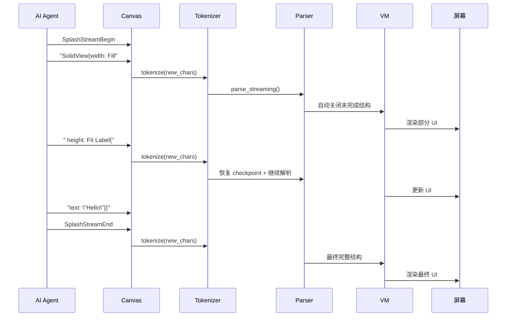

# 第11章：流式求值

## 为什么这很重要

当 AI Agent 生成一段 500 行的 Splash UI 代码时，用户需要等到全部 500 行输出完毕才能看到 UI 吗？

在大多数框架中，答案是"是"——JSON 需要所有括号匹配，JSX 需要完整编译，QML 需要完整解析。但在 Makepad 2.0 中，答案是"不需要"。

**流式求值**（Streaming Evaluation）是 Splash 的核心能力之一——AI 输出的每一段代码片段都能立即被解析、编译和渲染。用户看到的不是"等待...等待...完整 UI 出现"，而是**UI 逐渐成型**的过程：先出现容器背景，再填入文字，再加上按钮……

这不是一个附加功能——它是 Splash 语法设计（详见第6章）的直接结果，也是 Canvas Agent-to-App 管线（详见第27章）的技术基础。本章揭示这个能力的完整实现机制。



---

## 批量 vs 流式：两种求值模式

Splash VM 提供两种求值方式：

### 批量求值（`eval`）

```rust
pub fn eval(&mut self, script_mod: ScriptMod) -> ScriptValue
```

*来源：`platform/script/src/vm.rs:982`*

接收完整的 Splash 代码，一次性 tokenize → parse → execute。这是 `script_mod!` 和 `POST /splash` 的默认方式。

### 流式求值（`eval_with_append_source`）

```rust
/// Evaluate script incrementally by appending new source to an existing body.
///
/// Pass the full growing source code string each time. On first call, creates
/// the body and tokenizes/parses everything. On subsequent calls, computes the
/// delta (new chars since last call), restores the parser checkpoint (removing
/// auto-close opcodes), tokenizes only the new chars, continues parsing, then
/// auto-closes again for execution. Always re-executes from opcode 0.
pub fn eval_with_append_source(
    &mut self,
    script_mod: ScriptMod,
    code: &str,
    source: ScriptObject,
) -> ScriptValue
```

*来源：`platform/script/src/vm.rs:1039-1051`*

函数文档本身就是流式求值的完整说明。关键点：

1. **增量 tokenize**：每次调用只 tokenize 新增的字符片段
2. **checkpoint 恢复**：恢复上一次的 parser 状态，撤销之前的自动关闭
3. **自动关闭**：为不完整的代码补上缺失的 `}`，让 VM 可以执行
4. **完全重新执行**：每次从 opcode 0 开始执行，渲染完整的 UI

### 用户体验的差异

| | 批量求值 | 流式求值 |
|---|---|---|
| AI 输出第 1% | 用户看到空白 | 用户看到容器背景 |
| AI 输出第 50% | 用户仍看到空白 | 用户看到半完成的 UI |
| AI 输出第 100% | 完整 UI 突然出现 | UI 最后的细节补全 |
| 用户感知 | "AI 在思考" | "UI 在构建" |
| 总等待时间 | 相同 | 相同 |
| 感知等待时间 | 长（空白期焦虑） | 短（持续有进展） |

感知等待时间的差异是心理学级别的——总时间一样，但流式模式让用户全程有东西看，焦虑感大幅降低。

---

## 流式求值的三阶段协议

Canvas 通过 WebSocket 或 HTTP 使用流式求值，协议分三个阶段：

```rust
pub enum CanvasCommand {
    SplashStreamBegin,              // 阶段 1：开始
    SplashStreamAppend { code: String },  // 阶段 2：追加（多次）
    SplashStreamEnd,                // 阶段 3：结束
}
```

*来源：`tools/canvas/src/ws/types.rs:9-13`*

**阶段 1：Begin** — 清空当前 UI，准备接收新代码。Canvas 重置内部的代码缓冲区。

**阶段 2：Append**（多次调用）— 每次追加一段代码片段。Canvas 将新片段拼接到已有代码后面，然后调用 `eval_with_append_source` 进行增量求值。每次 Append 后用户都能看到当前代码对应的 UI。

**阶段 3：End** — 标记代码输出完成。Canvas 执行最后一次求值，关闭流式模式。

对应的 HTTP 端点：

| 端点 | 对应阶段 |
|------|---------|
| `POST /splash/stream` + body | Begin + 第一次 Append |
| `POST /splash/stream` + body | 后续 Append |
| `POST /splash/end` | End |

---

## 深入源码：增量求值的实现

`eval_with_append_source` 的核心逻辑可以分为四步：

### 第一步：计算增量

```rust
let prev_len = body.source_len;
let content_changed = prev_len > 0
    && (code.len() < prev_len
        || code[..prev_len] != body.tokenizer.original[..prev_len]);

if content_changed {
    // 内容完全变化——重置，从头 tokenize
    body.tokenizer.clear();
    body.parser = ScriptParser::default();
    body.checkpoint = None;
    body.source_len = code.len();
    body.tokenizer.tokenize(code, &mut self.bx.heap);
} else if code.len() >= prev_len {
    body.source_len = code.len();
    let new_chars = &code[prev_len..];
    if !new_chars.is_empty() {
        body.tokenizer.tokenize(new_chars, &mut self.bx.heap);
    }
}
```

*来源：`platform/script/src/vm.rs:1101-1121`*

VM 比较新代码和之前的代码。如果新代码是之前代码的扩展（前缀相同，只是尾部有新内容），只 tokenize 新增部分。如果内容完全变化（比如用户完全替换了代码），重置一切从头开始。

这个检查确保了两种场景都能正确处理：AI 逐段追加（增量）和用户完全替换代码（重置）。

### 第二步：恢复 checkpoint 并解析

```rust
if let Some(cp) = body.checkpoint.take() {
    body.parser.restore_checkpoint(cp);
}

let cp = body.parser.parse_streaming(
    &body.tokenizer,
    &existing_mod.file,
    (existing_mod.line, existing_mod.column),
    &existing_mod.values,
    unfinished,
);

body.checkpoint = Some(cp);
```

*来源：`platform/script/src/vm.rs:1097-1136`*

关键操作是 `restore_checkpoint` → `parse_streaming` → 保存新 checkpoint。

**为什么需要 checkpoint？** 上一次求值时，parser 为了让不完整的代码能执行，会自动插入缺失的 `}`（auto-close）。这些自动关闭的 opcode 在下一次追加时需要被撤销——因为代码还没真正结束。`restore_checkpoint` 就是做这个撤销操作的。

然后 `parse_streaming` 从当前位置继续解析新的 token，再次自动关闭，保存新的 checkpoint。

### 第三步：静默执行

```rust
self.bx.silence_errors = true;
let result = self.run_root(body_id);
self.bx.silence_errors = false;
```

*来源：`platform/script/src/vm.rs:1142-1144`*

`silence_errors = true` 是流式求值的关键策略——不完整的代码必然会产生运行时错误（比如引用了还没定义的变量），这些错误在代码未完成时是无意义的。静默模式下 VM 继续执行能执行的部分，跳过出错的部分，尽量渲染出部分 UI。

### 第四步：渲染

VM 执行后产生的 Widget 树被渲染到屏幕上。用户看到当前代码段对应的（不完整但可见的）UI。

---

## 技术边界：什么能流式，什么不能

### 支持流式渲染的结构

| 结构 | 流式行为 | 原因 |
|------|---------|------|
| Widget 声明 `View{...}` | 逐步显示 | auto-close 补上 `}` 后即可渲染 |
| 属性赋值 `text: "hello"` | 值到达后立即生效 | token 完整即可求值 |
| 嵌套 Widget | 外层先出现，内层后填入 | 外层的 auto-close 在内层到达时被撤销 |
| `let` 模板定义 | 定义完成后可用 | 模板是编译期结构 |

### 不支持增量的结构

| 结构 | 行为 | 原因 |
|------|------|------|
| 字符串字面量 `"hel` | 等待关闭引号 | tokenizer 保持在 String 状态，发射 `StringUnfinished` |
| `fn` 函数定义 | 函数体需要完整 | 不完整的函数体无法编译为可执行的 opcode |
| 条件表达式 `if x {` | 需要完整的 if/else | 不完整的条件无法确定执行路径 |

对于 AI 生成场景，影响最大的是**字符串**。当 AI 输出 `Label{text: "Hello Wor` 时，`"Hello Wor` 是一个未完成的字符串——tokenizer 无法确定何时结束。VM 会使用 `intern_unfinished_string` 将当前已有的部分作为临时值，让 Label 显示"Hello Wor"。当后续的 `ld"}` 到达时，字符串被正确关闭为"Hello World"。

---

## 流式求值在 Canvas 中的应用

Canvas 的 `SplashStreamAppend` 命令直接调用 `eval_with_append_source`。一个典型的流式渲染过程：

```
时间线：
──────────────────────────────────────────

t=0ms   AI 开始输出
        → SplashStreamBegin
        → Canvas 清空画布

t=50ms  AI: "SolidView{width: Fill height: Fit draw_bg.color: #x1a1a2e"
        → Append → auto-close → 渲染深色背景

t=120ms AI: " flow: Down padding: 20\nLabel{text: \"Title\""
        → Append → auto-close → 背景 + "Title" 文字出现

t=200ms AI: " draw_text.color: #xfff draw_text.text_style.font_size: 24}"
        → Append → Label 样式更新（白色大字）

t=350ms AI: "\nButton{text: \"Click me\" draw_bg.color: #x51cf66}"
        → Append → 绿色按钮出现

t=400ms AI: "\n}"
        → SplashStreamEnd → 最终完整 UI
```

用户在 50ms 就看到了背景，120ms 看到标题，350ms 看到按钮。整个过程 400ms——但体验上几乎没有"等待"的感觉，因为全程都有视觉进展。

对比批量模式：用户在前 399ms 看到空白画布，第 400ms 完整 UI 突然出现。体验上感觉"AI 在思考了 400ms"。

这种差异在更复杂的 UI（如 token-dashboard 的 148 行代码）中更加明显。流式模式下，用户在前几百毫秒就看到了仪表板的框架结构，接下来的 1-2 秒逐渐填入卡片、图表、数据。批量模式下则是 2 秒的空白之后整个仪表板一次性出现。

---

## 为什么其他框架难以做到

流式求值不只是"技术实现"——它需要从语法设计到 VM 架构的全链路支持：

| 层级 | Splash 的设计 | 其他框架的障碍 |
|------|-------------|---------------|
| 语法 | 无需分隔符，token 自描述 | JSON 需要逗号；XML 需要关闭标签 |
| Tokenizer | 增量输入（`tokenize(new_chars)`） | 大多数 tokenizer 需要完整输入 |
| Parser | checkpoint + auto-close | 需要完整 AST 才能输出 |
| VM | `silence_errors` 容忍不完整代码 | 错误中断执行 |
| 渲染 | 每次追加都渲染 | 需要完整 Virtual DOM diff |

这就是为什么第6章说"Splash 的语法设计服务于流式解析"——不是事后添加的能力，而是从第一天就作为设计目标。

---

## 连接 Part VI：Canvas 的流式渲染

本章讲解了流式求值的技术机制。在 Part VI 中，这些机制将在更大的系统中发挥作用：

- **第27章**将展示 Canvas 如何通过 `StdioBridge` 接收 WS/HTTP 命令，将 `SplashStreamAppend` 转化为 `eval_with_append_source` 调用
- **第28章**将展示 AI Agent 如何决定何时使用批量模式（`POST /splash`）和流式模式（`SplashStream*`）
- **第29章**将展示自愈循环如何利用流式渲染——AI 修复代码后立即推送，用户实时看到 UI 修复过程

流式求值是连接"Splash 语言"和"AI 生成 UI"的关键桥梁。语言设计确保了代码可以增量解析（详见第6章），VM 实现确保了不完整的代码也能产生可见的 UI，Canvas 架构确保了这一切可以通过网络远程驱动（详见第27-29章）。

---

## 模式提炼

### 模式一：增量求值三步曲

```
1. 恢复 checkpoint（撤销上次的 auto-close）
2. tokenize 新增字符 → parse_streaming → 新的 auto-close
3. 静默执行 → 渲染部分 UI → 保存新 checkpoint
```

这是 `eval_with_append_source` 的核心循环。每次新代码到达时重复这三步。

### 模式二：auto-close 容错策略

不完整的代码通过自动关闭获得可执行性：
- 未关闭的 `{` → parser 自动补上 `}`
- 未完成的字符串 → tokenizer 临时发射部分字符串
- 未定义的变量引用 → VM 静默跳过（`silence_errors`）

代价是部分 UI 可能暂时不正确，但随着更多代码到达，UI 逐步趋于正确。这是一个"进展优于等待"的设计哲学。

### 模式三：流式 vs 批量的选择

| 场景 | 推荐模式 |
|------|---------|
| AI 实时生成 UI | 流式（`SplashStream*`） |
| 加载已保存的应用 | 批量（`POST /splash`） |
| 用户编辑代码 | 批量（每次保存后完整求值） |
| 热重载 | 批量（文件变化触发完整重新求值） |

---

## 本章小结

| 概念 | 说明 |
|------|------|
| 批量求值 | `eval()` — 完整代码一次性处理 |
| 流式求值 | `eval_with_append_source()` — 增量追加 + 增量渲染 |
| 三阶段协议 | `StreamBegin` → `StreamAppend` × N → `StreamEnd` |
| checkpoint | Parser 状态快照，支持撤销 auto-close |
| auto-close | 自动补全未关闭的结构，让不完整代码可执行 |
| silence_errors | 静默跳过不完整代码导致的错误 |

核心要点：

1. **流式求值是语法设计的结果**——Splash 的无分隔符、花括号嵌套设计使 auto-close 成为可能
2. **用户体验是"观看构建"而非"等待结果"**——相同的总时间，不同的感知
3. **这为 AI 生成 UI 提供了毫秒级反馈**——Canvas 的 Agent-to-App 管线的技术基础

Part II（Splash 语言篇）到此完成。下一步进入 Part III（Widget 体系篇），系统讲解 Makepad 的布局引擎、组件库和自定义 Widget 机制。
