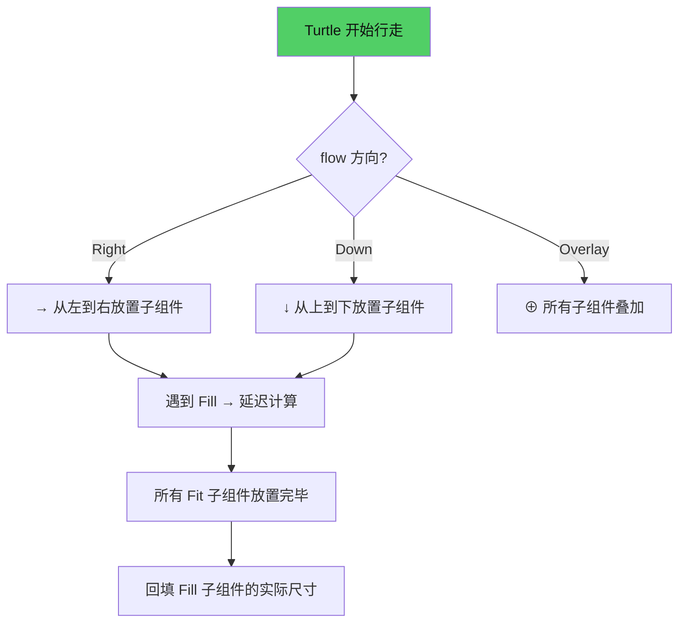
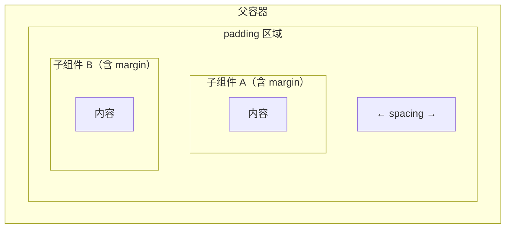

# 第12章：布局引擎 Turtle

## 为什么这很重要

前面的章节中，我们反复使用 `flow: Down`、`width: Fill`、`align: Center` 等布局属性，但从未解释它们的底层机制。当你的布局"不对"——某个组件没有出现在预期位置、尺寸不对、对齐偏移——你需要理解布局引擎的工作方式才能诊断问题。

Makepad 的布局引擎叫 **Turtle**（海龟）。这个名字来自 Logo 语言的"海龟图形"隐喻——一只虚拟的海龟在画布上行走，每经过一个 Widget 就前进相应的距离。布局就是海龟的行走路径。

Turtle 不是 CSS Flexbox 的复制品。它是一个单遍布局算法——从上到下、从左到右扫描 Widget 树，一次遍历完成所有布局计算。没有回溯、没有多轮迭代。这使得 Turtle 的性能非常好，但也意味着某些 CSS 中常见的布局模式（如"子元素等高"）需要不同的实现方式。



---

## Turtle 的行走规则

### Walk 结构

每个组件有一个 `Walk`——描述它在布局中"占多大空间"：

```rust
pub struct Walk {
    pub abs_pos: Option<Vec2d>,  // 绝对定位（忽略 Turtle 流）
    pub margin: Inset,           // 外边距
    pub width: Size,             // 宽度
    pub height: Size,            // 高度
}
```

*来源：`draw/src/turtle.rs:49-60`（简化）*

### Size 枚举：三种尺寸模式

```rust
pub enum Size {
    Fill,                        // 填满剩余空间
    Fit,                         // 收缩到内容
    Fixed(f64),                  // 固定像素值
}
```

在 Splash 中：

```splash
width: Fill              // Size::Fill — 默认值
width: Fit               // Size::Fit
width: 200               // Size::Fixed(200.0)
width: Fill{min: 100 max: 500}  // 带约束的 Fill
```

*来源：`splash.md:362-371`*

### Flow 枚举：四种排列方向

```splash
flow: Right              // 从左到右（默认）
flow: Down               // 从上到下
flow: Overlay            // 堆叠
flow: Flow.Right{wrap: true}  // 自动换行
```

*来源：`splash.md:375-382`*

Turtle 根据 `flow` 方向前进：

- **Right**：每放一个子组件，Turtle 向右移动 `子组件宽度 + spacing`
- **Down**：每放一个子组件，Turtle 向下移动 `子组件高度 + spacing`
- **Overlay**：所有子组件放在同一位置，Turtle 不移动
- **Wrap**：到达边界时换行/换列

---

## Fill 的延迟计算

`Fill` 是布局中最复杂的部分。当 Turtle 遇到 `width: Fill` 的子组件时，它不知道该给它多少空间——因为后面可能还有其他子组件。

解决方案：**延迟计算**。

1. Turtle 先跳过所有 `Fill` 子组件，只放置 `Fit` 和 `Fixed` 子组件
2. 所有非 Fill 子组件放置完毕后，计算剩余空间
3. 将剩余空间按权重分配给 `Fill` 子组件

```
父容器宽度: 400px
子组件 A: width: 100 (Fixed) → 占 100px
子组件 B: width: Fill      → 待定
子组件 C: width: Fit        → 测量后为 60px
spacing: 10px × 2 = 20px

剩余 = 400 - 100 - 60 - 20 = 220px
子组件 B 宽度 = 220px
```

多个 `Fill` 子组件平分剩余空间：

```
父容器宽度: 400px
子组件 A: width: Fill → 待定
子组件 B: width: Fill → 待定
spacing: 10px

剩余 = 400 - 10 = 390px
A 和 B 各得 195px
```

这就是 token-dashboard 中四张卡片等宽的原因——四个 `RoundedView{width: Fill}` 在 `flow: Right` 的父容器中平分可用空间。

---

## Align：对齐机制

`align` 控制子组件在父容器**剩余空间**中的位置：

```splash
align: Center            // x:0.5 y:0.5 → 居中
align: Align{x: 0.0 y: 0.0}  // 左上角
align: Align{x: 1.0 y: 1.0}  // 右下角
align: Align{x: 0.5 y: 0.0}  // 顶部水平居中
```

*来源：`splash.md:394-401`*

Align 的工作方式：Turtle 先按 flow 方向放置所有子组件，计算子组件占用的总面积。然后将剩余空间按 `align` 比例分配到子组件组的前面和后面。

```
父容器: 400×200
子组件总占用: 200×50
剩余: 200×150

align: Center (x:0.5 y:0.5)
→ 子组件组偏移 (200×0.5, 150×0.5) = (100, 75) 像素
→ 子组件从 (100, 75) 开始放置
```

token-dashboard 中柱状图的底部对齐就用了 `align: Align{y: 1.0}`——把子组件推到父容器底部（详见第7章）。

---

## Padding、Margin、Spacing 的区别



| 属性 | 作用范围 | 影响 |
|------|---------|------|
| `padding` | 父容器 → 内容区 | 缩小 Turtle 的可用空间 |
| `margin` | 子组件 → 外围 | 在子组件周围添加空白 |
| `spacing` | 子组件之间 | 相邻子组件的间隔（不影响首尾） |

`padding` 是容器级的——它缩小 Turtle 行走的"画布"。`margin` 是组件级的——它在组件自身周围添加空白。`spacing` 是子组件间的——它只在两个相邻子组件之间生效。

---

## 常见布局问题诊断

### 问题：组件不可见（0px 高度）

**原因**：子组件 `height: Fill`（默认值），但父容器 `height: Fit`。Fill-in-Fit 循环依赖导致 0px。

**修复**：给子组件加 `height: Fit`（详见第7章：陷阱一）。

### 问题：Fill 子组件没有占满空间

**原因**：父容器自身也是 `width: Fit`。Fit 容器的宽度由子组件决定，Fill 子组件在 Fit 容器中没有"剩余空间"可填。

**修复**：确保 Fill 子组件的父容器有明确的宽度（`Fixed` 或父级的 `Fill`）。

### 问题：`Filler{}` 和 `width: Fill` 并存导致 50/50 分割

**原因**：`Filler{}` 本身就是 `width: Fill`。当它和另一个 `Fill` 子组件并存时，两者平分空间。

**修复**：不要同时使用 `Filler{}` 和 `width: Fill` 的兄弟组件。给内容组件用 `width: Fill`，它自然会推开 `Fit` 的兄弟组件。

*来源：`splash.md:740-757`*

### 问题：文字被截断

**原因**：父容器有 `clip_x: true`（默认值）且宽度不足。

**修复**：给文字容器足够的宽度，或使用 `clip_x: false` 允许溢出。

---

## 模式提炼

### 模式一：Holy Grail 布局

```splash
View{width: Fill height: Fill flow: Down
    // Header
    SolidView{width: Fill height: 60 draw_bg.color: #x222}
    // Body（填满中间）
    View{width: Fill height: Fill flow: Right
        // Sidebar
        SolidView{width: 200 height: Fill draw_bg.color: #x333}
        // Content（填满剩余）
        View{width: Fill height: Fill}
    }
    // Footer
    SolidView{width: Fill height: 40 draw_bg.color: #x222}
}
```

Header 和 Footer 是固定高度，Body 用 `height: Fill` 占满中间。Body 内部 Sidebar 固定宽度，Content 用 `width: Fill`。

### 模式二：等分布局

```splash
View{width: Fill height: Fit flow: Right spacing: 8
    RoundedView{width: Fill height: Fit ...}  // 1/3
    RoundedView{width: Fill height: Fit ...}  // 1/3
    RoundedView{width: Fill height: Fit ...}  // 1/3
}
```

N 个 `width: Fill` 子组件在 `flow: Right` 中自动等分。

### 模式三：底部对齐（柱状图）

```splash
View{width: Fill height: 200 flow: Right align: Align{y: 1.0}
    View{width: Fill height: Fit flow: Down align: Center
        RoundedView{width: 14 height: 80 draw_bg.color: #x7733cc}
        Label{text: "Mon"}
    }
    // 更多柱子...
}
```

`align: Align{y: 1.0}` 把子组件推到底部。每根柱子是 `flow: Down` 容器，柱体在上，标签在下。

---

## 本章小结

| 概念 | 说明 |
|------|------|
| Turtle | 单遍布局算法，沿 flow 方向行走 |
| Walk | 每个组件的尺寸描述（width + height + margin） |
| Size | Fill（填满）/ Fit（收缩）/ Fixed（固定）|
| Flow | Right / Down / Overlay / Wrap |
| Fill 延迟计算 | 先放 Fit/Fixed，再分配剩余空间给 Fill |
| Align | 在剩余空间中按比例偏移子组件组 |
| padding / margin / spacing | 容器内边距 / 组件外边距 / 组件间距 |

下一章将深入 Makepad 的文本世界——Label、TextInput、Markdown、Html 组件和文本渲染机制（详见第13章：文本世界）。
