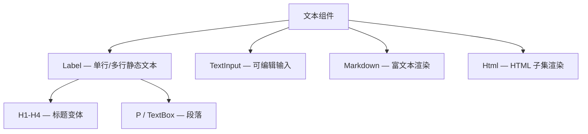

# 第13章：文本世界

## 为什么这很重要

文本是 UI 的基础——几乎每个界面都包含标签、标题、输入框、富文本。Makepad 2.0 提供了从简单标签到完整 Markdown 渲染的文本组件家族。理解这些组件的能力边界和使用模式，是构建信息密集型界面的关键。



---

## Label：静态文本

Label 是最基础的文本组件——显示一段不可编辑的文字。

```splash
Label{text: "Hello World"}

Label{text: "Styled Text"
    draw_text.color: #xff6b6b
    draw_text.text_style.font_size: 18
    draw_text.text_style: theme.font_bold{}}
```

*来源：`splash.md:524-530`*

### Label 的关键属性

| 属性 | 用途 | 默认值 |
|------|------|--------|
| `text` | 显示的文字 | `""` |
| `draw_text.color` | 文字颜色 | `#fff`（白色） |
| `draw_text.text_style.font_size` | 字号 | `theme.font_size_p` |
| `draw_text.text_style` | 字体族 | `theme.font_regular` |
| `width` / `height` | 尺寸 | 默认 Fill / Fill |
| `align` | 文字对齐 | 左上 |

**重要限制**：Label **不支持** `animator` 和 `cursor`。要做可 hover/可点击的文字，把 Label 包在 View 中（详见第10章：hover 响应容器模式）。

### 标题变体

```splash
H1{text: "Page Title"}       // 最大
H2{text: "Section"}          // 次大
H3{text: "Subsection"}       // 中等
H4{text: "Minor heading"}    // 较小
```

*来源：`splash.md:554-558`*

### 段落变体

```splash
P{text: "Paragraph text, typically with smaller font and wider width."}
Pbold{text: "Bold paragraph"}
TextBox{text: "Full-width text container"}
```

*来源：`splash.md:546-549`*

### 运行时更新文字

在 Splash 脚本中通过 `:=` 命名后用 `set_text()` 更新：

```splash
counter_label := Label{text: "0"}

// 在 on_click 或 fn 中：
ui.counter_label.set_text("" + state.counter)
```

`set_text()` 是最高效的 UI 更新方式——只修改文字内容，不重建 Widget（详见第9章：`set_text` vs `on_render` 对比）。

---

## TextInput：可编辑输入

TextInput 允许用户输入文字。它支持占位文字、密码模式、只读模式和数字限制：

```splash
TextInput{width: Fill height: Fit empty_text: "Type here..."}
TextInput{is_password: true empty_text: "Password"}
TextInput{is_read_only: true}
TextInput{is_numeric_only: true}
TextInputFlat{width: Fill height: Fit empty_text: "Flat style"}
```

*来源：`splash.md:575-580`*

### TextInput 事件

| 事件 | 触发时机 | Splash API | Rust API |
|------|---------|-----------|---------|
| 内容变化 | 用户编辑文本 | `on_change: \|text\|{...}` | `.changed(actions)` |
| 回车提交 | 用户按 Enter | `on_return: \|\|{...}` / `\|text\|{...}` | `.returned(actions)` |
| 读取文字 | 任意时刻 | `ui.input.text()` | `.text()` |
| 设置文字 | 任意时刻 | `ui.input.set_text("")` | `.set_text(cx, "")` |

`on_return` 是 TextInput 最重要的事件——用户按回车时触发，常用于搜索框和表单提交（详见第9章）。Rust 侧的 `.returned(actions)` 还会一并返回 `KeyModifiers`，便于区分普通回车和带修饰键的提交。

`on_change` 则适合做实时校验、搜索建议和即时预览。脚本侧会直接收到当前文本；Rust 侧用 `.changed(actions)` 取得更新后的字符串。

### TextInput 样式

TextInput 有自己的绘制层：`draw_bg`（背景）、`draw_text`（文字）、`draw_selection`（选中高亮）、`draw_cursor`（光标）。

---

## Markdown 和 Html

Makepad 内置了 Markdown 和 Html 渲染组件，可以直接在 Splash 中使用：

```splash
Markdown{
    width: Fill height: Fit
    selectable: true
    body: "# Title\n\nParagraph with **bold** and *italic*"
}

Html{
    width: Fill height: Fit
    body: "<h3>HTML Title</h3><p>Content with <b>bold</b></p>"
}
```

*来源：`splash.md:599-607`*

这两个组件都基于 `TextFlow`——Makepad 的富文本排版引擎。TextFlow 处理段落折行、内联样式、链接高亮等。

### 可用字体

| 字体 | Splash 名 | 用途 |
|------|----------|------|
| 常规 | `theme.font_regular` | 正文默认 |
| 粗体 | `theme.font_bold` | 标题、强调 |
| 斜体 | `theme.font_italic` | 引用、注释 |
| 粗斜体 | `theme.font_bold_italic` | 双重强调 |
| 等宽 | `theme.font_code` | 代码 |
| 图标 | `theme.font_icons` | UI 图标 |

*来源：`splash.md:570`*

---

## 模式提炼

### 模式：文字对比色

**问题**：默认文字颜色是白色（`#fff`），在浅色背景上不可见。

**方案**：始终显式设置 `draw_text.color`。深色背景用浅色文字，浅色背景用深色文字。

```splash
// 深色背景 + 浅色文字
SolidView{draw_bg.color: #x1a1a2e
    Label{text: "Visible" draw_text.color: #xeeeeff}}

// 浅色背景 + 深色文字
SolidView{draw_bg.color: #xf5f5f5 new_batch: true
    Label{text: "Visible" draw_text.color: #x222222}}
```

---

## 本章小结

| 组件 | 用途 | 可编辑 | 支持 Animator |
|------|------|--------|-------------|
| Label | 静态文字 | 否 | 否 |
| H1-H4 | 标题 | 否 | 否 |
| P / TextBox | 段落 | 否 | 否 |
| TextInput | 输入框 | 是 | 是 |
| Markdown | Markdown 渲染 | 选择 | 否 |
| Html | HTML 渲染 | 选择 | 否 |

下一章讲解交互组件——Button、CheckBox、Slider、DropDown（详见第14章：交互组件）。
