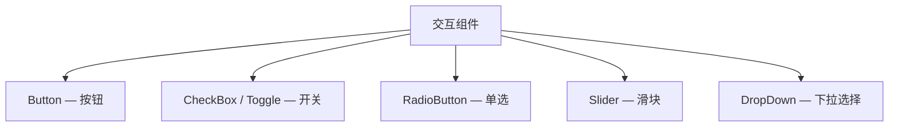

# 第14章：交互组件

## 为什么这很重要

文本组件显示信息，交互组件收集输入。Button、CheckBox、Slider、DropDown——这些是用户与应用对话的工具。本章系统讲解 Makepad 的交互组件家族及其在 Splash 中的使用方式。



---

## Button：按钮

Makepad 提供三种按钮样式：

```splash
Button{text: "Standard"}          // 标准（有立体边框）
ButtonFlat{text: "Flat"}          // 扁平（无边框）
ButtonFlatter{text: "Minimal"}    // 极简（透明背景）
```

*来源：`splash.md:615-617`*

### 自定义按钮样式

```splash
ButtonFlat{text: "Custom"
    draw_bg +: {
        color: uniform(#x336)
        color_hover: uniform(#x449)
        color_down: uniform(#x225)
    }
    draw_text +: {color: #xfff}
}
```

*来源：`splash.md:628-638`*

`color_hover` 和 `color_down` 是 Animator 驱动的变体——鼠标悬停时过渡到 hover 色，按下时过渡到 down 色（详见第10章）。

### 按钮事件

| 模式 | Splash | Rust |
|------|--------|------|
| 点击 | `on_click: \|\|{...}` | `button.clicked(actions)` |
| 程序触发 | `ui.btn.on_click()` | — |

带图标的按钮：

```splash
Button{text: "Save"
    icon_walk: Walk{width: 16 height: 16}
    draw_icon.color: #xfff
    draw_icon.svg: crate_resource("self://path/to/icon.svg")
}
```

*来源：`splash.md:620-625`*

---

## CheckBox 和 Toggle：开关

```splash
CheckBox{text: "Enable notifications"}
CheckBoxFlat{text: "Flat style"}
Toggle{text: "Dark mode"}
ToggleFlat{text: "Flat toggle"}
```

*来源：`splash.md:655-659`*

CheckBox 和 Toggle 功能相同——一个有/无状态的开关。区别是视觉样式：CheckBox 是方块打勾，Toggle 是滑动开关。

### 事件：Rust 用 `changed`，Splash 用 `on_click`

```splash
CheckBox{text: "Enable notifications"
    on_click: |checked|{
        if checked { ui.status_label.set_text("ON") }
        else { ui.status_label.set_text("OFF") }
    }
}
```

脚本侧没有单独的 `on_change` 名称；当前实现是在切换时触发 `on_click`，并把新的布尔状态作为参数传入。

```rust
// Rust 侧
if let Some(checked) = item.check_box(cx, ids!(check)).changed(actions) {
    // checked: bool
}
```

*来源：`examples/todo/src/main.rs:315`*

Rust 侧如果已经在 `handle_actions` 里处理交互，`changed(actions)` 仍然是最直接的入口（详见第5章 Todo 示例）。

---

## RadioButton：单选

```splash
RadioButton{text: "Option A"}
RadioButtonFlat{text: "Option A"}
```

*来源：`splash.md:670-673`*

RadioButton 用法和 CheckBox 类似，但交互语义不同：它点击后只会从 `off` 切到 `on`，不会再次点击取消。Rust 侧单个按钮通常用 `.clicked(actions)` 检测；如果是一组单选项，则用 `RadioButtonSet::selected(cx, actions)` 得到被选中的索引。

---

## Slider：滑块

```splash
Slider{width: Fill text: "Volume" min: 0. max: 100. default: 50.}
SliderMinimal{text: "Value" min: 0. max: 1. step: 0.01 precision: 2}
```

*来源：`splash.md:680-681`*

### Slider 属性

| 属性 | 说明 | 默认 |
|------|------|------|
| `min` | 最小值 | 0.0 |
| `max` | 最大值 | 1.0 |
| `step` | 步进 | 连续 |
| `default` | 初始值 | 0.0 |
| `precision` | 显示精度（小数位） | 自动 |

### Slider 事件

```splash
Slider{text: "Brightness" min: 0. max: 100.
    on_change: |val|{
        state.brightness = val
        ui.brightness_label.set_text("" + val)
    }
}
```

`on_change: |val|{...}` 是 Splash 中最常见的有参数闭包事件之一（详见第9章）。`TextInput` 的 `on_change` / `on_return` 在运行时也会传入当前文本。

---

## DropDown：下拉选择

```splash
DropDown{labels: ["Small" "Medium" "Large"]}
DropDownFlat{labels: ["Option A" "Option B" "Option C"]}
```

*来源：`splash.md:687-688`*

DropDown 的 `labels` 是一个字符串数组。选择变化通过 Rust 侧处理。

---

## 模式提炼

### 模式：表单布局

```splash
View{width: Fill height: Fit flow: Down spacing: 12 padding: 20
    View{width: Fill height: Fit flow: Right spacing: 8 align: Align{y: 0.5}
        Label{text: "Name:" width: 80 draw_text.color: #x888}
        input_name := TextInput{width: Fill height: Fit empty_text: "Enter name"}
    }
    View{width: Fill height: Fit flow: Right spacing: 8 align: Align{y: 0.5}
        Label{text: "Volume:" width: 80 draw_text.color: #x888}
        Slider{width: Fill text: "" min: 0. max: 100. default: 50.}
    }
    View{width: Fill height: Fit flow: Right spacing: 8
        Filler{}
        Button{text: "Submit" draw_bg.color: #x51cf66}
    }
}
```

**要素**：`flow: Down` 垂直排列表单行，每行 `flow: Right` 水平排列标签+控件，`Filler{}` 将提交按钮推到右侧。

---

## 本章小结

| 组件 | 输入类型 | Splash 事件 | Rust 事件 |
|------|---------|------------|----------|
| Button | 点击 | `on_click` | `.clicked()` |
| CheckBox | 开/关 | `on_click` | `.changed()` |
| Toggle | 开/关 | `on_click` | `.changed()` |
| RadioButton | 选择 | — | `.clicked()` / `RadioButtonSet::selected()` |
| Slider | 连续值 | `on_change` | `.changed()` |
| DropDown | 列表选择 | — | `.changed()` |

下一章讲解列表组件——PortalList 虚拟化列表和 FlatList（详见第15章：列表与虚拟化）。
