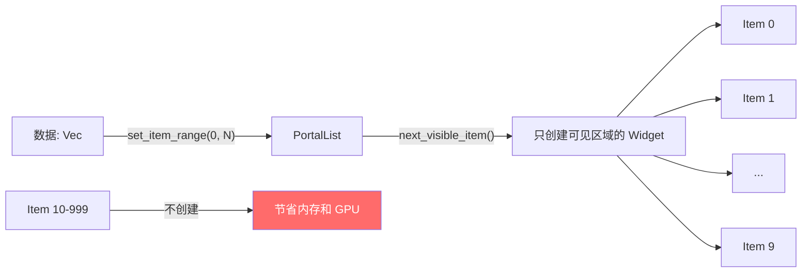

# 第15章：列表与虚拟化

## 为什么这很重要

第5章的 Todo 应用已经使用了 `PortalList`——Makepad 的虚拟化列表组件。当时我们把它当作黑盒使用。本章深入讲解 PortalList 的工作原理、配置选项和性能特性。

对于任何需要显示"可变长度数据"的应用——聊天记录、文件列表、搜索结果——PortalList 是核心组件。理解它的虚拟化机制，就能理解 Makepad 如何高效渲染上万条数据。



---

## PortalList 基础

### Splash 定义

```splash
list := PortalList{
    width: Fill height: Fill
    flow: Down
    scroll_bar: ScrollBar{}
    Item := CachedView{
        // 行模板
        RoundedView{width: Fill height: Fit ...}
    }
    Empty := CachedView{
        // 空状态模板
        View{align: Center Label{text: "No items"}}
    }
}
```

*改编自：`examples/todo/src/main.rs:100-108`*

PortalList 的核心概念：

1. **模板定义**：`Item :=` 和 `Empty :=` 定义两种行模板
2. **虚拟化**：只创建可见区域内的行
3. **CachedView**：每行被缓存为 GPU 纹理，滚动时直接使用缓存
4. **ScrollBar**：内置滚动条支持

### Rust 渲染循环

```rust
// 在 Widget::draw_walk 中
let todos = TODOS.read().unwrap();
list.set_item_range(cx, 0, todos.len());
while let Some(item_id) = list.next_visible_item(cx) {
    let item = list.item(cx, item_id, id!(Item));
    let todo = &todos[item_id];
    item.label(cx, ids!(label)).set_text(cx, &todo.text);
    item.draw_all_unscoped(cx);
}
```

*来源：`examples/todo/src/main.rs:223-235`（简化）*

三步：
1. `set_item_range(0, N)` 告诉列表有 N 项数据
2. `next_visible_item()` 返回下一个需要渲染的可见项 ID
3. `list.item(cx, item_id, id!(Item))` 获取（或创建）该项的 Widget 实例

PortalList 只对可见区域内的项调用 `next_visible_item`。如果列表有 10000 项但只有 20 项可见，只创建 20 个 Widget 实例。

### 事件处理

```rust
for (item_id, item) in list.items_with_actions(actions) {
    if item.check_box(cx, ids!(check)).changed(actions) { ... }
    if item.button(cx, ids!(delete)).clicked(actions) { ... }
}
```

*来源：`examples/todo/src/main.rs:314-319`*

`items_with_actions` 只遍历产生了用户操作的项，返回 `(index, widget)` 对。不需要遍历所有 10000 项——只处理有事件的那几项。

---

## PortalList 配置

| 属性 | 说明 | 默认 |
|------|------|------|
| `flow` | 列表方向 | `Down` |
| `scroll_bar` | 滚动条配置 | 无 |
| `drag_scrolling` | 触摸拖动滚动 | `false` |
| `auto_tail` | 新项添加时自动滚动到底部 | `false` |
| `capture_overload` | 捕获滚动溢出事件 | `false` |
| `selectable` | 行是否可选中 | `false` |

*来源：`splash.md:790-791`*

`auto_tail: true` 特别适合聊天应用——新消息到达时列表自动滚到最新消息。

---

## FlatList vs PortalList

| 特性 | PortalList | FlatList |
|------|-----------|---------|
| 虚拟化 | 是（只渲染可见项） | 否（渲染所有项） |
| 性能 | O(可见项) | O(全部项) |
| 适用规模 | 无限 | < 100 项 |
| 模板 | `Item :=` 声明 | 直接放子组件 |
| CachedView | 支持 | 不需要 |
| 滚动 | 内置 ScrollBar | 需外层 ScrollView |

FlatList 是简单的线性容器——所有子组件都同时存在。适合项数固定且少的场景（如设置页面的选项列表）。PortalList 是虚拟化的——动态创建和回收 Widget。适合数据驱动的长列表。

---

## 模式提炼

### 模式：数据-列表-事件三角

```
Vec<Data> ←→ PortalList ←→ MatchEvent
   ↑            |              |
   └────── redraw(cx) ←───────┘
```

数据在 Rust 中，列表在 Splash 中，事件在 Rust 中处理。修改数据后调用 `redraw()` 刷新列表。这是 Makepad 列表应用的标准架构（详见第5章 Todo 完整示例）。

---

## 本章小结

| 概念 | 说明 |
|------|------|
| PortalList | 虚拟化列表，只渲染可见项 |
| CachedView | 将行渲染为 GPU 纹理缓存 |
| `set_item_range` | 声明数据范围 |
| `next_visible_item` | 获取下一个需要渲染的项 |
| `items_with_actions` | 获取有用户操作的项 |
| FlatList | 非虚拟化简单列表 |

下一章讲解高级容器——Dock、Modal、PageFlip、ExpandablePanel（详见第16章：高级容器）。
