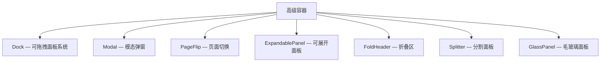

# 第16章：高级容器

## 为什么这很重要

前面的章节覆盖了基础容器（View、SolidView、RoundedView）和列表容器（PortalList）。但构建复杂应用还需要更高级的布局组件——标签页面板、模态弹窗、可折叠区域、分割面板。本章讲解 Makepad 的高级容器组件。



---

## Dock：可拖拽面板

Dock 是 Makepad Studio 使用的核心组件——一个可拖拽、可分割、可合并的面板系统。适合 IDE、仪表板、多窗口应用。

Dock 的配置比较复杂，通常在 Rust 侧用代码构建面板树。本书不深入 Dock 的完整 API——它是 Part V 架构篇的内容（详见第22章：事件与 Action 系统中的 Dock 事件处理）。

---

## Modal：模态弹窗

Modal 在内容之上叠加一个半透明遮罩层和弹窗内容：

```splash
modal := Modal{
    content: RoundedView{
        width: 300 height: Fit
        draw_bg.color: #x2a2a4e
        draw_bg.radius: 12.
        padding: 20 flow: Down spacing: 12 new_batch: true
        Label{text: "Confirm Delete?" draw_text.color: #xfff draw_text.text_style.font_size: 16}
        Label{text: "This action cannot be undone." draw_text.color: #x888}
        View{flow: Right spacing: 8 height: Fit
            Filler{}
            Button{text: "Cancel"}
            Button{text: "Delete" draw_bg.color: #xff4444}
        }
    }
}
```

Modal 的显示/隐藏通常在 Rust 侧通过 `modal.open(cx)` 和 `modal.close(cx)` 控制。

---

## PageFlip：页面切换

PageFlip 在多个"页面"之间切换，同一时刻只显示一个页面：

```splash
page_flip := PageFlip{
    active_page: page_home
    page_home := View{
        Label{text: "Home Page"}
    }
    page_settings := View{
        Label{text: "Settings Page"}
    }
}
```

在 Rust 侧切换页面：`page_flip.set_active_page(cx, ids!(page_settings))`。在 Splash 中可以用 `on_render` 条件渲染实现类似效果（详见第9章）。

---

## ExpandablePanel：可展开面板

```splash
ExpandablePanel{
    width: Fill height: Fit
    header: View{height: 40 align: Align{y: 0.5}
        Label{text: "Details" draw_text.color: #xfff}
    }
    body: View{height: Fit flow: Down padding: 12
        Label{text: "Expanded content here"}
    }
}
```

ExpandablePanel 内置展开/折叠动画（Forward 过渡）。

---

## FoldHeader：折叠区

FoldHeader 和 ExpandablePanel 类似，但更轻量——通常用在设置页面的分组中：

```splash
FoldHeader{
    header: View{height: Fit flow: Right align: Align{y: 0.5} spacing: 8
        FoldButton{}
        Label{text: "Advanced Settings"}
    }
    body: View{height: Fit flow: Down padding: Inset{left: 23} spacing: 8
        CheckBox{text: "Enable debug mode"}
        CheckBox{text: "Show FPS counter"}
    }
}
```

*来源：`splash.md:774-785`*

`FoldButton` 是一个小三角图标，点击时旋转（通过 Animator）。

---

## Splitter：分割面板

Splitter 将区域分为两个可调大小的部分：

```splash
Splitter{
    axis: SplitterAxis.Horizontal
    align: SplitterAlign.FromA(250.)
    a := View{Label{text: "Left Panel"}}
    b := View{Label{text: "Right Panel"}}
}
```

*改编自：`splash.md:762-768`*

| 属性 | 说明 |
|------|------|
| `axis` | `Horizontal`（左右分割）/ `Vertical`（上下分割） |
| `align` | `FromA(px)` / `FromB(px)` / `Weighted(0.5)` |
| `a` / `b` | 两个子面板（用 `:=` 命名） |

---

## GlassPanel：毛玻璃面板

GlassPanel 创建一个带模糊效果的半透明面板，常用于 overlay 式的导航面板：

```splash
GlassPanel{
    width: 300 height: Fill
    // 内容
}
```

GlassPanel 的模糊效果是 GPU shader 级别的——在它后面的内容会被实时模糊。

---

## 模式提炼

### 模式：容器选择决策树

```
需要模态遮罩？ → Modal
需要多页切换？ → PageFlip 或 on_render 条件渲染
需要折叠展开？ → FoldHeader（轻量）或 ExpandablePanel（带动画）
需要可调分割？ → Splitter
需要可拖拽面板？ → Dock
需要毛玻璃效果？ → GlassPanel
```

对于简单的"显示/隐藏"需求，优先考虑 `on_render` 条件渲染（详见第9章）而非 Modal 或 PageFlip——条件渲染在纯 Splash 中就能工作，不需要 Rust 侧控制。

---

## 本章小结

| 容器 | 用途 | 复杂度 |
|------|------|--------|
| Modal | 模态弹窗 | 中 |
| PageFlip | 页面切换 | 低 |
| ExpandablePanel | 展开/折叠 | 低 |
| FoldHeader | 轻量折叠 | 低 |
| Splitter | 可调分割 | 中 |
| GlassPanel | 毛玻璃面板 | 低 |
| Dock | 可拖拽面板系统 | 高 |

下一章讲解如何创建自定义 Widget——`#[derive(Script, ScriptHook, Widget)]`、Widget trait 和 Widget 生命周期（详见第17章：自定义 Widget）。
