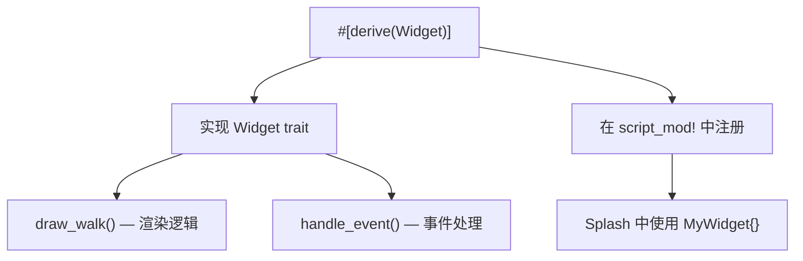

# 第17章：自定义 Widget

## 为什么这很重要

到目前为止，我们使用的都是 Makepad 内置的 Widget——View、Label、Button、PortalList。但实际应用中你总会遇到内置组件无法满足的需求：自定义图表、特殊交互模式、业务专属的 UI 组件。

Makepad 2.0 的 Widget 系统是可扩展的——你可以用 Rust 创建新的 Widget，然后在 Splash 中像内置组件一样使用它。第5章的 `TodoList` 就是一个自定义 Widget 的实例。

本章讲解创建自定义 Widget 的完整流程。



---

## Widget trait 的核心方法

每个自定义 Widget 都需要实现 `Widget` trait 的两个核心方法：

```rust
impl Widget for TodoList {
    fn draw_walk(&mut self, cx: &mut Cx2d, scope: &mut Scope, walk: Walk) -> DrawStep {
        // 渲染逻辑：在这里绘制 Widget 的视觉内容
    }

    fn handle_event(&mut self, cx: &mut Cx, event: &Event, scope: &mut Scope) {
        // 事件处理：在这里响应鼠标、键盘等事件
    }
}
```

*来源：`examples/todo/src/main.rs:210-246`（简化）*

### draw_walk：渲染

`draw_walk` 在每帧被调用（如果 Widget 需要重绘）。它接收：

- `cx: &mut Cx2d`——2D 绘图上下文
- `scope: &mut Scope`——作用域数据（可传递父组件的数据）
- `walk: Walk`——布局信息（位置和尺寸）

返回 `DrawStep::done()` 表示渲染完成。

### handle_event：事件

`handle_event` 在每个事件循环迭代中被调用。通常转发给内部的 View：

```rust
fn handle_event(&mut self, cx: &mut Cx, event: &Event, scope: &mut Scope) {
    self.view.handle_event(cx, event, scope);
}
```

---

## 创建自定义 Widget 的步骤

### 步骤一：定义 Rust 结构体

```rust
#[derive(Script, ScriptHook, Widget)]
struct MyChart {
    #[deref]
    view: View,
    // 自定义字段
    #[rust]
    data: Vec<f64>,
}
```

- `#[derive(Script, ScriptHook, Widget)]`——让结构体可以作为 Widget 使用
- `#[deref] view: View`——委托基础的布局和绘制给内部的 View
- `#[rust]`——标记非 Splash 字段（不会出现在 Splash DSL 中）

### 步骤二：实现 Widget trait

```rust
impl Widget for MyChart {
    fn draw_walk(&mut self, cx: &mut Cx2d, scope: &mut Scope, walk: Walk) -> DrawStep {
        // 使用 self.data 绘制图表
        while let Some(step) = self.view.draw_walk(cx, scope, walk).step() {
            // 自定义渲染逻辑
        }
        DrawStep::done()
    }

    fn handle_event(&mut self, cx: &mut Cx, event: &Event, scope: &mut Scope) {
        self.view.handle_event(cx, event, scope);
    }
}
```

### 步骤三：在 Splash 中注册

```splash
mod.widgets.MyChartBase = #(MyChart::register_widget(vm))
mod.widgets.MyChart = set_type_default() do mod.widgets.MyChartBase{
    width: Fill height: 200
}
```

`#(MyChart::register_widget(vm))` 告诉 Splash VM 有一个叫 `MyChart` 的新 Widget 类型。

### 步骤四：在 Splash 中使用

```splash
chart := mod.widgets.MyChart{
    width: Fill height: 300
}
```

注册后，自定义 Widget 和内置 Widget 使用方式完全相同——支持属性设置、`:=` 命名、模板定义。

---

## 实例：TodoList 的 Widget 结构

回顾第5章的 TodoList——它是一个完整的自定义 Widget 实例：

```rust
#[derive(Script, ScriptHook, Widget)]
struct TodoList {
    #[deref]
    view: View,
}
```

*来源：`examples/todo/src/main.rs:204-208`*

TodoList 的 `draw_walk` 从 `TODOS` 数据源读取数据，遍历 PortalList 的可见项，为每一项设置文字和样式（详见第5章的完整分析）。

它在 Splash 中被注册和使用：

```splash
mod.widgets.TodoListBase = #(TodoList::register_widget(vm))
mod.widgets.TodoList = set_type_default() do mod.widgets.TodoListBase{
    list := PortalList{...}
}

// 使用
todo_list := mod.widgets.TodoList{}
```

*来源：`examples/todo/src/main.rs:96-109,174`*

---

## Scope：父子组件通信

`Scope` 是 Makepad 中父组件向子组件传递数据的机制：

```rust
// 父组件传递数据
let scope = Scope::with_data(&mut my_data);
child.draw_walk(cx, &mut scope, walk);

// 子组件接收数据
fn draw_walk(&mut self, cx: &mut Cx2d, scope: &mut Scope, walk: Walk) -> DrawStep {
    if let Some(data) = scope.data.get::<MyData>() {
        // 使用父组件传递的数据
    }
}
```

*来源：`platform/script/src/apply.rs:41-47`*

Scope 是类型擦除的——通过 `Any` trait 实现。子组件需要知道父组件传递的具体类型才能 `downcast_ref`。

---

## 模式提炼

### 模式：Deref 委托

```rust
#[derive(Script, ScriptHook, Widget)]
struct MyWidget {
    #[deref]
    view: View,
}
```

几乎所有自定义 Widget 都使用 `#[deref] view: View` 模式——将基础的布局、绘制、事件处理委托给内部的 View。你只需要在 `draw_walk` 和 `handle_event` 中添加自定义逻辑。

### 模式：数据驱动渲染

```rust
fn draw_walk(&mut self, cx: &mut Cx2d, scope: &mut Scope, walk: Walk) -> DrawStep {
    let data = DATA.read().unwrap();  // 读取全局数据
    while let Some(step) = self.view.draw_walk(cx, scope, walk).step() {
        // 用 data 驱动渲染
    }
    DrawStep::done()
}
```

Widget 在 `draw_walk` 中读取数据并渲染。数据修改后调用 `redraw(cx)` 触发重绘。这和第4章的"状态-更新-渲染"循环是相同的模式，只是发生在 Widget 内部。

---

## 本章小结

| 概念 | 说明 |
|------|------|
| `#[derive(Widget)]` | 让 Rust 结构体成为 Widget |
| `draw_walk()` | Widget 的渲染入口 |
| `handle_event()` | Widget 的事件入口 |
| `#[deref] view: View` | 委托基础功能给内部 View |
| `register_widget(vm)` | 在 Splash VM 中注册自定义 Widget |
| `Scope` | 父子 Widget 间的数据传递 |

Part III（Widget 体系篇）到此完成。下一步进入 Part IV（渲染与 Shader 篇），讲解 Makepad 的 GPU 渲染管线和 Sdf2d Shader 编程。
