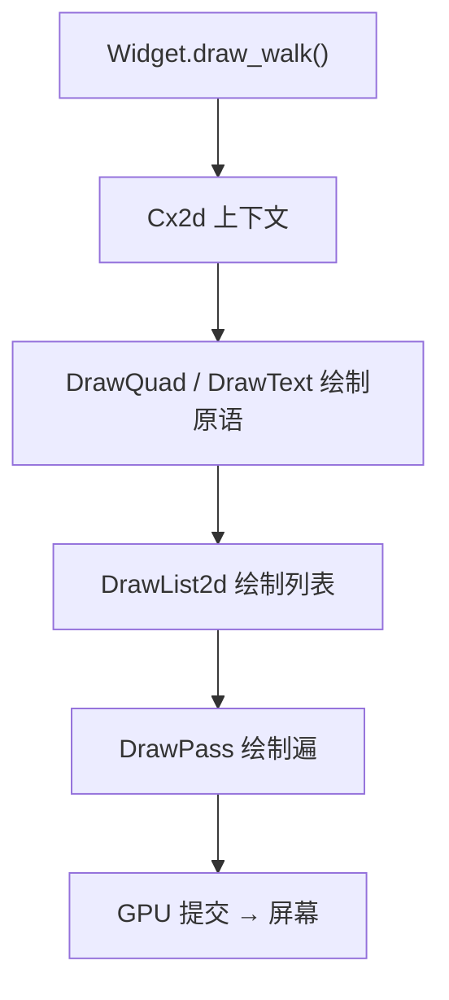
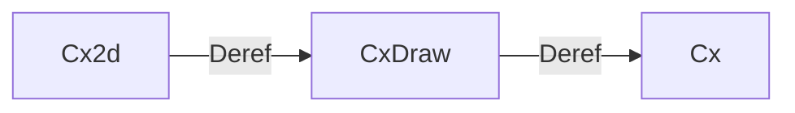
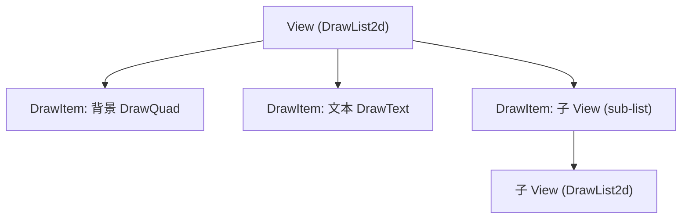
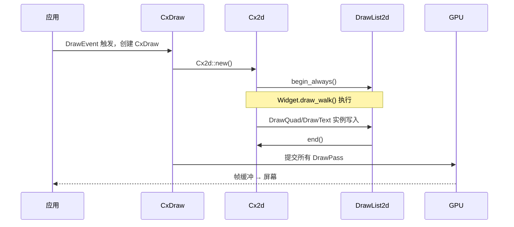

# 第18章：Draw 管线

## 为什么这很重要

前面的章节讲解了如何使用 Widget 构建 UI，但 Widget 是如何被渲染到屏幕上的？Makepad 的 Draw 管线（Draw Pipeline）是连接 Widget 声明与 GPU 渲染之间的桥梁。理解这条管线，你才能写出高性能的自定义 Widget（详见第17章），理解 shader 的执行上下文（详见第19章）。



---

## 核心架构：三层上下文

Makepad 的绘制系统由三层嵌套的上下文对象组成，每层通过 `Deref` 向下委托：



**Cx** 是全局状态容器，管理窗口、事件循环、全局资源。**CxDraw** 在每次 `DrawEvent` 时创建：

```rust
pub struct CxDraw<'a> {
    pub cx: &'a mut Cx,
    pub draw_event: &'a DrawEvent,
    pub(crate) pass_stack: Vec<PassStackItem>,  // 渲染遍层级
    pub draw_list_stack: Vec<DrawListId>,       // 绘制列表层级
    pub fonts: Rc<RefCell<Fonts>>,              // 字体资源
}
```

*来源：`draw/src/cx_draw.rs:23-31`*

`CxDraw` 在 `Drop` 时自动提交字体纹理更新——如果纹理未准备好，则触发全量重绘。

**Cx2d** 是 Widget 在 `draw_walk` 中直接使用的上下文，负责 2D 布局（Turtle，详见第12章）和绘制调用分组：

```rust
pub struct Cx2d<'a, 'b> {
    pub cx: &'b mut CxDraw<'a>,
    pub(crate) turtles: Vec<Turtle>,                   // 布局栈
    pub(crate) draw_call_parent_stack: Vec<u64>,       // 合批分组
}
```

*来源：`draw/src/cx_2d.rs:12-24`（简化）*

---

## 绘制原语：DrawQuad 与 DrawText

所有 2D 可视元素最终都是四边形（Quad）。`DrawQuad` 是最基本的绘制原语：

```splash
mod.draw.DrawQuad = mod.std.set_type_default() do #(DrawQuad::script_shader(vm)){
    vertex_pos: vertex_position(vec4f)
    fb0: fragment_output(0, vec4f)
    draw_call: uniform_buffer(draw.DrawCallUniforms)
    draw_pass: uniform_buffer(draw.DrawPassUniforms)
    draw_list: uniform_buffer(draw.DrawListUniforms)
    geom: vertex_buffer(geom.QuadVertex, geom.QuadGeom)

    vertex: fn() {
        self.vertex_pos = self.clip_and_transform_vertex(self.rect_pos, self.rect_size)
    }
    fragment: fn(){
        self.fb0 = depth_clip(self.world, self.pixel(), self.depth_clip)
    }
    pixel: fn(){ #0000 }
}
```

*来源：`draw/src/shader/draw_quad.rs:3-68`*

`DrawColor` 继承自 `DrawQuad`，只覆盖 `pixel` 函数输出纯色：

```splash
mod.draw.DrawColor = { ..mod.draw.DrawQuad  pixel: fn(){ return vec4(self.color.rgb*self.color.a, self.color.a); } }
```

*来源：`draw/src/shader/draw_quad.rs:70-76`*

`DrawText` 处理字形渲染——每个字形是一个四边形，使用 SDF 纹理实现高质量缩放。它持有 `grayscale_texture`、`color_texture`、`msdf_texture` 三种字体纹理。

*来源：`draw/src/shader/draw_text.rs:30-78`*

---

## DrawList：绘制列表

`DrawList2d` 是绘制命令的有序集合。每个 `View{}` 创建一个 DrawList：



核心操作：`begin_always`/`begin_maybe` 开始记录、`end` 结束记录、`redraw` 标记需重绘。

`Cx2d::will_redraw` 通过比较 Turtle 位置判断是否需要重绘——位置未变则跳过，这是避免全量重绘的关键。

*来源：`draw/src/draw_list_2d.rs:14-28`，`draw/src/cx_2d.rs:114-120`*

---

## DrawPass 与合批

**DrawPass** 是一次完整的 GPU 渲染提交，持有根绘制列表、DPI 缩放、相机矩阵。

为减少 GPU draw call 数量，Makepad 通过 `draw_call_parent_stack` 将连续的同类型绘制原语合批：

```rust
pub fn push_draw_call_parent(&mut self) {
    let id = self.draw_call_parent_next;
    self.draw_call_parent_next = self.draw_call_parent_next.wrapping_add(1).max(2);
    self.draw_call_parent_stack.push(id);
}
```

*来源：`draw/src/cx_2d.rs:57-61`*

同一分组内、相同 shader 的连续绘制实例会被合并为一个 `ManyInstances` 批次——实例数据打包到同一 vertex buffer，GPU 一次绘制。背景和内容在不同 lane 中，避免 z-order 混乱。

---

## 完整绘制流程



1. **DrawEvent** 触发——平台层请求重绘
2. **CxDraw/Cx2d 创建**——初始化字体纹理、Turtle 布局栈
3. **Widget 树遍历**——每个 Widget 的 `draw_walk` 写入绘制原语
4. **合批优化**——同类绘制实例合并
5. **GPU 提交**——每个 DrawPass 提交到平台 GPU API（Metal/D3D11/WebGL）
6. **字体纹理更新**——CxDraw drop 时提交字体图集变更

---

## 模式提炼

### 模式：三层 Deref 链

```
Cx2d → CxDraw → Cx
```

在 `draw_walk` 中拿到 `Cx2d`，就可以直接调用 `Cx` 上的任何方法——无需手动穿透层级。

### 模式：pixel 函数覆盖

```splash
mod.draw.MyDraw = { ..mod.draw.DrawQuad  pixel: fn(){ ... } }
```

所有 2D 渲染的核心模式——vertex 逻辑共享，pixel 逻辑自定义。

### 模式：脏区检测避免全量重绘

DrawList 通过 `dirty_check_rect` 比较位置变化，结合 `begin_maybe` 的条件执行，大部分静态 UI 在每帧中被跳过。

---

## 本章小结

| 概念 | 说明 |
|------|------|
| `Cx2d` | 2D 绘制上下文，Widget 直接使用 |
| `CxDraw` | 绘制事件上下文，管理 pass 和字体 |
| `DrawQuad` | 最基本的四边形绘制原语 |
| `DrawText` | 文本绘制原语，使用 SDF 字体纹理 |
| `DrawList2d` | 绘制命令的有序列表 |
| `DrawPass` | 一次 GPU 渲染提交 |
| `ManyInstances` | 实例化合批，减少 draw call |

理解了 Draw 管线后，下一章将深入 `pixel` 函数内部，讲解 Makepad 强大的 Sdf2d Shader 编程系统。
