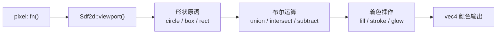

# 第19章：Sdf2d Shader 编程

## 为什么这很重要

上一章讲解了 Draw 管线，管线的最后一步是 `pixel` 函数。Makepad 提供了 `Sdf2d`（Signed Distance Field 2D）API，让你在 GPU 上用类似绘图 API 的方式描述形状。RoundedView 的圆角、Button 的按下效果、Slider 的轨道——所有内置 Widget 的视觉外观都由 Sdf2d 实现。



---

## Shader 结构与变量类型

`DrawQuad` 的 `fragment` 调用 `pixel()`，`pixel()` 返回 `vec4` 颜色。Shader 中有四种变量类型：

| 类型 | 声明 | 说明 |
|------|------|------|
| **instance** | `instance(default)` | 每个实例不同（rect_pos、color），Splash 可直接设置 |
| **uniform** | `uniform(type)` | 同一 draw call 共享，系统自动填充 |
| **varying** | `varying(type)` | vertex → fragment 插值传递 |
| **texture** | `texture_2d(type)` | GPU 纹理采样 |

---

## Sdf2d API

`Sdf2d` 通过距离场描述形状——对每个像素计算"到最近形状边界的有符号距离"，据此决定填充或描边。

### 初始化与基本流程

```
pixel: fn(){
    let sdf = Sdf2d::viewport(self.pos * self.rect_size);
    sdf.circle(50., 50., 30.);   // 定义形状
    sdf.fill(#f80);              // 着色
    return sdf.result;           // 输出
}
```

### 形状原语

*来源：`draw/src/shader/sdf.rs:150-500`*

| 函数 | 说明 |
|------|------|
| `sdf.circle(x, y, r)` | 圆形 |
| `sdf.box(x, y, w, h, radius)` | 圆角矩形（最常用） |
| `sdf.box_all(x, y, w, h, r_lt, r_rt, r_rb, r_lb)` | 独立四角圆角 |
| `sdf.rect(x, y, w, h)` | 无圆角矩形 |
| `sdf.hexagon(x, y, r)` | 六边形 |
| `sdf.hline(y, h)` | 水平线 |
| `sdf.arc_round_caps(x, y, r, start, end, thickness)` | 圆端弧线 |
| `sdf.arc_flat_caps(x, y, r, start, end, thickness)` | 平端弧线 |

路径绘制：`sdf.move_to(x, y)` → `sdf.line_to(x, y)` → `sdf.close_path()`

### 着色操作

| 函数 | 说明 |
|------|------|
| `sdf.fill(color)` | 填充并清除形状 |
| `sdf.fill_keep(color)` | 填充但保留形状（可继续 stroke） |
| `sdf.stroke(color, width)` | 描边并清除形状 |
| `sdf.stroke_keep(color, width)` | 描边但保留形状 |
| `sdf.glow(color, width)` | 外发光效果 |

*来源：`draw/src/shader/sdf.rs:215-274`*

### 布尔运算

```
sdf.circle(50., 50., 30.);
sdf.circle(70., 50., 30.);
sdf.union();               // 并集
sdf.fill(#f00);
```

| 运算 | 效果 |
|------|------|
| `union()` | 并集——形状合并 |
| `intersect()` | 交集——只保留重叠区域 |
| `subtract()` | 差集——从旧形状中减去新形状 |
| `gloop(k)` | 平滑并集——圆滑过渡 |
| `blend(k)` | 混合——在两个形状间插值（适合动画） |

*来源：`draw/src/shader/sdf.rs:276-300`*

### 变换

```
sdf.translate(x, y)        // 平移
sdf.rotate(angle, cx, cy)  // 绕点旋转
sdf.scale(factor, cx, cy)  // 绕点缩放
```

---

## 辅助工具

**Pal（调色板）**：`Pal.premul(color)` 预乘 alpha、`Pal.hsv2rgb(hsva)` 色彩空间转换、`Pal.iq0..iq7(t)` 程序化渐变色。

**GaussShadow**：`GaussShadow.rounded_box_shadow(lower, upper, point, sigma, corner)` 和 `box_shadow` 实现 GPU 高斯模糊阴影。

*来源：`draw/src/shader/sdf.rs:11-148`*

---

## 完整示例：RoundedView 的 draw_bg

```
draw_bg: {
    pixel: fn(){
        let sdf = Sdf2d::viewport(self.pos * self.rect_size);
        sdf.box(
            self.border_width,
            self.border_width,
            self.rect_size.x - self.border_width * 2.0,
            self.rect_size.y - self.border_width * 2.0,
            max(1.0, self.border_radius)
        );
        sdf.fill_keep(self.color);
        if self.border_width > 0.0 {
            sdf.stroke(self.border_color, self.border_width);
        }
        return sdf.result;
    }
}
```

每个属性（`border_width`、`border_radius`、`color`）都是 instance 变量，可在 Splash 中设置或通过 Animator 动画化（详见第10章）。

---

## 模式提炼

### 模式：viewport + shape + fill 三步法

```
let sdf = Sdf2d::viewport(self.pos * self.rect_size);
sdf.circle(x, y, r);    // 1. 定义形状
sdf.fill(color);         // 2. 着色
return sdf.result;       // 3. 输出
```

几乎所有 Makepad shader 都遵循这个三步模式。多个形状按顺序叠加——后绘制的在上面。

### 模式：fill_keep + stroke 组合

```
sdf.box(x, y, w, h, r);
sdf.fill_keep(bg_color);              // 填充但不清除形状
sdf.stroke(border_color, border_width);// 同一形状上描边
```

`fill_keep` 保留距离场，后续 `stroke` 可在同一形状上描边。用 `fill`（不带 keep）则会重置距离场。

### 模式：instance 变量驱动外观

```splash
Button{ draw_bg: { color: #f00, border_radius: 8.0 } }
```

Shader 中的 instance 变量可从 Splash DSL、Rust 代码和 Animator 三个入口驱动，比传统 CSS 更灵活。

---

## 本章小结

| 概念 | 说明 |
|------|------|
| `Sdf2d::viewport` | 初始化距离场，传入像素坐标 |
| `circle` / `box` / `rect` | 基础形状原语 |
| `fill` / `stroke` / `glow` | 着色操作 |
| `union` / `intersect` / `subtract` | 布尔运算组合形状 |
| `blend(k)` | 两形状间插值，适合动画 |
| `Pal` / `GaussShadow` | 调色板和阴影辅助工具 |
| `instance` 变量 | 可从 DSL/Rust/Animator 设置的 shader 参数 |

SDF shader 解决了"形状怎么画"。下一章讲解矢量图形（Vector Widget），用三角化方式绘制复杂的 SVG 路径和动画。
