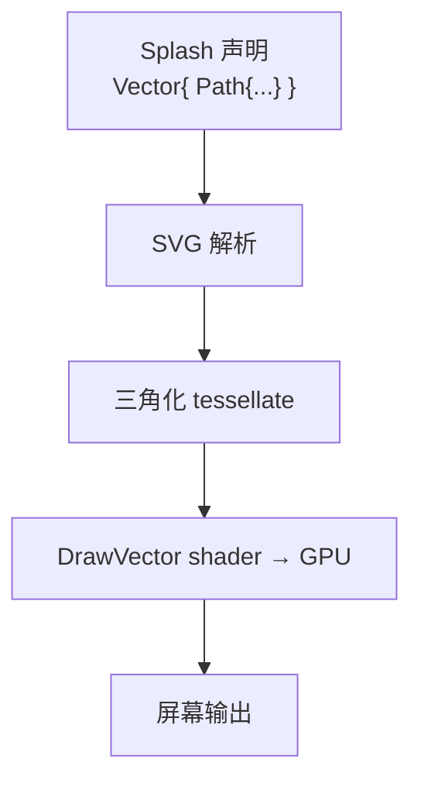

# 第20章：矢量图形

## 为什么这很重要

第19章的 Sdf2d 适合 UI 控件的简单形状。但当你需要绘制图标、插画、数据可视化——SVG 路径有数十个控制点，用 SDF 描述代价太高。Makepad 的 **Vector Widget** 将 SVG 风格的矢量图形声明式地写在 Splash 中，引擎将路径三角化（tessellation）后交给 GPU 渲染。



---

## 基本用法

```splash
Vector{width: 200 height: 200 viewbox: vec4(0 0 200 200)
    Rect{x: 10 y: 10 w: 80 h: 60 rx: 5 ry: 5 fill: #f80}
    Circle{cx: 150 cy: 50 r: 30 fill: #08f}
    Line{x1: 10 y1: 150 x2: 190 y2: 150 stroke: #fff stroke_width: 2}
}
```

*来源：`splash.md` Vector Widget 章节*

`Vector{}` 属性：`width`/`height` 控制布局尺寸，`viewbox: vec4(min_x min_y w h)` 定义内部坐标系。

### 形状元素

| 形状 | 关键属性 |
|------|----------|
| `Rect` | x, y, w, h, rx, ry |
| `Circle` | cx, cy, r |
| `Ellipse` | cx, cy, rx, ry |
| `Line` | x1, y1, x2, y2 |
| `Polyline` / `Polygon` | points: "x,y x,y ..." |
| `Path` | d: "M10 80 Q50 10 100 80" |

### 通用样式

| 属性 | 说明 |
|------|------|
| `fill` | 颜色 / Gradient / `false`（不填充） |
| `stroke` / `stroke_width` | 描边色和宽度 |
| `opacity` / `fill_opacity` / `stroke_opacity` | 透明度 |
| `stroke_linecap` | "butt" / "round" / "square" |
| `stroke_linejoin` | "miter" / "round" / "bevel" |
| `transform` | 变换（见下文） |
| `filter` | 滤镜引用 |

---

## Path：SVG 路径

```splash
Path{d: "M 10 80 Q 52 10 95 80 T 180 80" fill: #f0f stroke: #fff stroke_width: 1.5}
```

常用命令：M（移动）、L（直线）、H/V（水平/垂直线）、Q（二次贝塞尔）、C（三次贝塞尔）、A（弧线）、Z（闭合）。路径由 `parse_path_data` 解析后传入三角化引擎。

*来源：`draw/src/svg/mod.rs` re-export 的 `makepad_svg::path_data::parse_path_data`*

---

## Group 与变换

```splash
Vector{width: 200 height: 200 viewbox: vec4(0 0 200 200)
    Group{opacity: 0.7 transform: Rotate{deg: 15}
        Rect{x: 20 y: 20 w: 60 h: 60 fill: #f00}
        Circle{cx: 130 cy: 50 r: 30 fill: #0f0}
    }
}
```

变换类型：`Translate{x: y:}`、`Rotate{deg:}`、`Scale{x: y:}`。组合变换用数组：

```splash
transform: [Translate{x: 36.8 y: 11.4} Scale{x: 7.6 y: 7.6}]
```

*来源：`draw/src/svg/render.rs:28-41`*

---

## Gradient：渐变

**线性渐变**：

```splash
let my_grad = Gradient{x1: 0 y1: 0 x2: 1 y2: 1
    Stop{offset: 0 color: #ff0000}
    Stop{offset: 0.5 color: #00ff00}
    Stop{offset: 1 color: #0000ff}
}
Vector{...  Rect{x: 0 y: 0 w: 200 h: 100 fill: my_grad} }
```

**径向渐变**：

```splash
let radial = RadGradient{cx: 0.5 cy: 0.5 r: 0.5
    Stop{offset: 0 color: #fff}   Stop{offset: 1 color: #000}
}
```

渐变在 GPU 端通过纹理行实现——`DrawVector` 的 `gradient_texture` 纹理在渲染前由 `add_gradient_row` 填充。

*来源：`draw/src/shader/draw_vector.rs:18`，`draw/src/svg/render.rs:54-56`*

---

## Filter 与 Tween

**DropShadow 滤镜**：

```splash
let shadow = Filter{ DropShadow{dx: 2 dy: 4 blur: 6 color: #000 opacity: 0.5} }
Vector{...  Rect{... filter: shadow} }
```

阴影通过 `DrawVector` shader 中的 `erf7`/`blur_step` 高斯近似实现（详见第19章 GaussShadow）。

**Tween 属性动画**——动画化几乎任何数值/颜色属性：

```splash
Path{d: Tween{dur: 2.0 loop_: true
    values: ["M 10 80 Q 50 10 100 80" "M 10 80 Q 50 150 100 80"]
} fill: #f0f}

Circle{cx: 50 cy: 50 r: 30
    fill: Tween{dur: 1.5 loop_: true from: #ff0000 to: #0000ff}}
```

Tween 属性：`from`/`to`（起止值）、`values`（关键帧数组）、`dur`（秒）、`begin`（延迟）、`loop_`（循环）、`calc`（插值方式）。动画由 `render_svg` 的 `time` 参数驱动。

*来源：`splash.md` Tween 章节，`draw/src/svg/render.rs:19-27`*

---

## 完整示例：应用图标

```splash
let glass_bg = Gradient{x1: 0 y1: 0 x2: 1 y2: 1
    Stop{offset: 0 color: #x556677 opacity: 0.45}
    Stop{offset: 1 color: #x334455 opacity: 0.35}
}
let brain_grad = Gradient{x1: 0.5 y1: 0 x2: 0.5 y2: 1
    Stop{offset: 0 color: #x77ccff}
    Stop{offset: 0.75 color: #x8866dd}
    Stop{offset: 1 color: #x9944cc}
}
let icon_shadow = Filter{DropShadow{dx: 0 dy: 4 blur: 6 color: #x000000 opacity: 0.5}}

Vector{width: 256 height: 256 viewbox: vec4(0 0 256 256)
    Rect{x: 16 y: 16 w: 224 h: 224 rx: 44 ry: 44 fill: glass_bg filter: icon_shadow}
    Group{transform: [Translate{x: 36.8 y: 11.4} Scale{x: 7.6 y: 7.6}]
        Path{d: "M15.5 13a3.5 3.5 0 0 0 -3.5 3.5v1a3.5 3.5 0 0 0 7 0v-1.8"
            fill: false stroke: brain_grad stroke_width: 0.35
            stroke_linecap: "round" stroke_linejoin: "round"}
    }
}
```

*来源：`splash.md` Complete Example 章节*

---

## 渲染架构

`render_svg` 递归遍历 `SvgDocument` 树，对每个节点调用三角化并写入 `DrawVector` 顶点缓冲区：

```rust
for node in nodes {
    match node {
        SvgNode::Path(path)   => render_path(dv, path, defs, parent_xf, time, grad_map),
        SvgNode::Rect(rect)   => render_rect(dv, rect, defs, parent_xf, time, grad_map),
        SvgNode::Circle(circ) => render_circle(dv, circ, defs, parent_xf, time, grad_map),
        // ...
    }
}
```

*来源：`draw/src/svg/render.rs:62-80`*

### Sdf2d 与 Vector 对比

| 维度 | Sdf2d（第19章） | Vector（本章） |
|------|-----------------|----------------|
| 渲染方式 | 距离场，逐像素计算 | 三角化，多边形光栅化 |
| 适用场景 | 简单形状、UI 控件 | 复杂路径、图标、插画 |
| 动画 | instance + Animator | Tween 属性动画 |
| 渐变 | 需手动 shader | 内置 Gradient / RadGradient |

---

## 模式提炼

### 模式：let 变量预定义资源

```splash
let my_grad = Gradient{...}
let my_filter = Filter{...}
Vector{...  Rect{fill: my_grad filter: my_filter} }
```

渐变和滤镜用 `let` 预定义后被多个形状共享，避免重复。

### 模式：Group 组合变换

```splash
Group{transform: [Translate{x: 36.8 y: 11.4} Scale{x: 7.6 y: 7.6}]
    Path{d: "M..."}   Path{d: "M..."}
}
```

多个路径需统一缩放或定位时，用 `Group` 包裹而非逐个修改坐标。

### 模式：Tween 驱动属性动画

Tween 可附加在 fill、stroke、d、opacity 等属性上，引擎每帧自动插值。这与第10章的 Animator 是不同的动画系统——Animator 驱动 Widget 状态，Tween 驱动矢量图形属性。

---

## 本章小结

| 概念 | 说明 |
|------|------|
| `Vector{}` | 矢量图形根容器 |
| `Path{d: "..."}` | SVG 路径数据 |
| `Gradient` / `RadGradient` | 线性/径向渐变 |
| `Filter{DropShadow{...}}` | 阴影滤镜 |
| `Group{transform: ...}` | 分组 + 共享变换 |
| `Tween{dur: from: to:}` | 属性动画 |
| `DrawVector` | 矢量图形的 GPU shader |

Vector 和 Sdf2d 共同构成 Makepad 的 2D 渲染能力。下一章进入第三维度——3D 场景渲染。
