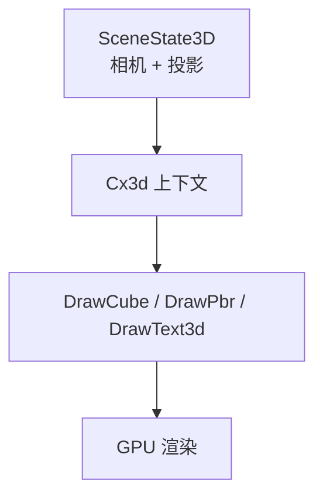
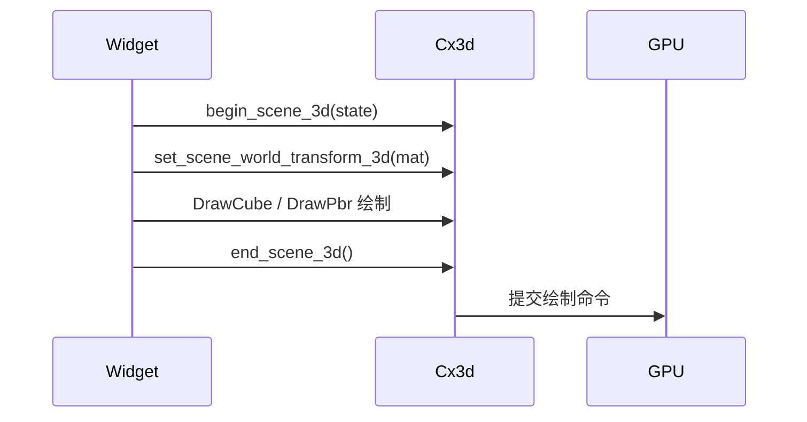
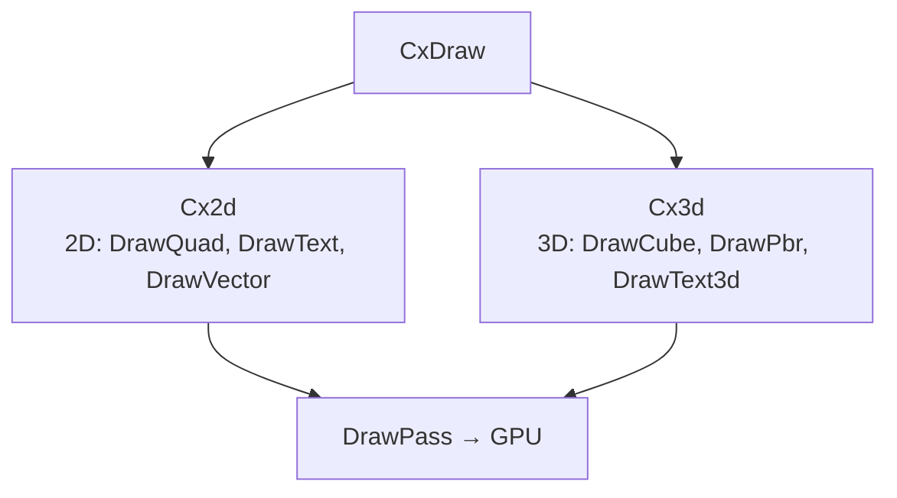

# 第21章：3D 场景

## 为什么这很重要

前三章讲解了 Makepad 的 2D 渲染体系。Makepad 同样具备 3D 渲染能力，虽然在 UI 应用中使用频率较低，但在产品展示、数据可视化、游戏原型等场景中有用。如果你的项目不涉及 3D，可以跳过本章。



---

## 核心架构

### Cx3d：3D 绘制上下文

与 2D 的 `Cx2d` 对应（详见第18章），`Cx3d` 通过相同的 `Deref` 链委托到 `CxDraw` 和 `Cx`：

```rust
pub struct Cx3d<'a, 'b> {
    pub cx: &'b mut CxDraw<'a>,
    scene_3d: Cx3dState,
}
```

*来源：`draw/src/cx_3d.rs:11-14`*

### SceneState3D：场景状态

```rust
pub struct SceneState3D {
    pub time: f64,              // 场景时间（动画用）
    pub camera_pos: Vec3f,      // 相机位置
    pub view: Mat4f,            // 视图矩阵（世界 → 相机）
    pub projection: Mat4f,      // 投影矩阵（相机 → 裁剪）
    pub viewport_rect: Rect,    // 视口矩形
}
```

*来源：`draw/src/scene_3d.rs:7-13`*

### SceneScope3D：场景作用域

渲染过程中追踪世界变换和绘制调用锚点：

```rust
pub struct SceneScope3D {
    pub scene: SceneState3D,
    pub world_transform: Mat4f,
    pub draw_call_anchors: Vec<SceneDrawCallAnchor>,
}
```

*来源：`draw/src/scene_3d.rs:24-28`*

---

## 3D 场景生命周期



1. `begin_scene_3d` 设置相机和投影
2. `set_scene_world_transform_3d` 设置模型矩阵（返回旧矩阵用于恢复）
3. 调用 DrawCube/DrawPbr 等绘制原语
4. `end_scene_3d` 结束场景

*来源：`draw/src/cx_3d.rs:44-67`*

---

## 3D 绘制原语

### DrawCube：立方体

基本的 Lambert 光照立方体：

```splash
mod.draw.DrawCube = {
    backface_culling: true
    geom: vertex_buffer(geom.CubeVertex, geom.CubeGeom)

    vertex: fn() {
        let pos = self.get_size() * self.geom.geom_pos + self.get_pos();
        let model_view = self.draw_list.view_transform * self.transform;
        let normal = normalize((model_view * vec4(self.geom.geom_normal, 0.0)).xyz);
        self.world = model_view * vec4(pos, 1.0);
        let dp = max(dot(normal, normalize(self.light_dir)), 0.0);
        self.lit_color = self.get_color(dp);
        self.vertex_pos = self.draw_pass.camera_projection
            * (self.draw_pass.camera_view * self.world);
    }
    pixel: fn() { return self.lit_color; }
}
```

*来源：`draw/src/shader/draw_cube.rs:10-60`（简化）*

光照模型：环境光 28% + 漫反射 72%，通过法线与 `light_dir` 点积计算。

### DrawPbr：PBR 材质

基于物理的渲染，支持完整纹理集：

```rust
pub struct DrawPbrMaterialState {
    pub base_color_factor: Vec4f,
    pub metallic_factor: f32,
    pub roughness_factor: f32,
    pub emissive_factor: Vec3f,
    pub textures: DrawPbrTextureSet,  // base_color, metallic_roughness, normal, occlusion, emissive, env
}
```

*来源：`draw/src/shader/draw_pbr.rs:26-34`*

支持的基础网格：`Cube`、`Sphere`、`Capsule`、`Surface`、`RoundedCube`，通过 `PbrPrimitiveMeshKey` 参数化生成。

### DrawText3d

3D 空间中的文本渲染，使用与 2D `DrawText` 相同的 SDF 字体技术。

---

## 3D 拾取：DrawCallAnchor

为支持 3D 空间中的鼠标交互，每个绘制调用可注册锚点：

```rust
pub struct SceneDrawCallAnchor {
    pub area: Area,
    pub draw_list_id: Option<DrawListId>,
    pub draw_item_id: Option<usize>,
    pub world_pos: Vec3f,
}
```

*来源：`draw/src/scene_3d.rs:15-21`*

2D 事件系统（详见第22章）通过锚点将鼠标事件映射到 3D 对象，避免昂贵的射线-三角形相交测试。

---

## 2D 与 3D 的关系



`Cx2d` 和 `Cx3d` 从同一个 `CxDraw` 派生，绘制命令汇入同一 `DrawPass`。2D 和 3D 内容可以在同一 pass 中共存——例如 3D 场景上叠加 2D UI。

| 维度 | 2D（Cx2d） | 3D（Cx3d） |
|------|-----------|-----------|
| 布局 | Turtle 引擎 | 手动矩阵变换 |
| 光照 | 无（SDF 模拟） | Lambert / PBR |
| DSL 支持 | 完整 Splash 集成 | 主要 Rust 代码 |

---

## 模式提炼

### 模式：Cx2d / Cx3d ��行架构

Makepad 将 2D 和 3D 分为并行上下文，共享底层 `CxDraw`/`Cx`，但各自维护独立状态。

### 模式：保存/恢复变换矩阵

```rust
let previous = cx3d.set_scene_world_transform_3d(new_transform);
// ... 绘制子节点 ...
cx3d.set_scene_world_transform_3d(previous.unwrap());
```

经典的 save/restore 模式，支持层级化场景图的递归构建。

### 模式：锚点注册实现 3D 拾取

3D 对象通过 `SceneDrawCallAnchor`（世界坐标 + Area）让 2D 事件系统可以定位它们，避免实时射线相交测试。

---

## 本章小结

| 概念 | 说明 |
|------|------|
| `Cx3d` | 3D 绘制上下文，与 Cx2d 并行 |
| `SceneState3D` | 相机、视图/投影矩阵 |
| `DrawCube` | 立方体，Lambert 光照 |
| `DrawPbr` | PBR 材质，完整纹理集 |
| `SceneDrawCallAnchor` | 3D 拾取锚点 |

Part IV（渲染与 Shader 篇）到此完成。从 Draw 管线到 SDF Shader，从矢量图形到 3D 场景，全面覆盖了 Makepad 的渲染体系。下一章进入 Part V（底层机制篇），深入事件与 Action 的内部实现。
