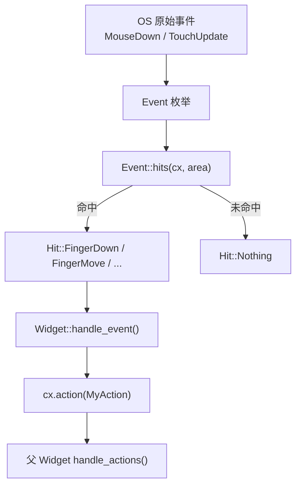
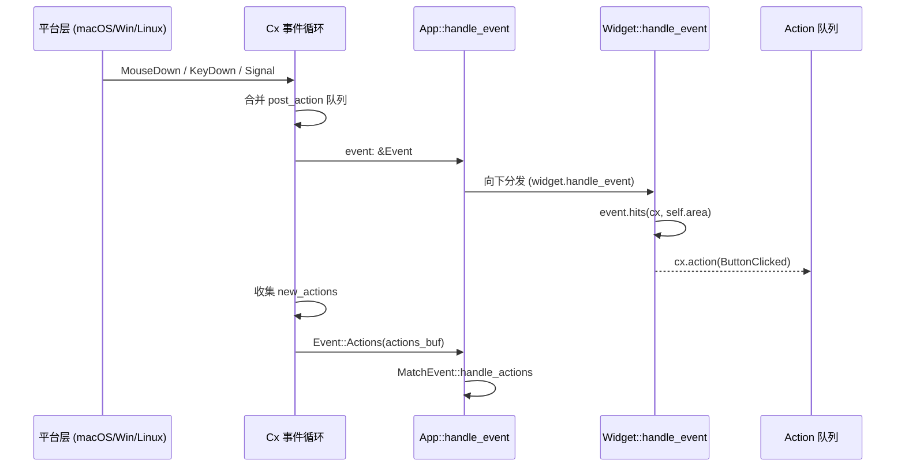

# 第22章：事件与 Action 系统

> Makepad 的事件分发管线与 Action 通信机制是整个框架的神经系统。
> 本章深入 Rust 层面的实现，与第9章所述的 Splash 脚本事件形成互补。

## 22.1 Event 枚举全景

Makepad 将所有平台输入统一为一个 `Event` 枚举，定义于 `platform/src/event/event.rs`。
该枚举涵盖六大类事件：

| 类别 | 典型变体 | 说明 |
|------|----------|------|
| 生命周期 | `Startup`, `Shutdown`, `Foreground`, `Background`, `Resume`, `Pause` | 应用全局状态转换 |
| 窗口管理 | `WindowGotFocus`, `WindowClosed`, `WindowGeomChange` | 窗口级别事件 |
| 指针输入 | `MouseDown`, `MouseMove`, `MouseUp`, `TouchUpdate`, `Scroll` | 原始输入，需经 Hit 转换 |
| 键盘/文本 | `KeyDown`, `KeyUp`, `TextInput`, `TextCopy` | 键盘与 IME 输入 |
| 媒体/网络 | `AudioDevices`, `NetworkResponses`, `VideoPlaybackPrepared` | 异步资源事件 |
| 框架内部 | `Draw`, `NextFrame`, `Timer`, `Signal`, `Actions` | 渲染循环与内部通信 |

```rust
// platform/src/event/event.rs (核心结构，约 240 行)
pub enum Event {
    Startup,
    Shutdown,
    Foreground,
    Background,
    Resume,
    Pause,
    Draw(DrawEvent),
    MouseDown(MouseDownEvent),
    MouseMove(MouseMoveEvent),
    MouseUp(MouseUpEvent),
    TouchUpdate(TouchUpdateEvent),
    KeyDown(KeyEvent),
    Actions(ActionsBuf),
    // ... 共 60+ 变体
}
```

关键设计：每个输入事件携带 `Cell<Area>` 类型的 `handled` 字段，允许 Widget 通过
内部可变性标记"已处理"，阻止事件继续冒泡。

## 22.2 从原始事件到 Hit：命中测试管线

开发者不应直接匹配 `MouseDown` 等原始事件。Makepad 提供 `Event::hits()` 方法，
将原始坐标与 Widget 的绘制区域（Area）做命中测试，返回高层 `Hit` 枚举：

```rust
// platform/src/event/event.rs
pub enum Hit {
    KeyFocus(KeyFocusEvent),
    KeyFocusLost(KeyFocusEvent),
    KeyDown(KeyEvent),
    KeyUp(KeyEvent),
    FingerScroll(FingerScrollEvent),
    FingerDown(FingerDownEvent),
    FingerMove(FingerMoveEvent),
    FingerHoverIn(FingerHoverEvent),
    FingerHoverOver(FingerHoverEvent),
    FingerHoverOut(FingerHoverEvent),
    FingerUp(FingerUpEvent),
    FingerLongPress(FingerLongPressEvent),
    Nothing,
}
```



`hits()` 内部从 `Cx` 的绘制列表中查找 Area 对应的矩形区域，并与事件坐标比较。
这使得命中测试与渲染顺序天然一致，无需额外的布局查询。

## 22.3 Action 系统：Widget 间通信

Action 是 Makepad 的"向上通信"机制，与事件的"向下分发"方向相反。

### ActionTrait 与类型擦除

```rust
// platform/src/action.rs
pub trait ActionTrait: 'static {
    fn debug_fmt(&self, f: &mut fmt::Formatter<'_>) -> fmt::Result;
    fn ref_cast_type_id(&self) -> TypeId;
}

pub type Action = Box<dyn ActionTrait>;
pub type ActionsBuf = Vec<Action>;
pub type Actions = [Action];
```

`ActionTrait` 的巧妙之处：它为所有 `'static + Debug` 类型自动实现（blanket impl），
因此任何满足条件的枚举都能直接作为 Action 使用，无需手动 `impl`。

### 发送与接收

| 方法 | 调用位置 | 线程安全 | 说明 |
|------|----------|----------|------|
| `cx.action(val)` | Widget 内部 | 否（主线程） | 同步入队 |
| `Cx::post_action(val)` | 后台线程 | 是（Send） | 通过 `mpsc::Sender` + `SignalToUI` |
| `cx.capture_actions(f)` | 父 Widget | 否 | 捕获子树产生的 Action |
| `cx.extend_actions(buf)` | 父 Widget | 否 | 重新注入被捕获的 Action |

```rust
// platform/src/action.rs
pub fn post_action(action: impl ActionTrait + Send) {
    ACTION_SENDER_GLOBAL
        .lock().unwrap()
        .as_mut().unwrap()
        .send(Box::new(action)).unwrap();
    SignalToUI::set_action_signal();
}
```

`post_action` 通过全局 `Mutex<Option<Sender<ActionSend>>>` 实现跨线程发送，
配合 `SignalToUI` 唤醒主线程的事件循环。

### Action 向下转型

```rust
// 使用 ActionCast trait 安全转型
impl<T: ActionTrait + Default + Clone> ActionCast<T> for Box<dyn ActionTrait> {
    fn cast(&self) -> T {
        if let Some(item) = (*self).downcast_ref::<T>() {
            item.clone()
        } else {
            T::default()  // 类型不匹配时返回默认值
        }
    }
}
```

这种"不匹配返回默认值"的设计避免了 `Option` 层层嵌套，使 `match` 分支更简洁。

## 22.4 MatchEvent：事件分发的便捷 Trait

`MatchEvent` trait（`draw/src/match_event.rs`）将巨大的 `Event` 枚举解构为
独立的回调方法：

```rust
// draw/src/match_event.rs
pub trait MatchEvent {
    fn handle_startup(&mut self, _cx: &mut Cx) {}
    fn handle_shutdown(&mut self, _cx: &mut Cx) {}
    fn handle_foreground(&mut self, _cx: &mut Cx) {}
    fn handle_action(&mut self, _cx: &mut Cx, _e: &Action) {}
    fn handle_actions(&mut self, cx: &mut Cx, actions: &Actions) {
        for action in actions { self.handle_action(cx, action); }
    }
    fn handle_network_responses(&mut self, cx: &mut Cx, e: &NetworkResponsesEvent) {
        // 自动分发为 handle_http_response / handle_http_stream 等
    }
    // ... 20+ 生命周期/输入/媒体回调方法
}
```

开发者只需 `impl MatchEvent for App`，覆盖感兴趣的方法即可，
其余均为空默认实现。`handle_network_responses` 还会自动将网络事件细分为
`handle_http_response`、`handle_http_stream` 等更具体的回调。

## 22.5 事件分发完整流程



整个流程分两个阶段：

1. **事件阶段**：OS 事件向下分发到 Widget 树，Widget 通过 `hits()` 判断是否命中
2. **Action 阶段**：Widget 产生的 Action 被收集后，以 `Event::Actions` 形式再次分发

## 22.6 map_actions 与 capture_actions

`Cx` 提供两个高级 API 用于 Action 流的拦截与变换：

```rust
// platform/src/action.rs - 捕获子树 Action，阻止传播到外部
pub fn capture_actions<F>(&mut self, f: F) -> ActionsBuf {
    let mut actions = Vec::new();
    std::mem::swap(&mut self.new_actions, &mut actions);
    f(self);
    std::mem::swap(&mut self.new_actions, &mut actions);
    actions
}

// 对子树产生的 Action 做变换后重新注入
pub fn map_actions<F, G, R>(&mut self, f: F, g: G) -> R {
    let start = self.new_actions.len();
    let r = f(self);
    let end = self.new_actions.len();
    if start != end {
        let buf = self.new_actions.drain(start..end).collect();
        let buf = g(self, buf);
        self.new_actions.extend(buf);
    }
    r
}
```

典型用例：`Modal` 组件捕获内部 Action，根据对话框状态决定是否释放到外层。

## 22.7 与 Splash 事件系统的关系

详见第9章关于 Splash `on_click`、`on_render` 等脚本事件的说明。
Rust 层的 Event/Action 系统与 Splash 脚本事件通过 `ScriptHook` 桥接：

| Rust 层 | Splash 层 | 桥接方式 |
|----------|-----------|----------|
| `Event::MouseDown` -> `Hit::FingerDown` | `on_click` 回调 | ScriptHook 在 handle_event 中触发脚本求值 |
| `cx.action()` | `mod.state` 更新 | 脚本状态变更后触发 `redraw()` |
| `Event::Draw` | `on_render` 回调 | DrawEvent 驱动脚本重绘 |

## 模式提炼

| 模式 | 描述 | 源码位置 |
|------|------|----------|
| **类型擦除 Action** | `Box<dyn ActionTrait>` + blanket impl，零样板代码 | `platform/src/action.rs` |
| **Hit 命中测试** | 将坐标空间匹配委托给渲染系统，避免布局重查 | `platform/src/event/event.rs` |
| **Cell 标记消费** | `Cell<Area>` / `Cell<bool>` 实现无 &mut 的事件消费标记 | `platform/src/event/finger.rs` |
| **capture/extend** | `mem::swap` 实现零拷贝 Action 流截获 | `platform/src/action.rs` |
| **跨线程 post_action** | `Mutex<Sender>` + `SignalToUI` 唤醒主线程 | `platform/src/action.rs` |

## 本章小结

Makepad 的事件系统遵循"向下分发、向上反馈"的单向数据流：

- `Event` 枚举统一了 60+ 种平台事件，通过 `hits()` 转化为 Widget 可处理的 `Hit`
- `ActionTrait` 利用 Rust 的 blanket impl 实现零样板的类型擦除通信
- `MatchEvent` trait 将庞大的事件枚举分解为独立回调，降低认知负担
- `capture_actions` / `map_actions` 提供了 Action 流的拦截与变换能力
- 跨线程通信通过 `post_action` + `SignalToUI` 安全桥接到主线程

详见第26章了解各平台如何将 OS 原始事件注入此管线。
