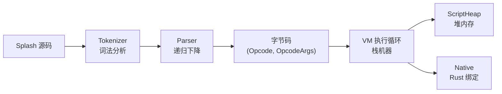
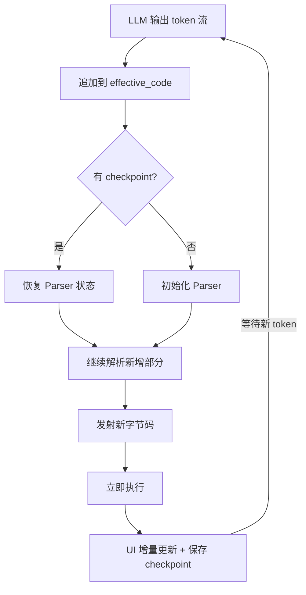

# 第23章：Splash VM 内幕

> Splash 是 Makepad 2.0 的运行时脚本语言，其 VM 架构决定了热重载与流式求值的性能上限。
> 本章深入字节码、操作码、解析器与执行模型，比第6章的语言概览更底层。

## 23.1 VM 总体架构

Splash VM 是一个基于栈的字节码虚拟机，核心组件分布在 `platform/script/src/`：

| 文件 | 行数 | 职责 |
|------|------|------|
| `vm.rs` | ~1250 | VM 主体：ScriptVm、ScriptBody、执行循环 |
| `parser.rs` | ~4265 | 递归下降解析器，源码直接发射字节码 |
| `opcode.rs` | ~407 | 操作码定义与编码格式 |
| `opcodes_*.rs` | - | 各类操作码的执行实现（ops/vars/calls/control/loops/assign） |
| `tokenizer.rs` | - | 词法分析器 |
| `value.rs` | - | 值表示（NaN boxing） |



## 23.2 操作码设计

每条指令由 `(Opcode, OpcodeArgs)` 二元组构成。`Opcode` 为单字节（最多 256 条），
`OpcodeArgs` 为 32 位，高 4 位编码参数类型：

```
OpcodeArgs 布局:
 31  30  29  28 | 27 ........... 0
 NIL POP  --  T |     value (28 bit)
```

| 位域 | 含义 |
|------|------|
| bit 31 | `NEED_NIL_FLAG` - 需要 nil 检查 |
| bit 30 | `POP_TO_ME_FLAG` - 弹栈至 me |
| bit 29-28 | `TYPE_MASK` - 参数类型：00=None, 01=Nil, 10=Number |
| bit 27-0 | 无符号数值（跳转偏移、变量索引等） |

约 130 条操作码分为：算术逻辑（0-24）、赋值（25-65，覆盖 3 种目标 x 12 种运算符）、
对象/数组构造（66-72）、函数调用（73-83）、控制流与循环（84-113）、变量访问（86-98）。

逻辑运算使用专用短路操作码：`LOGIC_AND_TEST`（若 falsy 跳过）、
`LOGIC_OR_TEST`（若 truthy 跳过）、`NIL_OR_TEST`（`??` 运算符）。

## 23.3 解析器：无 AST 的直接发射

`parser.rs` 是 Splash 最核心的文件。其设计跳过 AST 构建，
通过约 30 种状态驱动的递归下降直接发射字节码：

```rust
// platform/script/src/parser.rs
enum State {
    BeginStmt { last_was_sep: bool },
    BeginExpr { required: bool },
    EndExpr,
    IfTest { index: u32 },
    ForIdent { idents: u32, index: u32 },
    Loop { index: u32 },
    While { index: u32 },
    // ... 约 30 种状态
}
```

三重优势：零 AST 分配（减少 GC 压力）、支持流式求值（边解析边执行）、
增量编译（`ParserCheckpoint` 保存状态，新代码追加时从断点继续）。

## 23.4 ScriptVm 核心结构

```rust
// platform/script/src/vm.rs
pub struct ScriptVm {
    pub bx: Box<ScriptVmInner>,  // 堆分配以减少栈帧大小
}
// ScriptVmInner 包含：heap, threads, code, builtins, native
```

每个编译单元对应一个 `ScriptBody`，包含 tokenizer、parser、scope 对象和 checkpoint。
`ScriptSource` 区分 `Mod`（完整模块）与 `Streaming`（LLM 流式输入）两种来源。

## 23.5 执行线程与值表示

协作式多线程（`ScriptThreads`），每个线程维护：操作数栈（`stack`）、
词法作用域链（`scopes`）、方法接收者栈（`mes`）、循环状态（`loops`）、
错误处理（`trap`）。

Splash 使用 **NaN boxing** 将所有值编码为 64 位 f64。数值运算零拷贝，
对象引用编码在 NaN 有效载荷中，栈操作仅为 64 位 push/pop。
详见第24章。

## 23.6 函数调用协议

调用流程：`CALL_ARGS` 压栈参数并创建 `ScriptMe::Call` 帧 -> `CALL_EXEC` 跳转到目标函数 ->
函数体执行 -> `RETURN` 弹出作用域，返回值留在栈顶。

Native 函数通过 `ScriptNative` 注册：

```rust
native.add_method(heap, gc, id_lut!(set_static),
    script_args!(value = NIL),
    |vm, args| {
        let value = script_value!(vm, args.value);
        vm.bx.heap.set_static(value);
        value
    },
);
```

VM 将参数从栈中取出打包为 `ScriptArgs`，调用 Rust 闭包，返回值推回栈顶。

## 23.7 流式求值



`checkpoint` 保存 tokenizer 位置、parser 状态栈、字节码偏移量。
新代码段从上次停止处继续解析，无需重解析整个文件。也是第11章的深入主题。

## 23.8 与 Shader 编译的分岔

当解析器遇到 `FN_BODY_TYPED`（带完整类型标注的函数），执行路径从 VM 字节码
切换到 GPU 着色语言生成，翻译为目标语言字符串片段而非操作码。详见第25章。

## 模式提炼

| 模式 | 描述 | 源码位置 |
|------|------|----------|
| **无 AST 直接发射** | 解析器直接输出字节码，省去中间表示 | `parser.rs` |
| **NaN Boxing** | 64 位值编码，数值/指针共用一个 word | `value.rs` |
| **检查点恢复** | `ParserCheckpoint` 支持断点续解析 | `vm.rs`, `parser.rs` |
| **操作码参数编码** | 32 位高 4 位类型标记 + 低 28 位数值 | `opcode.rs` |
| **短路操作码** | `LOGIC_AND_TEST`/`LOGIC_OR_TEST` 合并测试与跳转 | `opcode.rs` |
| **双路径函数** | `FN_BODY_DYN` 走 VM，`FN_BODY_TYPED` 走 Shader 编译 | `parser.rs` |

## 本章小结

Splash VM 的设计哲学是"为流式求值而生"：

- 单字节 `Opcode` + 32 位 `OpcodeArgs` 的紧凑指令格式，约 130 条操作码覆盖完整语义
- 递归下降解析器通过约 30 种状态驱动，直接发射字节码，跳过 AST 构建
- 基于栈的执行模型配合 NaN boxing 值表示，单次指令分发仅需 64 位操作
- `ParserCheckpoint` 使 LLM 流式输出可以逐段解析执行，UI 实时更新
- 函数调用区分动态（VM 执行）和静态（Shader 编译）两条路径

详见第24章了解 GC 与堆内存管理，第25章了解 Shader 编译路径。
