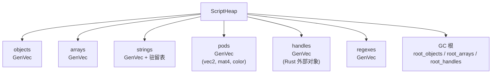
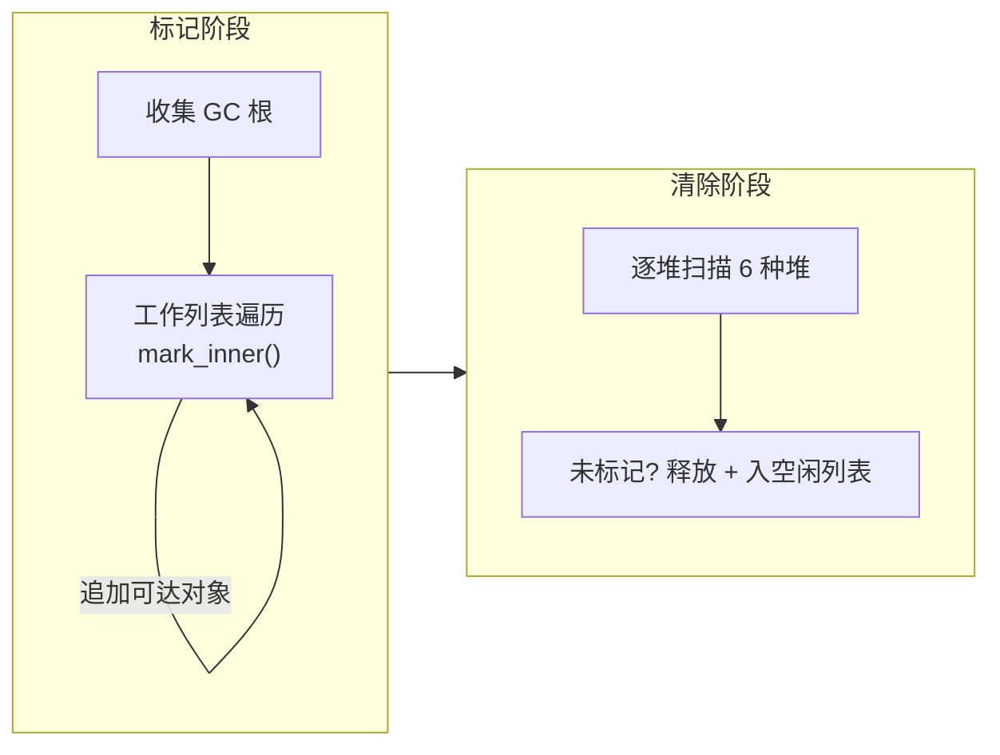

# 第24章：GC 与内存管理

> Splash VM 的垃圾回收器是整个脚本引擎的基石。
> 本章深入堆管理、GC 根、标记-清除算法及六种堆类型的设计。

## 24.1 ScriptHeap：六种堆的统一管理

Splash 的堆由六种独立的 `GenVec` 组成，每种管理一类值（`platform/script/src/heap.rs`）：

```rust
pub struct ScriptHeap {
    pub modules: ScriptObject,               // 全局模块根
    pub(crate) objects: GenVec<ScriptObjectData>,         // 对象堆
    pub(crate) arrays: GenVec<ScriptArrayData>,           // 数组堆
    pub(crate) strings: GenVec<Option<ScriptStringData>>, // 字符串堆
    pub(crate) pods: GenVec<ScriptPodData>,               // Pod 类型堆 (vec2/mat4 等)
    pub(crate) handles: GenVec<Option<ScriptHandleData>>, // 外部句柄堆
    pub(crate) regexes: GenVec<Option<ScriptRegexData>>,  // 正则表达式堆

    // 每种堆对应的空闲列表
    pub(crate) objects_free: Vec<ScriptObject>,
    // ... arrays_free, strings_free, pods_free, handles_free, regexes_free

    // GC 根
    pub(crate) root_objects: Rc<RefCell<HashMap<ScriptObject, usize>>>,
    pub(crate) root_arrays: Rc<RefCell<HashMap<ScriptArray, usize>>>,
    pub(crate) root_handles: Rc<RefCell<HashMap<ScriptHandle, usize>>>,

    pub(crate) string_intern: HashMap<ScriptRcString, ScriptString>, // 字符串驻留
    pub(crate) mark_vec: Vec<ScriptGcMark>,  // GC 标记工作列表
}
```



分六种堆的理由：类型安全（每种引用只能索引对应堆）、GC 效率（按类型扫描）、
空间局部性（同类连续存储）、独立空闲列表。

## 24.2 GenVec：带代际检查的向量

`GenVec`（`gen_index.rs`）是一个带代际号的向量。每次 `free_slot` 递增槽位代际，
使旧引用的索引操作会因代际不匹配而 panic，从而检测 use-after-free。

## 24.3 对象标记系统

每个堆对象有一个 `Tag`，编码多种状态位：

| 标记位 | 含义 |
|--------|------|
| `alloced` | 已分配（区分空槽与活跃对象） |
| `marked` | GC 标记阶段已标记 |
| `static` | 永久对象，不参与 GC |
| `reffed` | 被 `ScriptObjectRef` 持有 |
| `frozen` | 不可变对象 |

Static 对象通过 `heap.set_static(value)` 递归标记整个对象图为永久存在，
GC 时直接跳过。适合全局模块和内建原型。

## 24.4 GC 根

标记阶段的起点包括：

| 根类型 | 说明 |
|--------|------|
| `root_objects/arrays/handles` | Rust 侧持有的 `ScriptObjectRef`（引用计数管理） |
| 线程栈 | 操作数栈、作用域栈、me 栈、循环源、trap 值 |
| 代码体 | ScriptBody 中的 scope/me 对象 |
| 类型系统 | type_check 原型、type_defaults、pod_types 默认值 |
| 词法字符串 | tokenizer 中的字符串字面量 |
| native 类型表 | ScriptNative 注册的类型对象 |

`ScriptObjectRef` 采用引用计数式根管理：创建时计数 +1 并插入 root_objects，
drop 时计数 -1，归零移除。

## 24.5 标记阶段

标记使用工作列表（`mark_vec`）驱动的迭代式遍历，避免递归栈溢出：

```rust
// platform/script/src/gc.rs
pub fn mark(&mut self, threads: &ScriptThreads, code: &ScriptCode) {
    self.mark_vec.clear();
    // 1. 收集所有根到 mark_vec（type_check、root_objects、线程栈...）
    // 2. 工作列表循环
    let mut i = 0;
    while i < self.mark_vec.len() {
        let mark = self.mark_vec[i];
        self.mark_inner(mark);  // 追加新可达对象到 mark_vec
        i += 1;
    }
}
```

`mark_inner` 对 Object 标记 proto 链、map 键值、vec 键值；对 Array 标记每个元素。
通过 `mark_value_fields!` 宏的分裂借用技巧解决同时遍历和修改不同堆的借用冲突。

## 24.6 清除阶段

遍历每种堆的全部槽位，回收未标记对象：

```rust
pub fn sweep(&mut self, log_stats: bool) {
    for i in 1..self.objects.len() {
        let obj = &mut self.objects.get_at_mut(i);
        if obj.tag.is_static() { obj.tag.clear_mark(); continue; }
        if !obj.tag.is_marked() && obj.tag.is_alloced() {
            obj.clear();
            self.objects.free_slot(i as u32);  // 递增代际
            let new_gen = self.objects.generation(i);
            self.objects_free.push(ScriptObject::new(i as u32, new_gen));
        } else { obj.tag.clear_mark(); }
    }
    // 对 arrays, strings, pods, handles, regexes 执行相同逻辑
}
```

特殊处理：字符串回收时从驻留表移除，并将 String 堆内存缓存到 `strings_reuse`
供复用；Handle 回收时调用 `gc()` 回调通知 Rust 侧释放外部资源。



## 24.7 GC 触发与统计

`ScriptHeapGcLast` 记录上轮各堆存活量。某种堆的分配量超过上次存活量 2 倍时
自动触发 GC，或通过脚本 `gc.run()` 手动触发。

清除后打印统计：`GC: 120us obj(S:45 A:123 R:67) arr(...) str(...) ...`
（S=static、A=alive、R=removed）。

## 24.8 脚本 API

通过 `mod_gc.rs` 暴露给 Splash：

```javascript
gc.set_static(my_object)  // 标记为永久对象
gc.run()                  // 手动触发 GC
gc.run_status()           // 触发 GC 并打印统计
gc.dump_tag(my_object)    // 调试：打印对象 tag 信息
```

GC 在事件循环安全点触发（所有线程栈状态稳定），避免增量 GC 的复杂性。
详见第23章了解线程栈如何作为 GC 根参与标记。

## 模式提炼

| 模式 | 描述 | 源码位置 |
|------|------|----------|
| **分类堆** | 六种值类型各自独立的 GenVec 堆 | `heap.rs` |
| **代际检查** | GenVec 通过 generation 检测悬空引用 | `gen_index.rs` |
| **三态标记** | alloced/marked/static 三态系统 | `gc.rs` |
| **工作列表遍历** | 迭代式 mark_vec 替代递归 | `gc.rs` |
| **分裂借用宏** | `mark_value_fields!` 解决多堆借用冲突 | `gc.rs` |
| **字符串驻留复用** | 回收时缓存 String 堆内存到 `strings_reuse` | `gc.rs` |
| **引用计数根** | `ScriptObjectRef` 的 Rc-based 根管理 | `heap.rs` |

## 本章小结

Splash 的 GC 系统围绕"分类堆 + 标记-清除"展开：

- 六种独立 `GenVec` 堆，每种有独立空闲列表与回收逻辑
- `GenVec` 代际检查在索引时检测悬空引用，提供额外安全保障
- 标记阶段从多种根出发，工作列表迭代遍历，`mark_value_fields!` 宏解决借用冲突
- 清除按堆类型扫描，字符串有驻留表清理，Handle 有回调通知
- Static 标记为永久存在，GC 跳过；在事件循环安全点触发

详见第23章了解 VM 值表示与堆交互，第25章了解 Shader 编译中的类型堆使用。
