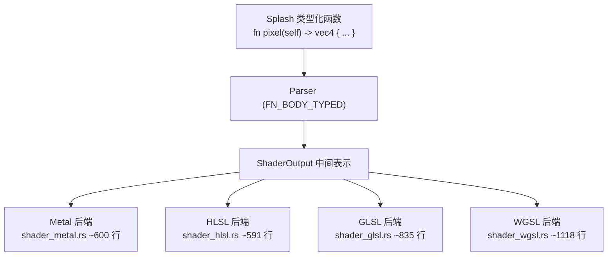
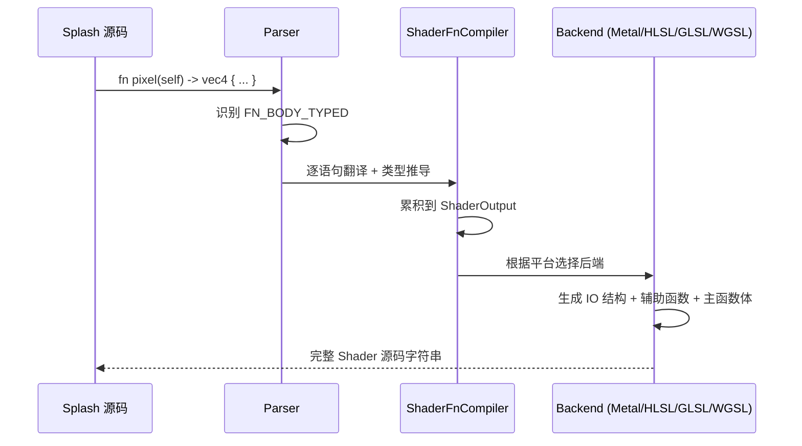

# 第25章：Shader 编译器

> Makepad 的 Shader 编译器将 Splash 中的类型化函数直接编译为 Metal、HLSL、GLSL 和 WGSL
> 四种 GPU 着色语言。本章深入编译管线、后端架构与 IO 系统。

## 25.1 设计哲学：一次书写，四端运行

传统 GPU 框架要求用目标着色语言编写 Shader，或使用 SPIR-V 等中间表示。
Makepad 选择了不同路径：**用 Splash 语言编写 Shader，编译器生成四种目标代码。**

Shader 代码与 UI 逻辑共存于 `script_mod!` 中，享受类型系统和热重载。



## 25.2 编译入口

详见第23章，解析器区分 `FN_BODY_DYN`（VM 字节码）和 `FN_BODY_TYPED`（Shader 路径）。
后者不生成操作码，而是将表达式翻译为目标语言字符串片段。

Shader 编译使用独立的 `ShaderMe` 栈追踪上下文：

```rust
// platform/script/src/shader.rs
pub enum ShaderMe {
    FnBody { ret: Option<ScriptPodType>, escaped: bool, stack_depth: usize },
    LoopBody { stack_depth: usize },
    ForLoop { var_id: LiveId, stack_depth: usize },
    IfBody {
        phi: Option<String>,       // SSA phi 变量（分支汇合点）
        phi_type: Option<ShaderType>,
        has_return: bool,
        if_branch_returned: bool,
        // ...
    },
    LogicOp { op: &'static str, first_operand: String, first_type: ShaderType },
    BuiltinCall { name: LiveId },
}
```

注意 `IfBody` 的 `phi` 字段：Shader 不支持动态返回值，编译器在 if-else 汇合点
生成 SSA 风格的 phi 变量。

## 25.3 ShaderBackend 与 IO 映射

```rust
// platform/script/src/shader_backend.rs
pub enum ShaderBackend { Metal, Wgsl, Hlsl, Glsl, Rust }
```

每种后端将 IO 类型映射为不同的变量前缀：

| IO 类型 | Metal | HLSL | GLSL | WGSL |
|---------|-------|------|------|------|
| `RUST_INSTANCE` | `_io.i->` | 输入结构 | attribute | storage buffer |
| `DYN_UNIFORM` | `_io.u->` | cbuffer | uniform buffer | uniform |
| `VARYING` | `_iov.v->` | 语义 | varying | struct 字段 |
| `TEXTURE_2D` | `_io.` | texture | sampler2D | texture_2d |
| `VERTEX_POSITION` | `_iov.v->_position` | `SV_Position` | `gl_Position` | `@builtin(position)` |

## 25.4 四大后端

### Metal (macOS / iOS)

`shader_metal.rs` 生成 Metal IO 结构体（`Io { constant IoUniform *u; thread IoInstance *i; }`）
和辅助函数（如矩阵求逆 `_mp_inverse`，MSL 标准库不提供）。

### HLSL (Windows / D3D11)

`shader_hlsl.rs` 需要区分整型/浮点输入格式，矩阵按 D3D 输入布局分块
（mat3 -> 3xvec3, mat4 -> 4xvec4）。

### GLSL (Linux / Android / WebGL)

`shader_glsl.rs` 将 varying 变量打包为 vec4 数组以减少插值器使用，
收集 geometry/instance/varying 字段后计算打包偏移。

### WGSL (WebGPU)

`shader_wgsl.rs` 是最复杂的后端（~1118 行），WGSL 要求显式 binding 编号：

```rust
pub struct WgslDrawShaderSource {
    pub wgsl: String,
    pub dyn_uniform_binding: u32,
    pub texture_binding_base: u32,
    pub sampler_binding_base: u32,
    pub geometry_slots: usize,
    pub instance_slots: usize,
}
```

## 25.5 类型系统与安全输出

Shader 编译依赖 Splash 的 Pod 类型系统（详见第24章）：

| Splash 类型 | GLSL | Metal | HLSL | WGSL |
|-------------|------|-------|------|------|
| `vec2` | `vec2` | `float2` | `float2` | `vec2<f32>` |
| `vec4` | `vec4` | `float4` | `float4` | `vec4<f32>` |
| `mat4` | `mat4` | `float4x4` | `float4x4` | `mat4x4<f32>` |
| `u32` | `uint` | `uint` | `uint` | `u32` |

浮点常量输出有安全处理，防止极大/极小值破坏 Shader 解析器：

```rust
fn write_shader_float(out: &mut String, v: f64) {
    let abs_v = v.abs();
    if abs_v != 0.0 && (abs_v >= 1e15 || abs_v < 1e-6) {
        write!(out, "{:e}", v).ok();  // 科学计数法
    } else {
        write!(out, "{}", v).ok();
        // 确保有小数点：1 → 1.0（避免 "1f" 这样的无效 Metal/GLSL）
        if !out[start..].contains('.') { out.push_str(".0"); }
    }
}
```

## 25.6 纹理与采样器

支持 9 种纹理类型（1D/2D/3D/Cube 及其数组变体 + 深度纹理），
每种后端有对应的类型名称映射：

```rust
pub struct ShaderSampler {
    pub filter: SamplerFilter,    // Nearest / Linear
    pub address: SamplerAddress,  // Repeat / ClampToEdge / ClampToZero / MirroredRepeat
    pub coord: SamplerCoord,      // Normalized / Pixel
    pub is_video: bool,
}
```

## 25.7 编译流程总结



## 模式提炼

| 模式 | 描述 | 源码位置 |
|------|------|----------|
| **统一源语言** | Splash 函数可编译为 VM 字节码或 GPU 着色器 | `shader.rs` |
| **后端枚举** | 5 种后端通过模式匹配分发 IO 映射 | `shader_backend.rs` |
| **IO 前缀抽象** | `ShaderIoPrefix` 统一不同后端的变量访问 | `shader_backend.rs` |
| **Phi 变量** | if-else 分支汇合使用 SSA 风格 phi 节点 | `shader.rs` |
| **安全浮点输出** | `write_shader_float` 防止极值破坏解析 | `shader.rs` |
| **Varying 打包** | GLSL 将多个 varying 打包为 vec4 数组 | `shader_glsl.rs` |

## 本章小结

Makepad 的 Shader 编译器实现了"一次书写，四端运行"：

- `FN_BODY_TYPED` 在解析阶段分流到 Shader 路径，直接翻译为目标着色语言
- `ShaderOutput` 作为中间表示收集 IO 声明、采样器和函数体代码
- 四种后端（Metal/HLSL/GLSL/WGSL）各自实现 IO 结构生成、类型映射和辅助函数注入
- 编译器依赖 Splash 的 Pod 类型堆（详见第24章），类型映射通过后端枚举分发

详见第19章了解 SDF Shader 的上层 API，第26章了解各平台如何加载编译后的 Shader。
