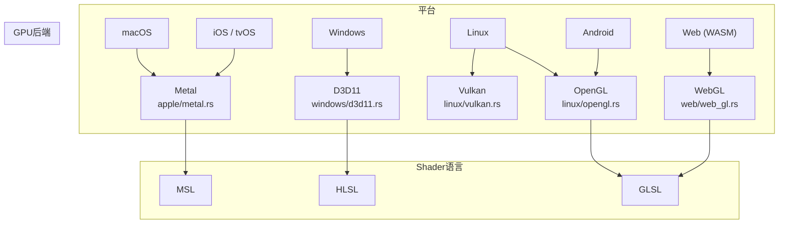

# 第26章：跨平台层

> Makepad 在五大平台上实现原生渲染。本章剖析平台抽象层的架构：
> 每个平台如何接入事件循环、选择 GPU 后端、并将 OS 事件转换为统一 `Event`。

## 26.1 平台目录结构

跨平台代码组织在 `platform/src/os/` 下，采用"共享核心 + 平台特化"模式：

```
platform/src/os/
  mod.rs               # cfg 条件编译选择平台
  cx_native.rs         # 平台无关的 Cx 扩展
  cx_shared.rs         # 共享工具函数
  apple/               # macOS + iOS + tvOS 共享
    metal.rs           #   Metal GPU 后端
    apple_sys.rs       #   系统 API 绑定
    macos/ ios/ tvos/  #   平台特化子目录
  windows/             # Windows 平台
    d3d11.rs           #   D3D11 GPU 后端
    win32_app.rs       #   Win32 应用框架
    win32_event.rs     #   事件转换
  linux/               # Linux + Android + OpenHarmony
    opengl.rs          #   OpenGL 后端
    vulkan.rs          #   Vulkan 后端
    x11/ wayland/      #   窗口系统
    android/           #   Android 特化
    open_harmony/      #   OpenHarmony 特化
  web/                 # WASM 平台
    web.rs web.js      #   主桥接
    web_gl.rs web_gl.js #  WebGL 后端
    from_wasm.rs       #   JS → Rust 消息
    to_wasm.rs         #   Rust → JS 消息
  headless/            # 无头模式（CI/测试）
```

## 26.2 平台与 GPU 后端对应关系



| 平台 | GPU 后端 | Shader 语言 | 窗口系统 |
|------|----------|-------------|----------|
| macOS | Metal | MSL | NSWindow |
| iOS / tvOS | Metal | MSL | UIWindow |
| Windows | D3D11 | HLSL | Win32 HWND |
| Linux | OpenGL / Vulkan | GLSL | X11 / Wayland / Direct |
| Android | OpenGL ES | GLSL | NativeActivity |
| Web | WebGL | GLSL | Canvas |

详见第25章了解 Shader 编译器如何为每种后端生成代码。

## 26.3 Apple 平台

Apple 三平台共享 `apple/metal.rs`（Metal 渲染）和 `apple_sys.rs`（Objective-C 绑定），
通过 `macos/`、`ios/`、`tvos/` 子目录特化窗口管理和生命周期。

Metal 后端负责：创建 `MTLDevice`/`MTLCommandQueue`、管理纹理图集、
编译 MSL Shader、执行绘制命令。

事件路径：`NSEvent (mouseDown:)` -> `MouseDownEvent { abs, button, modifiers }` -> `Event::MouseDown`。iOS 使用 `UITouch` -> `TouchUpdateEvent` 路径。

平台特有模块：`apple_media.rs`（AVFoundation）、`apple_webview.rs`（WKWebView）、
`core_midi.rs`、`av_capture.rs`（摄像头）、`apple_game_input.rs`（手柄）。

## 26.4 Windows 平台

`d3d11.rs` 封装 D3D11 API（设备、交换链、HLSL 编译、常量缓冲区）。
`win32_app.rs` 实现消息泵，`win32_event.rs` 做事件转换：

```
WM_LBUTTONDOWN → Event::MouseDown
WM_MOUSEMOVE   → Event::MouseMove
WM_KEYDOWN     → Event::KeyDown
WM_SIZE        → Event::WindowGeomChange
```

`angle.rs` 提供 ANGLE OpenGL ES 兼容层，用于替代 D3D11 的场景。

## 26.5 Linux 平台

最复杂的平台，需支持多种窗口系统和 GPU 后端：

- **窗口系统**：`x11/`（传统）、`wayland/`（现代）、`direct/`（无窗口系统/嵌入式）
- **GPU 后端**：OpenGL（默认）、Vulkan（可选，通过 `vulkan.rs` + `vulkan_naga.rs`）
- **Android 子平台**：`android/` 目录，NativeActivity 生命周期 + EGL 上下文，
  与 Linux 共享 OpenGL 后端
- **OpenXR 支持**：`openxr.rs`/`openxr_input.rs`/`openxr_opengl.rs`/`openxr_vulkan.rs`
  提供 VR/AR 渲染

## 26.6 Web 平台

通过 Rust -> WASM 编译 + JS 胶水代码实现双向通信：

```
Rust (to_wasm.rs) → 序列化消息 → JS (web.js) → DOM API / WebGL
JS (from_wasm.rs) ← 序列化消息 ← Rust (web.rs) ← 事件回调
```

核心文件：`web.js`（事件监听/窗口管理）、`web_gl.js`（WebGL API 调用）、
`web_audio.rs`、`web_midi.rs`、`web_socket.rs`、`web_network.rs`（Fetch API）。

## 26.7 事件统一层

各平台将 OS 原始事件转换为统一 `Event` 枚举（详见第22章）：

| Makepad Event | macOS | Windows | Android | Web |
|--------------|-------|---------|---------|-----|
| `Startup` | `didFinishLaunching` | `WM_CREATE` | `onCreate` | `DOMContentLoaded` |
| `Foreground` | `didBecomeActive` | `WM_ACTIVATEAPP` | `onStart` | `visibilitychange` |
| `Background` | `willResignActive` | `WM_ACTIVATEAPP(0)` | `onStop` | `visibilitychange` |
| `Resume` | (同 Foreground) | `WM_SETFOCUS` | `onResume` | `focus` |
| `Pause` | (同 Background) | `WM_KILLFOCUS` | `onPause` | `blur` |
| `Shutdown` | `willTerminate` | `WM_DESTROY` | `onDestroy` | `beforeunload` |

## 26.8 无头模式与设计取舍

`headless/` 提供无窗口运行模式（CI 测试、基准测试），跳过 GPU 初始化但执行完整事件循环。
支持 `--no-draw` 禁用绘制、`--draws=N` 限制帧数。

关键设计取舍：

| 决策 | 选择 | 理由 |
|------|------|------|
| 窗口系统 | 自建，不用 winit | 更好控制事件循环和渲染集成 |
| FFI 方式 | 直接 sys 绑定 | 减少间接层，更灵活 |
| Shader 策略 | 源码级翻译 | 比 SPIR-V 更可调试，无工具链依赖 |
| GPU 后端数量 | 4+1 | 覆盖所有主流平台的最优 API |

## 模式提炼

| 模式 | 描述 | 源码位置 |
|------|------|----------|
| **cfg 条件编译** | `mod.rs` 按 target_os 选择平台实现 | `platform/src/os/mod.rs` |
| **共享核心** | Apple 三平台共享 metal.rs 等核心文件 | `platform/src/os/apple/` |
| **消息桥接** | Web 通过 to_wasm/from_wasm 双向序列化 | `platform/src/os/web/` |
| **后端枚举分发** | `ShaderBackend` + `GpuBackend` 运行时选择 | `shader_backend.rs` |
| **统一事件入口** | 所有平台转换为同一 `Event` 枚举 | `platform/src/event/event.rs` |
| **自建窗口管理** | 不依赖 winit 等第三方库 | 各平台 app/window 文件 |

## 本章小结

Makepad 的跨平台架构通过"共享核心 + 平台特化"实现五大平台支持：

- **Apple**（macOS/iOS/tvOS）共享 Metal 后端和 Objective-C 桥接
- **Windows** 使用 D3D11 + Win32 API
- **Linux** 支持 X11/Wayland/Direct 三种窗口系统和 OpenGL/Vulkan 两种 GPU 后端，
  Android/OpenHarmony 作为子平台共享 OpenGL
- **Web** 通过 WASM + JS 胶水代码桥接 DOM/WebGL
- 所有平台转换为统一 `Event`（详见第22章），Shader 按后端生成（详见第25章）
- 自建窗口管理和 FFI 绑定，保持对事件循环和渲染集成的完全控制
