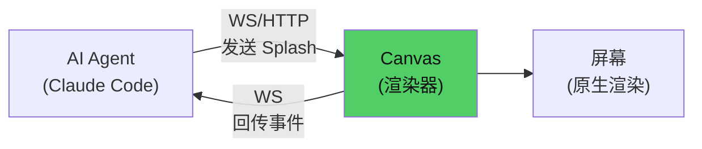
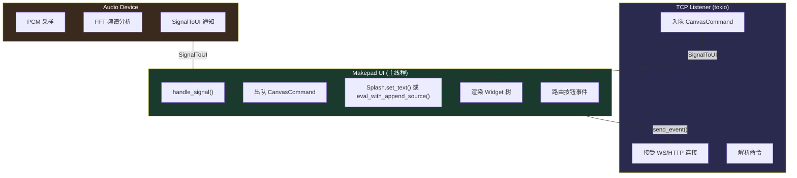

# 第27章：Canvas 架构剖析

## 为什么这很重要

前面 26 章构建了 Makepad 2.0 的完整技术基础——Splash 语言、Widget 体系、渲染引擎、事件系统。现在是把这些知识汇聚起来的时候。Canvas 是 Makepad 2.0 "AI-Native" 设计理念的完整实现——一个通过 WebSocket/HTTP 接收 Splash 代码并实时渲染的原生应用画布。

Canvas 的核心定义：**它是一个纯渲染器，不是状态容器。** AI Agent 负责生成 Splash 代码，Canvas 负责渲染和回传事件。所有业务逻辑（状态管理、交互响应、定时器）都在 Splash 代码中——不在 Canvas 的 Rust 代码中。



---

## 三线程架构

Canvas 的内部架构是三个线程的协作：



*来源：`tools/canvas/src/app.rs`, `tools/canvas/src/ws/stdio_bridge.rs`*

**线程 1（TCP Listener）**：tokio 异步运行时，监听 `127.0.0.1:{random_port}`。接受 WebSocket 和 HTTP 请求，解析为 `CanvasCommand`，入队到共享的 `Mutex<VecDeque<CanvasCommand>>`。端口号写入 `/tmp/makepad-canvas.port` 供外部程序发现。

**线程 2（UI 主线程）**：Makepad 的事件循环。通过 `SignalToUI` 被线程 1 唤醒，从队列中取出命令，调用 Splash Widget 的 `set_text()` 或流式求值函数渲染 UI。同时处理用户交互（按钮点击），将事件名称通过 `send_event()` 广播给 WS 客户端。

**线程 3（Audio Device）**：系统音频输出回调。每 ~4 个音频回调（约 15Hz）执行 FFT 频谱分析，将 16 波段数据写入 `AudioPlaybackState`（详见第30章）。

三个线程之间的同步：
- `Arc<Mutex<VecDeque>>` 存储命令队列
- `Arc<AtomicBool/U64>` 存储音频状态（无锁）
- `SignalToUI` 从工作线程唤醒 UI 线程（零分配唤醒机制）

---

## 核心数据结构

### CanvasCommand：命令协议

```rust
pub enum CanvasCommand {
    SplashRender { code: String },       // 替换整个面板
    SplashStreamBegin,                    // 开始流式渲染
    SplashStreamAppend { code: String },  // 追加代码片段
    SplashStreamEnd,                      // 结束流式渲染
    SplashEval { code: String },          // 求值 Splash 表达式
    AudioPlay { url: String },            // 播放音频
    AudioPause,
    AudioStop,
    AudioToggle,
    SaveApp { name: String },             // 保存当前应用
    ConnectionState { connected: bool },  // 连接状态变化
}
```

*来源：`tools/canvas/src/ws/types.rs:1-33`*

最重要的四个命令是 `SplashRender`（批量渲染）和 `SplashStreamBegin/Append/End`（流式渲染）。它们对应第11章讲解的两种求值模式。

### 双协议支持

Canvas 同时支持 WebSocket 和 HTTP：

| HTTP 端点 | 对应命令 |
|-----------|---------|
| `POST /splash` body=code | `SplashRender` |
| `POST /splash/stream` body=chunk | `SplashStreamAppend` |
| `POST /splash/end` | `SplashStreamEnd` |
| `POST /clear` | 清空画布 |
| `POST /audio/play` body=url | `AudioPlay` |
| `GET /event` | 轮询按钮事件 |
| `GET /ping` | 健康检查 |

*来源：`tools/canvas/CLAUDE.md`*

WebSocket 使用 JSON 消息：`{"splash": "..."}`, `{"audio": {"play": "url"}}`, 接收 `{"event": "click", "widget": "name"}`。

**为什么需要双协议？** WS 适合持久连接和双向通信（AI Agent 的首选），HTTP 适合一次性调试（`curl -X POST` 快速测试）。

### 事件路由：uid_map

当用户点击 Canvas 中的按钮时，Canvas 需要知道"这是哪个按钮"——然后把按钮名称发送给 AI Agent。

Canvas 通过 `uid_map` 实现这个映射：

```
Widget 树渲染
    → 提取所有 := 命名的 Widget
    → 建立 WidgetUid → widget_name 映射
    → 用户点击时，从 ButtonAction 获取 WidgetUid
    → 查 uid_map 得到 widget_name
    → 通过 WS/HTTP 发送 {"event": "click", "widget": "play_btn"}
```

某些 widget 名称有特殊处理：`audio_toggle`、`play_btn`、`audio_stop` 直接触发 Canvas 内置的音频控制，不发送到 Agent。

---

## 设计决策与权衡

### 为什么用 `Mutex<VecDeque>` 而不是 channel？

Makepad 的 `SignalToUI` 是一个轻量级唤醒机制——它只通知 UI 线程"有新东西"，不传递数据。数据通过共享的 `Mutex<VecDeque>` 传递。这比 `mpsc::channel` 更适合 Makepad 的事件循环模型——UI 线程在 `handle_signal` 中一次性取出所有命令，而不是逐条轮询 channel。

### 为什么每次 SplashRender 都重建整个 Widget 树？

`POST /splash` 会销毁之前的所有 Widget，用新代码重新创建完整的 Widget 树。这看起来"浪费"，但实际上：
1. Splash 的 Widget 创建非常快（< 1ms 对于几百个 Widget）
2. 这避免了"增量更新"的复杂性——不需要 diff 算法
3. AI 每次输出的是完整的 Splash 代码，不是 diff

**重要：不要在循环中调用 `POST /splash`**。每次 POST 都重建 Widget 树+重新注册 uid_map+全量重绘。如果每 3 秒 POST 一次，CPU 会飙到 100%。正确做法是 POST 一次，让 Canvas 中 `Splash` widget 提供的 `fn tick()` 和 `on_click` 驱动后续更新。

### 为什么只能同时渲染一个应用？

Canvas 的设计是"单画布"——同一时刻只有一个 Splash 应用在运行。这是有意的简化：
- 避免多个应用争夺 GPU 资源
- 简化事件路由（不需要区分事件来自哪个应用）
- 历史应用保存在侧边栏，可以随时切换回来

---

## 模式提炼

### 模式一：渲染器-而非-状态容器

Canvas 的 Rust 代码不包含任何业务逻辑。所有逻辑在 Splash 代码中：
- 状态 → `let state = {...}`
- 交互 → `on_click: ||{...}`
- 定时器 → Canvas 中的 `fn tick()`
- UI 更新 → `refresh()` / `on_render`

这种设计让 AI Agent 可以完全控制应用行为——只需要发送不同的 Splash 代码，不需要修改 Canvas 的 Rust 代码。

### 模式二：Signal-Queue-Process

```
工作线程产生数据 → 入队 + SignalToUI → UI 线程出队处理
```

这是 Makepad 中跨线程通信的标准模式。不使用 `async/await`，不使用 channel。`SignalToUI` 是最轻量的唤醒机制。

---

## 本章小结

| 组件 | 文件 | 职责 |
|------|------|------|
| `App` | `app.rs` | 主 Widget，处理 Signal、渲染 Splash、路由事件 |
| `StdioBridge` | `ws/stdio_bridge.rs` | TCP 监听，WS/HTTP 解析，命令入队 |
| `CanvasCommand` | `ws/types.rs` | 命令协议枚举（11 个变体） |
| `AudioPlaybackState` | `audio.rs` | 音频状态（原子操作，无锁） |

核心要点：Canvas 是纯渲染器，三线程架构（TCP/UI/Audio），双协议（WS+HTTP），单应用画布。

下一章讲解完整的 Agent-to-App 管线——AI 如何生成 Splash、推送到 Canvas、接收事件（详见第28章：Agent-to-App 管线）。
