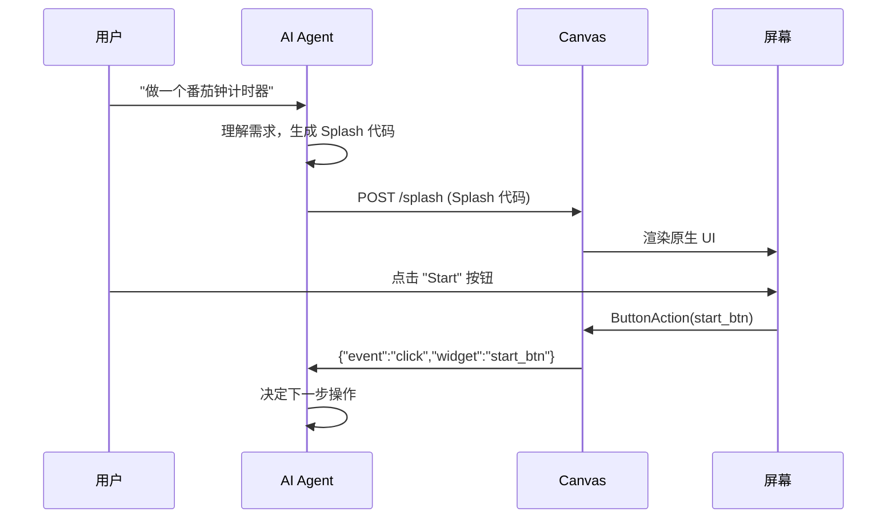

# 第28章：Agent-to-App 管线

## 为什么这很重要

第27章剖析了 Canvas 的内部架构。本章站在 AI Agent 的视角，讲解完整的 Agent-to-App 管线：用户用自然语言描述需求 → AI 生成 Splash 代码 → 推送到 Canvas → 用户看到原生应用 → 用户交互 → 事件回传给 Agent。

这条管线是全书 AI 叙事线的最终实现——从第1章的设计哲学，到第6章的语法设计，到第11章的流式求值，最终在这里汇聚成一个端到端的工作系统。



---

## 管线的五个阶段

### 阶段一：Canvas 发现

AI Agent 首先需要找到运行中的 Canvas。Canvas 启动时将端口号写入 `/tmp/makepad-canvas.port`：

```bash
PORT=$(cat /tmp/makepad-canvas.port)
curl -s "http://127.0.0.1:$PORT/ping"  # {"ok":true}
```

### 阶段二：Splash 代码生成

Agent 根据用户的自然语言描述生成 Splash 代码。关键约束：

1. **遵守 Splash 语法**——无逗号、`height: Fit`、`#x` 颜色前缀（详见第6-8章）
2. **包含完整应用逻辑**——状态、事件处理、`fn tick()`
3. **不依赖外部资源**——Canvas 无法加载外部图片

### 阶段三：推送到 Canvas

**批量推送**：`curl -X POST "http://127.0.0.1:$PORT/splash" --data-binary @app.splash`

**流式推送**（AI 实时生成时）：`SplashStreamBegin → Append × N → End`（详见第11章）

### 阶段四：事件回传

Canvas 通过 WS 回传按钮事件：`{"event": "click", "widget": "start_btn"}`

### 阶段五：迭代

Agent 可以修改代码并重新推送。同名应用原地更新。

---

## 四种 Canvas 应用案例

| 应用 | 类型 | 关键特性 | 来源 |
|------|------|---------|------|
| pomodoro | 计时器 | `fn tick()` + 6 按钮 | `examples/pomodoro.splash` |
| token-dashboard | 仪表板 | 纯展示 + 模板复用 | `examples/token-dashboard.splash` |
| music-player | 播放器 | `fn on_audio()` + 频谱 | `examples/music-player.splash` |
| claude-monitor | 监控 | 定时刷新 + 多面板 | `examples/claude-monitor.splash` |

*来源：`tools/canvas/examples/`*

所有四个应用都是纯 Splash——零 Rust 逻辑代码。

---

## 为什么是 Splash 而不是 HTML

| 维度 | Splash + Canvas | HTML + WebView |
|------|----------------|----------------|
| 渲染 | GPU 原生 | DOM |
| 流式渲染 | 原生支持 | 需要 SSR |
| 代码量 | ~50 行 | ~200 行 |
| 跨平台一致性 | 像素级 | 浏览器差异 |
| 启动 | 毫秒 | 秒级 |

---

## 模式提炼

### 模式一：POST 一次，Splash 内部驱动

不要循环 POST。POST 一次后，`on_click` 和 `fn tick()` 驱动所有后续交互。

### 模式二：Agent 只在需要时介入

大多数用户交互由 Splash `on_click` 处理。Agent 只在需要"超出 Splash 能力"的操作时介入（网络请求、文件操作）。

---

## 本章小结

| 阶段 | 操作 | 协议 |
|------|------|------|
| 发现 | `/tmp/makepad-canvas.port` | 文件 |
| 生成 | AI → Splash 代码 | — |
| 推送 | `POST /splash` / WS | HTTP/WS |
| 事件 | `{"event":"click","widget":"name"}` | WS |
| 迭代 | 修改并重推 | 同上 |

下一章讲解自愈循环——AI 如何通过截图检测渲染问题并自动修复（详见第29章：自愈循环与流式渲染）。
