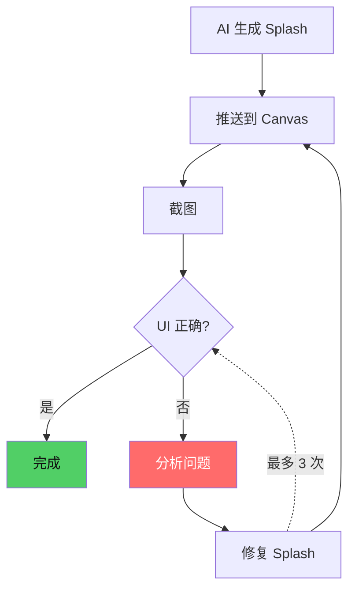

# 第29章：自愈循环与流式渲染

## 为什么这很重要

Agent-to-App 管线有一个致命弱点：AI 生成的代码不一定正确。漏写 `height: Fit` 就让 UI 空白，错误颜色值让文字不可见。**自愈循环**解决这个问题——推送代码后截图检查，发现问题就修复并重推。最多 3 次迭代。



---

## 三次迭代模式

**迭代 1（结构修复）**：空白屏幕 → 添加 `height: Fit`，修改容器类型

**迭代 2（视觉修复）**：内容可见但样式问题 → 修复 `draw_text.color`、添加 `new_batch: true`

**迭代 3（微调）**：布局基本正确 → 调整 spacing、padding、alignment

### Top 5 常见渲染问题

| # | 症状 | 原因 | 修复 |
|---|------|------|------|
| 1 | 整个 UI 空白 | 缺少 `height: Fit` | 添加到每个容器 |
| 2 | 文字不可见 | `draw_text.color` 与背景同色 | 设置对比色 |
| 3 | 背景不显示 | 在 `View` 上设 `draw_bg.color` | 改用 `SolidView`/`RoundedView` |
| 4 | 文字被遮盖 | 缺少 `new_batch: true` | 添加（详见第7章） |
| 5 | 颜色解析错误 | `#1e1e2e` 中 `e` 被当指数 | 使用 `#x` 前缀 |

---

## 流式渲染的实际应用

AI 生成代码时，LLM 输出是逐 token 的。Agent 可以将每段新输出通过 `SplashStreamAppend` 发送：

```
LLM tokens 1-10:  "SolidView{width: Fill"
  → StreamAppend → Canvas 显示背景

LLM tokens 11-25: " height: Fit\nLabel{text: \"Hello\""
  → StreamAppend → 背景 + "Hello" 出现

LLM tokens 26-40: "}\nButton{text: \"Click\"}"
  → StreamEnd → 完整 UI
```

用户在 AI "思考"时就看到 UI 逐步成型。总时间不变，但感知等待大幅降低（详见第11章：批量 vs 流式对比）。

---

## 截图分析策略

| 策略 | 检测 | 复杂度 |
|------|------|--------|
| 空白检测 | 大部分像素同色 → UI 未渲染 | 低 |
| 元素计数 | 代码有 4 卡片但只见 1 个 | 中 |
| 文字可见性 | 有 Label 但截图无文字 | 中 |
| 布局合理性 | 按钮位置、列表间距 | 高 |

这些策略不需要精确——Agent 只需判断"大致正确"。3 次迭代的代价很低。

---

## 局限

| 能修复（渲染层） | 不能修复（逻辑层） |
|-----------------|-------------------|
| height: Fit 遗漏 | 计时器逻辑错误 |
| 颜色值错误 | 状态管理 bug |
| 容器类型选错 | 事件处理逻辑 |

逻辑错误需要用户反馈，不是截图能发现的。

---

## 模式提炼

### 预防优于修复

遵循 Splash 规则（第6-8章）生成的代码，通常第一次就能正确渲染。Canvas 的 `skills/app/SKILL.md` 将规则编码为 Agent 的 system prompt：

- 每个容器 `height: Fit`
- 颜色用 `#x` 前缀
- 有背景+文字加 `new_batch: true`
- 用 `SolidView`/`RoundedView` 不用 `View` 做背景

---

## 本章小结

| 概念 | 说明 |
|------|------|
| 自愈循环 | 推送→截图→检测→修复→重推（最多 3 次） |
| 流式渲染 | AI 逐 token 推送，UI 逐步成型 |
| 预防策略 | 遵循 Splash 规则，减少修复需求 |

Part VI（AI-Native 篇）核心三章完成。接下来是 ch30-32 和 Part IV-V。
