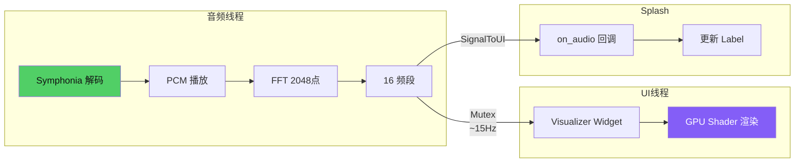
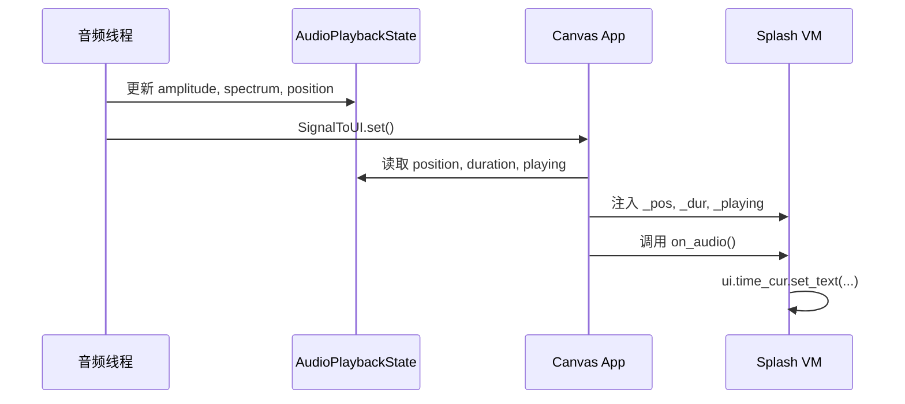

# 第30章：音频可视化案例

## 为什么这很重要

前两章介绍了 Canvas 架构（详见第27章）和 Agent-to-App 管线（详见第28章）。本章用一个完整的音频可视化案例，展示 Makepad 2.0 如何将音频解码、FFT 频谱分析、GPU 着色器渲染和 Splash 脚本无缝整合。这是 Canvas 内置通用能力的典型示范——音频服务不属于任何具体应用，而是所有 Splash 脚本都可以调用的基础设施。



---

## 音频管线总览

Canvas 的音频管线分为四层：

| 层 | 文件 | 职责 |
|---|---|---|
| 状态单例 | `audio.rs` | `AudioPlaybackState` — 全局共享播放状态 |
| 解码器 | `audio.rs` | Symphonia 解码 MP3/AAC，输出交错 PCM |
| 频谱分析 | `spectrum.rs` | Hann 窗 + rustfft，输出 16 个对数频段 |
| 可视化 | `visualizer.rs` | `DrawVisualizer` + GPU shader，逐帧渲染 |

---

## AudioPlaybackState：无锁状态共享

音频回调运行在实时线程，不能用常规 Mutex 阻塞。Canvas 采用原子变量 + 最小锁范围的设计：

```rust
pub struct AudioPlaybackState {
    pub is_playing: AtomicBool,        // 原子布尔，零开销
    pub amplitude: F64Atomic,          // 自定义原子 f64（AtomicU64 + to_bits）
    pub position_secs: F64Atomic,
    pub play_cursor: AtomicUsize,      // 播放位置（帧索引）
    pub samples: Mutex<Vec<f32>>,      // PCM 数据，仅加载时写入
    pub spectrum: Mutex<[f32; 16]>,    // FFT 频段，try_lock 非阻塞
}
```

`spectrum` 使用 `try_lock`——UI 线程正在读取时，音频线程跳过本次写入，不阻塞。状态通过 `OnceLock<Arc<AudioPlaybackState>>` 实现全局单例。

---

## Symphonia 解码

`decode_audio_bytes` 使用 Symphonia 库解码 MP3/AAC：Probe 探测格式 -> 获取 Track 参数 -> 循环 `next_packet()` + `decode()` -> `SampleBuffer` 拷贝到 `Vec<f32>`。解码后通过 `load_samples` 写入状态单例。Canvas 还实现了两级缓存（内存 HashMap + 磁盘），避免重复下载。

---

## 16 频段 FFT 频谱分析

`SpectrumAnalyzer`（`spectrum.rs`）对 2048 点采样做 FFT，输出 16 个频段。三个关键步骤：

1. **Hann 窗**：`w(i) = 0.5 * (1 - cos(2PI * i / (N-1)))`，减少频谱泄漏
2. **对数频段映射**：`lo = (band/16)^2 * nyquist`，低频段占更多 bin，符合听觉特性
3. **非对称平滑**：上升快（70% 新值），下降慢（15% 新值），让节拍清晰、衰减流畅

```rust
self.bands[band] = if normalized > prev {
    prev * 0.3 + normalized * 0.7
} else {
    prev * 0.85 + normalized * 0.15
};
```

---

## Visualizer Widget 与 GPU Shader

`DrawVisualizer` 将 16 个频段值（`b0`~`b15`）、`time`、`amplitude` 作为 shader instance 变量传入 GPU。`Visualizer` widget 通过 `NextFrame` 机制逐帧从 `AudioPlaybackState` 读取数据并触发重绘（详见第10章动画系统）。

---

## 内置可视化效果

Canvas 预定义了两种可视化 widget，都通过 `script_mod!` 在 Splash DSL 中注册。

### SpectrumBars：柱状频谱

在像素着色器中，根据 UV 坐标确定当前像素属于哪个频段，再与频段值比较决定是否绘制：

```
band_idx = floor(uv.x / (1/16))   // 16 列
bar_h = bands[band_idx] * 0.85     // 柱高
in_bar = step(1-uv.y, bar_h)       // 像素在柱内?
```

颜色使用余弦彩虹：`0.5 + 0.5 * cos(2PI * (hue + offset))`，hue 随 x 位置变化。顶部有指数衰减的辉光效果 `exp(-|distance| * 12)`。

### SpectrumCircular：圆环频谱

将频段映射到极坐标角度，频段值控制圆环半径：

```
angle = atan2(p.y, p.x)
norm_angle = (angle + PI) / 2PI
band_idx = floor(norm_angle * 16)
ring_radius = 0.3 + bands[band_idx] * 0.35
```

内圈有振幅驱动的辉光效果：`exp(-radius * 3) * amplitude * 0.4`。

---

## music-player.splash 案例分析

`tools/canvas/examples/music-player.splash` 是一个完整的音乐播放器 UI，展示了 Splash 脚本如何与 Canvas 音频服务协作：

```splash
let player = { track: 0 }
let songs = [
    {name: "Ambient Flow" artist: "SoundHelix"}
    {name: "Electronic Pulse" artist: "SoundHelix"}
]

fn on_audio() {
    ui.time_cur.set_text(fmt_time(_pos))
    ui.time_end.set_text(fmt_time(_dur))
    if _playing { ui.play_btn.set_text("Pause") }
    else { ui.play_btn.set_text("Play") }
}
```

### 关键设计模式

1. **约定命名触发音频控制**：按钮命名为 `play_btn` 和 `audio_stop`，Canvas 的 `handle_actions` 自动识别并路由到 `AudioPlaybackState::toggle/stop`。
2. **`on_audio` 回调**：Canvas 以约 10Hz 频率将播放状态（`_pos`、`_dur`、`_playing`）注入 Splash VM 全局变量，并调用 `on_audio` 函数更新 UI。
3. **纯 Splash 逻辑**：曲目切换（Prev/Next）完全在 `on_click` 中处理，不需要 Rust 端参与。



---

## 扩展：自定义可视化着色器

由于 SpectrumBars 和 SpectrumCircular 都通过 `script_mod!` 注册，你可以在 Splash 脚本中用 `draw_bg +:` 语法覆盖像素着色器（详见第19章 SDF 着色器）：

```splash
SpectrumBars{
    width: Fill height: 200
    draw_bg +: {
        pixel: fn() {
            // 你的自定义着色器
            let uv = self.pos
            let energy = self.b0 + self.b1 + self.b2 + self.b3
            return vec4(energy, uv.y * energy, 0.2, 1.0)
        }
    }
}
```

所有 `self.b0` ~ `self.b15`、`self.time`、`self.amplitude` 变量在着色器中都可用。

---

## 本章小结

- Canvas 音频管线由四层组成：状态单例、Symphonia 解码、FFT 频谱分析、GPU 可视化
- `AudioPlaybackState` 使用原子变量和 `try_lock` 实现音频线程与 UI 线程的无阻塞通信
- `SpectrumAnalyzer` 对 2048 点 FFT 做 Hann 窗、对数频段映射和非对称平滑
- `SpectrumBars` 和 `SpectrumCircular` 在 GPU shader 中实时渲染 16 频段数据
- Splash 脚本通过约定命名（`play_btn`、`audio_stop`）和 `on_audio` 回调与音频服务协作
- 可视化着色器可通过 `draw_bg +:` 在 Splash 中自由扩展（详见第19章）
