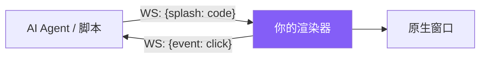
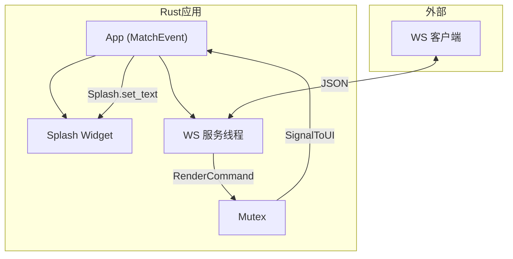
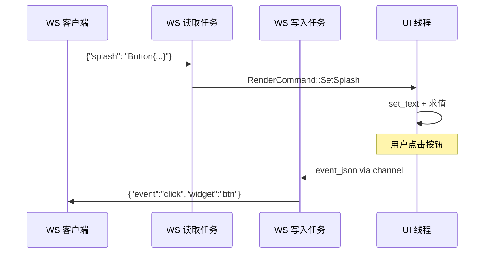

# 第31章：构建你的 AI 渲染器

## 为什么这很重要

第27章剖析了 Canvas 架构，第28章展示了 Agent-to-App 管线。本章带你从零构建一个精简版 Canvas——接受 WS 连接、渲染 Splash 代码、回传按钮事件。完成后你将拥有一个可被任何 AI Agent 驱动的原生 UI 渲染器。



---

## 第一步：应用骨架

依赖：`makepad-widgets`、`tokio`（rt-multi-thread + net）、`tokio-tungstenite`、`serde_json`。



核心数据结构——命令队列连接 WS 线程和 UI 线程：

```rust
pub enum RenderCommand { SetSplash(String), Clear }

pub struct CommandQueue {
    pub commands: Mutex<VecDeque<RenderCommand>>,
    pub signal: SignalToUI,
}
```

UI 定义使用 `script_mod!`，只需一个 Window + Splash widget：

```rust
script_mod! {
    use mod.prelude.widgets.*
    startup() do #(App::script_component(vm)){
        ui: Root{ Window{
            body +: { View{width: Fill height: Fill
                splash_panel := Splash{width: Fill height: Fit}
            }}
        }}
    }
}
```

---

## 第二步：WebSocket 服务

在独立线程中启动 tokio runtime，监听 WS 连接，解析 JSON 后入队：

```rust
pub fn start_ws_server(queue: Arc<CommandQueue>, port: u16) {
    std::thread::spawn(move || {
        let rt = tokio::runtime::Runtime::new().unwrap();
        rt.block_on(async move {
            let listener = TcpListener::bind(format!("127.0.0.1:{}", port)).await.unwrap();
            while let Ok((stream, _)) = listener.accept().await {
                let q = queue.clone();
                tokio::spawn(async move {
                    let ws = accept_async(stream).await.unwrap();
                    let (_sink, mut source) = ws.split();
                    while let Some(Ok(msg)) = source.next().await {
                        if let Ok(text) = msg.to_text() {
                            if let Ok(json) = serde_json::from_str::<Value>(text) {
                                if let Some(code) = json.get("splash").and_then(|v| v.as_str()) {
                                    q.commands.lock().unwrap()
                                        .push_back(RenderCommand::SetSplash(code.into()));
                                    q.signal.set(); // 唤醒 UI 线程
                                }
                            }
                        }
                    }
                });
            }
        });
    });
}
```

`SignalToUI::set()` 触发 UI 线程下一次事件循环中的 `handle_signal`，比 channel 更轻量。

---

## 第三步：渲染 Splash 代码

UI 线程在 `handle_signal` 中消费命令，把收到的 Splash 文本设置到 `Splash` widget：

```rust
impl MatchEvent for App {
    fn handle_startup(&mut self, cx: &mut Cx) {
        let queue = Arc::new(CommandQueue { /* ... */ });
        start_ws_server(queue.clone(), 9867);
        self.queue = Some(queue);
    }
    fn handle_signal(&mut self, cx: &mut Cx) {
        for cmd in self.drain_commands() {
            if let RenderCommand::SetSplash(code) = cmd {
                let splash = self.ui.widget(cx, ids!(splash_panel));
                splash.set_text(cx, &code);
            }
        }
    }
}
```

这里的核心 API 是 `Splash::set_text()` / `WidgetRef::set_text()`：接收 Splash 代码字符串，内部求值后替换当前 `Splash` 的根 View。

---

## 第四步：回传按钮事件

在 `handle_actions` 中捕获 `ButtonAction::Clicked`，通过 UID 映射找到 widget 名称，广播给所有 WS 客户端：

```rust
fn handle_actions(&mut self, _cx: &mut Cx, actions: &Actions) {
    for action in actions {
        if let Some(wa) = action.as_widget_action() {
            if wa.action.downcast_ref::<ButtonAction>()
                .is_some_and(|a| matches!(a, ButtonAction::Clicked(_)))
            {
                let name = self.uid_map.get(&wa.widget_uid)
                    .cloned().unwrap_or_default();
                let json = format!(r#"{{"event":"click","widget":"{}"}}"#, name);
                // 广播给所有 WS 客户端
                self.broadcast_event(&json);
            }
        }
    }
}
```

WS 双向通信：accept 后拆分 sink/source，写入端注册 `mpsc::UnboundedSender`，UI 线程通过 sender 推送事件，断开时移除。



---

## 测试

```bash
# 发送带按钮的 UI
echo '{"splash":"View{flow:Down padding:20 btn:=Button{text:\"Click\"}}"}' \
  | websocat ws://127.0.0.1:9867

# 持久连接：发送并接收事件
websocat ws://127.0.0.1:9867
> {"splash":"btn := Button{text:\"Ping\" draw_bg.color:#x44aa66}"}
< {"event":"click","widget":"btn"}
```

精简版约 200 行 Rust，Canvas 完整实现约 800 行。核心循环相同：**收 Splash -> set_text / 求值 -> 渲染 -> 捕获事件 -> 回传**。进阶方向：流式渲染（详见第11章）、状态注入、截图自愈（详见第29章）、音频服务（详见第30章）。

---

## 本章小结

- 最小 AI 渲染器四个组件：Makepad App、Splash Widget、WS 服务、事件回传
- `SignalToUI` 是跨线程唤醒 UI 线程的轻量机制
- `Splash.set_text()` 接收 Splash 代码字符串，并在内部求值后替换当前内容
- 事件回传通过 `handle_actions` 捕获点击，UID 映射到名称后发送 JSON
- 完整 Canvas 在此基础上增加流式渲染、音频（详见第30章）、自愈循环（详见第29章）
- 此模式不限于 AI，任何外部程序都可通过 WS 驱动 Makepad 渲染原生 UI
