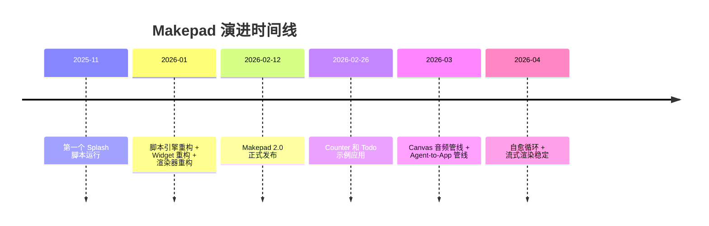
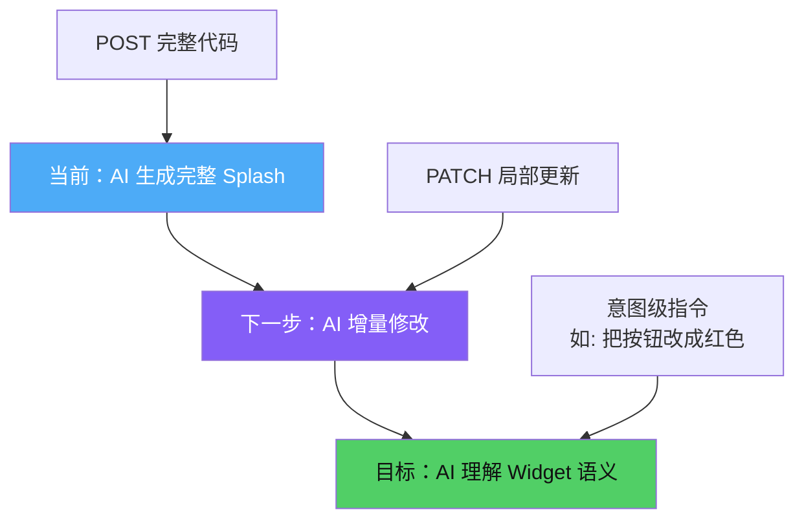

# 第32章：Makepad 的未来

## 为什么这很重要

前 31 章覆盖了 Makepad 2.0 的技术全貌——从 Splash 语言到 GPU 渲染，从 Widget 体系到 AI 渲染管线。本章梳理 Makepad 的发展方向和生态规划，帮助读者判断哪些技术投入值得持续关注。

---

## 从 1.x 到 2.0：已经发生的变化

2.0 的核心转变：

| 维度 | 1.x | 2.0 |
|---|---|---|
| UI 定义 | `live_design!` 编译期宏 | `script_mod!` 运行时求值 |
| 修改生效 | 重新编译 | 热重载，无需重新编译 |
| AI 友好度 | 低（需理解 Rust 宏语法） | 高（Splash 是独立脚本语言） |
| 动态性 | 有限 | 完整（运行时生成/替换 widget tree） |

---

## 路线图：短期（2026 Q2-Q3）

### Splash 语言增强

Splash 目前覆盖了 UI 构建的核心场景，但仍有明确的扩展方向：

- **模块系统**：支持 `import` 语句，允许 Splash 脚本引用其他 `.splash` 文件。当前所有代码必须在单个脚本中，限制了大型应用的组织能力。
- **类型提示**：可选的类型注解（`fn add(a: int, b: int) -> int`），改善 AI 生成代码的准确性和错误诊断。
- **异步支持**：Splash 目前已有 callback 风格的异步能力（如 `net.http_request`），但还没有统一的 `await` 语法。未来可补齐更直接的异步表达方式。

### Widget 生态

- **图表 Widget**：折线图、柱状图、饼图——Dashboard 类应用的基础组件
- **富文本编辑器**：基于现有 `CodeView` 扩展，支持格式化文本输入
- **数据表格**：支持排序、筛选的高性能表格，基于 `PortalList` 虚拟化（详见第15章）

### 平台覆盖

- **WASM 性能优化**：减少 Splash VM 在浏览器中的 GC 压力
- **Android/iOS 稳定性**：解决移动端音频延迟、触摸事件精度等已知问题（详见第26章跨平台）

---

## 路线图：中期（2026 Q4 - 2027）

### AI 集成深化

Canvas（详见第27章）证明了"AI 生成代码 -> 运行时渲染"的模式可行。下一步是让这个循环更紧密：

具体方向：

- **增量更新协议**：目前 Canvas 侧的大粒度更新仍以整段 Splash 替换为主，缺少协议级的局部 patch。计划支持针对特定 widget 的局部更新（`script_patch`），减少整树替换开销。
- **语义级 API**：让 AI 发送高层意图（"在列表末尾加一行"）而非底层代码，由 Canvas 端的 Splash 解释器翻译为具体操作。
- **多模态输入**：将截图分析能力（详见第29章自愈循环）标准化为 API，任何 AI Agent 都可以调用。

### 编辑器集成

- **LSP for Splash**：为 Splash 语言提供 Language Server Protocol 支持——代码补全、错误诊断、跳转定义
- **实时预览**：在 VS Code / Zed 等编辑器中嵌入 Splash 预览面板

---

## 路线图：长期愿景

### 运行时 UI 求值作为行业模式

Makepad 2.0 的核心创新不是某个具体技术，而是一个架构模式：**将 UI 定义从编译期搬到运行时，用独立脚本语言描述，通过流式求值直接驱动渲染。**

这个模式不依赖 Makepad 特有的技术。理论上，其他 UI 框架也可以采用类似设计：

| 框架 | 当前 UI 定义 | 运行时求值方案 |
|---|---|---|
| Makepad | Splash (script_mod!) | 已实现 |
| Flutter | Dart 编译 | Dart VM + hot reload（部分实现） |
| SwiftUI | Swift 编译 | Swift Playground（受限） |
| Compose | Kotlin 编译 | 尚无运行时方案 |
| Web | HTML/JS | 天然运行时（但非原生） |

Makepad 的独特优势在于：Splash 的流式求值是为 AI 生成场景设计的。LLM 逐 token 输出时，UI 可以边生成边渲染，不需要等待完整代码。这是编译型方案做不到的。

### 社区与生态

- **Splash 脚本市场**：可复用的 Splash 组件和模板共享平台
- **Canvas 插件体系**：允许第三方扩展 Canvas 的通用能力（如音频是第一个插件，详见第30章）
- **跨框架 Splash**：将 Splash 语言规范独立出来，允许其他渲染后端实现 Splash 解释器

---

## 已知挑战

技术路线图之外，Makepad 面临的现实挑战：

### 生态规模

Makepad 的 Widget 生态仍处于早期。与 Flutter（数万个 pub.dev 包）或 React（npm 生态）相比，可用组件数量有限。短期内核心团队需要持续补充基础 Widget。

### 学习曲线

Makepad 2.0 的技术栈跨度大：Rust + Splash + GPU Shader + 事件系统。对于只熟悉 Web 前端或 Flutter 的开发者，入门需要时间。本书的目标之一就是降低这个门槛。

### Splash 语言成熟度

Splash 作为新语言，调试工具、错误信息、文档覆盖都在完善中。运行时错误目前以 `eprintln!` 输出到 stderr，缺少结构化的错误报告机制。

---

## 对开发者的建议

1. **现在开始用 Splash 构建原型**：运行时求值的优势在原型阶段最明显——修改即见效，无需编译等待。
2. **复杂逻辑留在 Rust 端**：Splash 适合 UI 布局和简单交互，性能敏感或复杂业务逻辑应在 Rust 中实现，通过 `ScriptHook` 桥接（详见第17章自定义 Widget）。
3. **关注 Canvas 模式**：即使你不用 Canvas 本身，"WS + Splash + 事件回传"的架构模式可以应用于任何需要动态 UI 的场景（详见第31章）。
4. **参与社区**：Makepad 仓库的 issue 和 discussion 是获取最新进展的最佳渠道。

---

## 本章小结

- Makepad 2.0 的核心转变是从编译期 UI 定义到运行时求值，Splash 语言是这一转变的载体
- 短期路线图聚焦 Splash 语言增强（模块、类型提示）和 Widget 生态扩充
- 中期方向是 AI 集成深化——增量更新、语义级 API、标准化截图分析
- 长期愿景是将运行时 UI 求值推广为行业模式，不限于 Makepad 生态
- 已知挑战包括生态规模、学习曲线和 Splash 语言成熟度
- 开发者现在可以用 Splash 快速原型，用 Canvas 模式（详见第27章至第31章）探索 AI 驱动的 UI 开发
