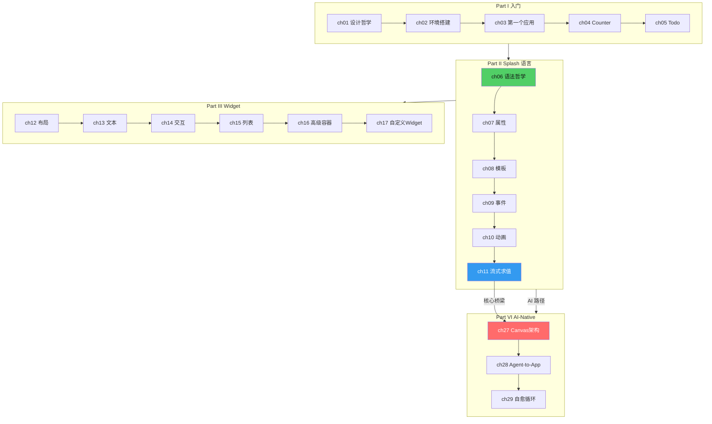

# 前言

## 为什么写这本书

2026 年，AI Agent 正在改变软件开发的方式。Claude Code、GitHub Copilot、Cursor 等工具让 AI 能够自主编写、测试和修复代码。但在 GUI 开发领域，有一个根本性的障碍：**大多数 UI 框架的代码需要编译后才能看到效果**。

这意味着 AI 生成 UI 代码后，必须经过编译、打包、加载的完整链路，才能验证结果是否正确。这个链路的延迟是秒级甚至分钟级的——对于需要多轮迭代的 AI 生成场景来说，太慢了。

Makepad 2.0 用一种不同的方式解决了这个问题。它的 UI 描述语言 Splash 是**运行时求值**的——AI 输出的代码可以被立即解析、编译和渲染，延迟是毫秒级的。更进一步，Splash 支持**流式求值**——AI 每输出一段代码，用户就能看到 UI 的一部分逐步成型。

这本书记录了 Makepad 2.0 的完整技术体系：从入门到架构，从语法设计到 AI 集成。

### 配套项目：Makepad Skills

本书有一个配套项目——[makepad-skills](https://github.com/ZhangHanDong/makepad-skills)——一组为 AI Agent（如 Claude Code）设计的技能插件。这些 Skills 将本书中的知识（Splash 语法规则、Widget API、常见陷阱、架构模式）编码为机器可消费的格式，让 AI 在编写 Makepad 代码时能够自动加载相关上下文。

本书是"给人类读的文档"，makepad-skills 是"给 AI 读的文档"。两者覆盖相同的知识体系，但面向不同的受众。如果你在使用 Claude Code 开发 Makepad 应用，建议同时安装 makepad-skills——AI 会自动在你遇到 Makepad 相关问题时加载对应的 skill。

## 阅读准备

### 前置知识

- **Rust 基础**：了解 struct、trait、enum、生命周期的基本概念
- **GUI 开发经验**：使用过任何 GUI 框架（Qt、Flutter、React、SwiftUI）
- **不需要**：GPU 编程经验、编译器知识、AI/ML 知识

### 推荐阅读路径

**路径 A：应用开发者**（想用 Makepad 构建应用）

> ch01 → ch02 → ch03 → ch04 → ch05 → ch06 → ch07 → ch08 → ch09 → ch12 → ch15

**路径 B：框架贡献者**（想理解 Makepad 内部实现）

> ch01 → ch03 → ch06 → ch11 → ch12 → ch17 → ch18 → ch22 → ch23 → ch24 → ch25

**路径 C：AI 工具开发者**（想构建 AI 生成 UI 的工具）

> ch01 → ch06 → ch11 → ch27 → ch28 → ch29 → ch31 → 附录E

### 全书知识地图

**三个锚点章节**：
- **第6章**（Splash 语法哲学）：理解"为什么这样设计"
- **第11章**（流式求值）：理解"AI 如何实时生成 UI"
- **第27章**（Canvas 架构）：理解"完整的 AI-to-App 系统"

### 标记说明

- `file:line` — 源码引用，指向 Makepad 仓库中的实际文件和行号
- `splash.md` — Splash 语言参考手册（权威来源）
- `详见第N章` — 跨章交叉引用
- 代码块标记 `splash` — Splash 语言代码
- 代码块标记 `rust` — Rust 代码

## 致谢

感谢 Makepad 团队创造了这个框架，特别是 Rik Arends 对"运行时 UI"理念的坚持。感谢 Claude Code 和 Canvas 的使用者——你们的实践验证了 Agent-to-App 管线的可行性。

本书基于 Makepad 2.0（dev 分支，2026 年 4 月快照）。Makepad 仍在快速发展中，部分 API 可能在后续版本中变化。
